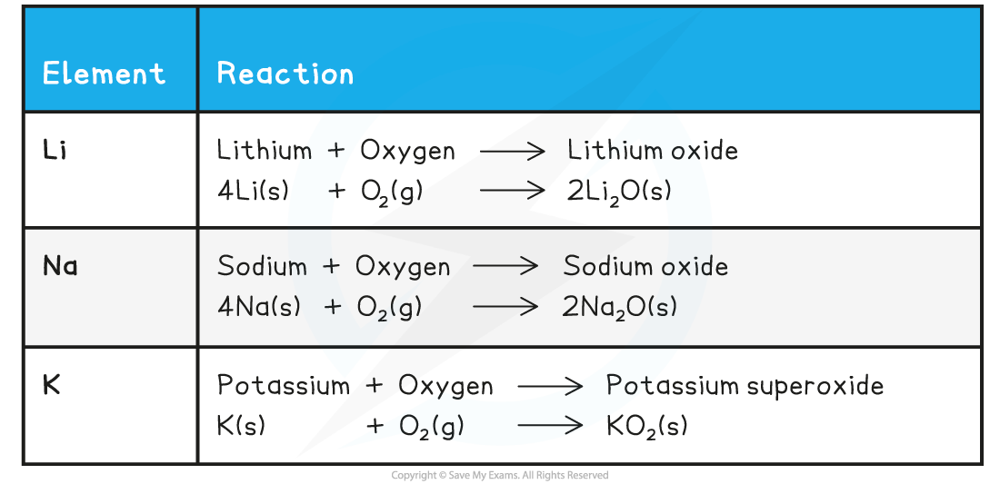
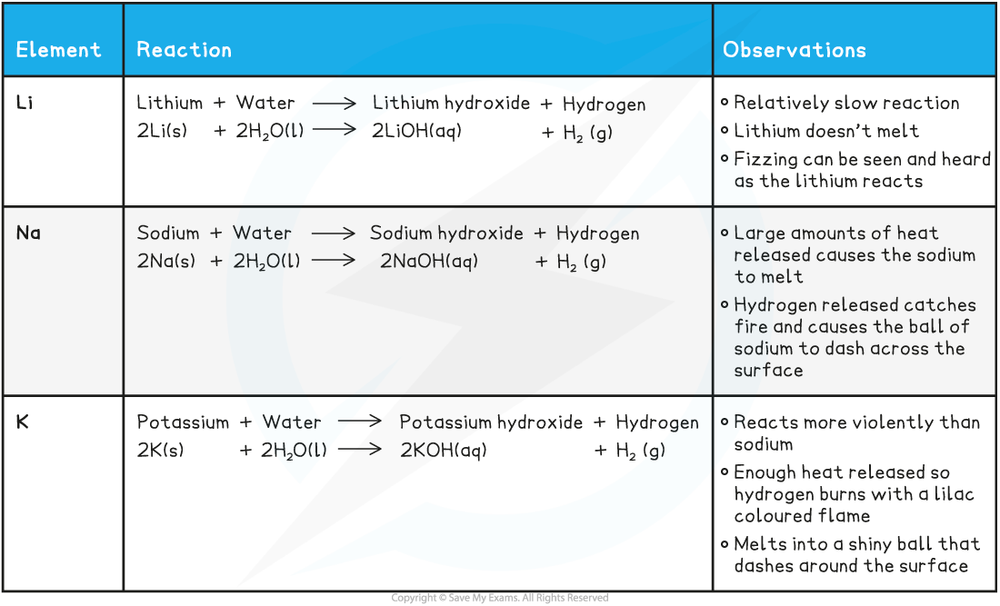

# Reactivity - Groups 1 & 2

## Reactivity Trend

> **Spec point** — `spcpt_vCtDZpcX3JYM2dF5`

## Reactivity Trend

#### Group 1 metals

- The reactivity of the group 1 metals **increases** as you go down the group
- When a group 1 element reacts its atoms only need to lose electron, as there is only 1 electron in the outer shell

  - When this happens, 1+ ions are formed
- The next shell down automatically becomes the outermost shell and since it is **already full,** a group 1 ion obtains **noble gas configuration**
- As you go down group 1, the number of shells of electrons increases by 1

  - This means that the outermost electron gets **further** away from the nucleus, so there are **weaker** **forces of attraction **between the outermost electron and the nucleus
  - **Less energy** is required to overcome the force of attraction as it gets weaker, so the outer electron is lost **more easily**
  - So, the alkali metals get more reactive as you descend the group

#### Group 2 metals

- The reactivity of the Group 2 metals also increases down the group for the same reasons

  - The outermost electron gets **further** away from the nucleus, so there are **weaker** **forces of attraction **between the outermost electron and the nucleus
  - **Less energy** is required to overcome the force of attraction as it gets weaker, so the outer electron is lost **more easily**
- This can be observed when the Group 2 metals react with water as well

  - Magnesium reacts **extremely slowly **with cold water
  - Calcium reacts **fairly vigorously** with cold water in an exothermic reaction

## Reactions with Oxygen, Chlorine & Water

> **Spec point** — `spcpt_5SzpS7vtyW2Q8vh5`

## Reactions with Oxygen, Chlorine & Water

#### Group 1 metals

**Reaction with oxygen**

- The alkali metals react with oxygen in the air forming **metal oxides, **which is why the alkali metals** tarnish** when exposed to the air
- The metal oxide produced is a dull coating which covers the surface of the metal
- The metals tarnish more rapidly as you go down the group

#### Summary of the Reactions of the First Three Alkali Metals with Oxygen

**Reaction with chlorine **

- The reactions of the Group 1 elements with chlorine are similar in appearance to the reactions of the Group 1 metals with oxygen
- Sodium, for example, burns with an intense orange flame in chlorine in exactly the same way that it does in pure oxygen
- The other metals also behave the same way in both gases

  - In each case, a white solid is formed, the simple chloride

**2M (s) + Cl****2**** (g) → 2MCl (s) **

**Reactions with water**

- The reactions of the alkali metals with water get more vigorous as you descend the group

#### Summary of the Reactions of the First Three Alkali Metals with Water

#### Group 2 metals

**Reactions with water and oxygen**

- The reaction of Group 2 metals with oxygen follows the following general equation:

**2M (s) + O****2 ****(g) → 2MO (s)**

- Where M is any metal in Group 2
- Remember than Sr and Ba **also **form a peroxide, MO2
- The reaction of all metals with water follows the following general equation:

**M (s) + 2H****2****O (l) → M(OH)****2 ****(s) + H****2 ****(g)**

- Except for, Be which does not react with water

#### Group 2 Metals Reacting with Water and Oxygen - Equations

|   | **Reaction with oxygen** | **Reaction with water** |
|---|---|---|
| **Mg** | 2Mg (s) + O2 (g) → 2MgO (s) | Mg (s) + 2H2O (l) → Mg(OH)2 (aq) + H2 (g |
| **Ca** | 2 Ca (s) + O2 (g) → 2CaO (s) | Ca (s) + 2H2O (l) → Ca(OH)2 (aq) + H2 (g) |
| **Sr** | 2Sr (s) + O2 (g) → 2SrO (s)  Sr (s) + O2 (g) → SrO2 (s) | Sr (s) + 2H2O (l) → Sr(OH)2 (aq) + H2 (g) |
| **Ba** | 2Ba (s) + O2 (g) → 2BaO (s)  Ba (s) + O2 (g) → BaO2 (s) | Ba (s) + 2H2O (l) → Ba(OH)2 (aq) + H2 (g) |

- Magnesium reacts **extremely slowly **with cold water:

**Mg (s) + 2H****2****O (l) → Mg(OH)****2 ****(aq) + H****2 ****(g)**

- The solution formed is **weakly** **alkaline** (pH 9-10) as **magnesium hydroxide **is only **slightly soluble**
- However, when magnesium is **heated** **in steam**, it reacts **vigorously **with steam to make magnesium oxide and hydrogen gas:

**Mg (s) + H****2****O (g) → MgO (s) + H****2 ****(g)**

**Reactions with chlorine**

- Group 2 metals react with chlorine gas to give the metal chloride

  - For example

**Mg (s) + Cl****2**** (g) → MgCl****2 ****(s) **
