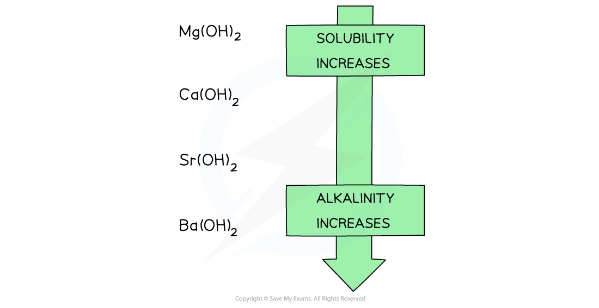
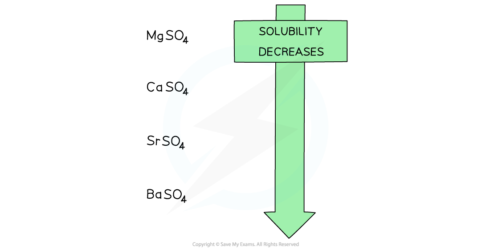

# Group 2 Hydroxides & Sulfates

## Solubility Trends

> **Spec point** — `spcpt_W7rmMZGzVks3GC3B`

## Solubility Trends

#### Group 2 hydroxides

- Going down the group, the solutions formed from the reaction of Group 2 oxides with water become more **alkaline**
- When the oxides are dissolved in water, the following ionic reaction takes place:

**O****2- ****(aq) + H****2****O(l) → 2OH****-**** (aq)**

- The higher the **concentration** of OH- ions formed, the more **alkaline** the solution
- The **alkalinity** of the formed solution can therefore be explained by the **solubility **of the Group 2 **hydroxides**

#### Solubility of the Group 2 Hydroxides Table

| **Group 2 hydroxide** | **Solubility at 298 K** **(mol / 100 g of water)** |
|---|---|
| **Mg(OH)****2** | 2.0 x 10–5 |
| **Ca(OH)****2** | 1.5 x 10–3 |
| **Sr(OH)****2** | 3.4 x 10–3 |
| **Ba(OH)****2** | 1.5 x 10–2 |

- The hydroxides dissolve in water as follows:

**X(OH)****2**** (aq) → X(aq) + 2OH****-**** (aq)**

Where X is the Group 2 element

- When the metal oxides react with water, a Group 2 hydroxide is formed
- Going down the group, the **solubility** of these hydroxides **increases**
- This means that the **concentration** of OH- ions **increases,** increasing the pH of the solution
- As a result, going down the group, the **alkalinity** of the solution formed increases when Group 2 oxides react with water

***Going down the group, the solubility of the hydroxides increases which means that the solutions formed from the reactions of the Group 2 metal oxides and water become more alkaline going down the group***

#### Group 2 sulfates

- The solubility of the Group 2 sulfates decreasing going down the group

***Going down the group, the solubility of the sulfates decreases***

> **Exam Hint**
> You may be wondering why there are no trends here for the solubility of Group 1 hydroxides and sulfates. You should recall from previous studies that Group 1 compounds are all soluble in water. They will therefore not produce any precipitates when testing for cations, so to identify them you need to use flame tests.
> 
> Group 1 hydroxides will be more soluble than Group 2 hydroxides. Even though we say the solubility of the Group 2 hydroxides increases down the group barium hydroxide is less soluble than a Group 1 hydroxide such as potassium hydroxide.
> 
> At 25 °C the solubility of **Ba(OH)****2** is 4.68 g / 100 cm3
> 
> At 25 °C the solubility of **KOH** is 121 g / 100 cm3
