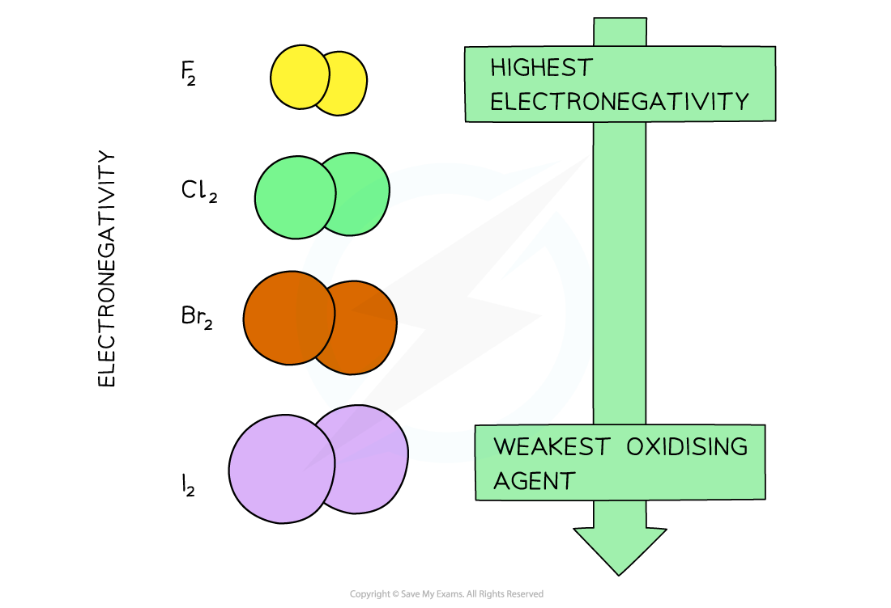
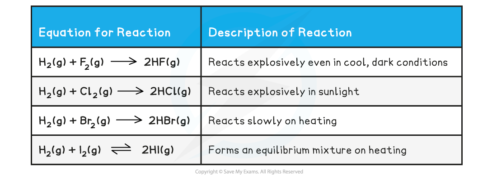

# Trends of the Group 7 Elements

## Trends of the Group 7 Elements

> **Spec point** — `spcpt_J7Tq2ZQFvQzpMPpP`

## Trends of the Group 7 Elements

- The Group 7 elements are called **halogens**
- The halogens have uses in water purification and as bleaching agents (chlorine), as flame-retardants and fire extinguishers (bromine) and as antiseptic and disinfectant agents (iodine)

#### Colours

- All halogens have distinct **colours **which get **darker **going down the group 

***The colours of the Group 7 elements get darker going down the group***

#### Volatility

- **Volatility **refers to how easily a substance can evaporate

  - A volatile substance will have a low boiling point

***The melting and boiling points of the Group 7 elements increase going down the group which indicates that the elements become less volatile***

- Going down the group, the **boiling point **of the elements increases which means that the **volatility **of the halogens decreases

  - This means that fluorine is the most volatile and iodine the least volatile

#### Trend in melting and boiling points

- Halogens are non-metals and are **diatomic molecules **at room temperature

  - This means that they exist as molecules which are made up of two similar atoms, such as F2
- The halogens are **simple molecular structures **with **weak **London dispersion forces between the diatomic molecules caused by instantaneous dipole-induced dipole forces 

***The diagram shows that a sudden imbalance of electrons in a nonpolar molecule can cause an instantaneous dipole. When this molecule gets close to another non-polar molecule it can induce a dipole as the cloud of electrons repel the electrons in the neighbouring molecule to the other side***

- The more **electrons **there are in a molecule, the greater the instantaneous dipole-induced dipole forces
- Therefore, the **larger **the molecule the **stronger **the London dispersion forces between molecules
- This is why as you go down the group, it gets more difficult to separate the molecules and the **melting **and **boiling points **increase
- As it gets more difficult to separate the molecules, the **volatility **of the halogens **decreases **going down the group

#### Trend in electronegativity

- The electronegativity of of the halogens decreases down the group 

***The electronegativity of the halogens decreases going down the group***

- The **electronegativity** of an atom refers to how strongly it attracts electrons towards itself in a covalent bond
- The decrease in electronegativity is linked to the size of the halogens
- Going down the group, the atomic radii of the elements increase which means that the outer shells get further away from the nucleus
- An ‘incoming’ electron will therefore experience more **shielding** from the attraction of the positive nuclear charge
- The halogens’ ability to accept an electron (their **oxidising power**) therefore decreases going down the group

***With increasing atomic size of the halogens (going down the group) their electronegativity, and therefore oxidising power, decreases***

#### Reactivity

- When a halogen atom reacts it will usually gain an electron, to form a **1-** ion (X + e- → X-)
- The oxidation number has decreased from 0 to -1, therefore reduction has occurred
- Therefore halogens will act as oxidising agents
- Down Group 7 we have seen that the atoms become larger so the outer electrons are further away and are therefore more shielded from the positive nucleus
- Larger halogen atoms such as iodine will find it more difficult to attract incoming electrons needed to form the 1- ion
- Therefore the reactivity decreases down Group 7

#### Reaction with hydrogen

- To demonstrate the decrease in the reactivity we can look a the reaction with hydrogen gas
- The table outlines the trend in the reactivity of the halogens with hydrogen gas
- As we can see the reaction becomes less vigorous down the group

#### Reaction between Halogen & Hydrogen Gas

