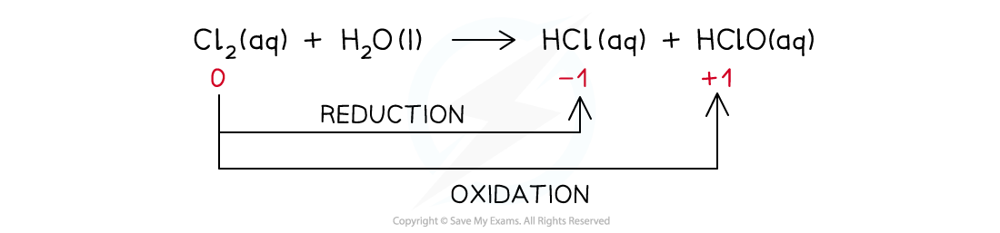

# Redox Reactions of the Halogens

## Redox Reactions of the Halogens

> **Spec point** — `spcpt_BRwWvh3pQJvGbxdM`

## Redox Reactions of the Halogens

#### Reactions with Group 1 & 2 metals

- The halogens react with some metals to form** ionic compounds** which are **metal halide** **salts**
- In all reactions where halogens are reacting with metals, the metals are being oxidised
- Reaction of sodium and chlorine

  - 2Na (s) + Cl2 (g) → 2NaCl (s)
  - Na is being oxidised, the oxidation number is changing from 0 to +1
- Calcium is a group 2 metal:

  - Ca (s) + Br2 (l) → CaBr2 (s)
  - Ca is being oxidised, the oxidation number is changing from 0 to +2
- Therefore the halogens are acting as oxidising agents

#### Reactions with Iron(II)

- Chlorine and bromine can oxidise iron(II) to iron(III)

Cl2 (g) + 2Fe2+ (aq) → 2Cl- (aq) + 2Fe3+ (aq)

Br2 (g) + 2Fe2+ (aq) → 2Br- (aq) + 2Fe3+ (aq)

- However, iodine is not a strong enough oxidising agent to oxidise iron(II) to iron(III)
- Iodine is actually oxidised from iodide ions to iodine by iron(III)

2I- (aq) + 2Fe3+ (aq) → I2 (aq) + 2Fe2+ (aq)

#### Disproportionation reaction

- A **disproportionation** **reaction** is a reaction in which the same species is both oxidised and reduced
- The reaction of **chlorine **with **dilute alkali** is an example of a disproportionation reaction
- In these reactions, the chlorine gets oxidised and reduced at the same time
- Different reactions take place at different **temperatures **of the dilute alkali

#### Chlorine in cold alkali (15 oC)

- The reaction that takes place is:

- The ionic equation is:

- The ionic equation shows that the chlorine gets both oxidised and reduced
- Chlorine gets oxidised as there is an increase in ox. no. from 0 to +1 in ClO-(aq)

  - The half-equation for the oxidation reaction is:

- Chlorine gets reduced as there is a decrease in ox. no. from 0 to -1 in Cl-(aq)

  - The half-equation for the reduction reaction is:

#### Chlorine in hot alkali (70 oC)

- The reaction that takes place is:

- The ionic equation is:

- The ionic equation shows that the chlorine gets both oxidised and reduced
- Chlorine gets oxidised as there is an increase in ox. no. from 0 to +5 in ClO3-(aq)

  - The half-equation for the oxidation reaction is:

- Chlorine gets reduced as there is a decrease in ox. no. from 0 to -1 in Cl-(aq)

  - The half-equation for the reduction reaction is:

#### Drinking water

- Chlorine can be used to clean water and make it drinkable
- The reaction of chlorine in water is a **disproportionation reaction **in which the chlorine gets both **oxidised **and **reduced**

***The disproportionation reaction of chlorine with water in which chlorine gets reduced to HCl and oxidised to HClO***

- Chloric(I) acid (HClO) **sterilises **water by killing **bacteria**
- Chloric acid can further dissociate in water to form ClO-(aq):

**HClO (aq) → H****+ ****(aq) + ClO****- ****(aq)**

- ClO-(aq) also acts as a **sterilising agent **cleaning the water
