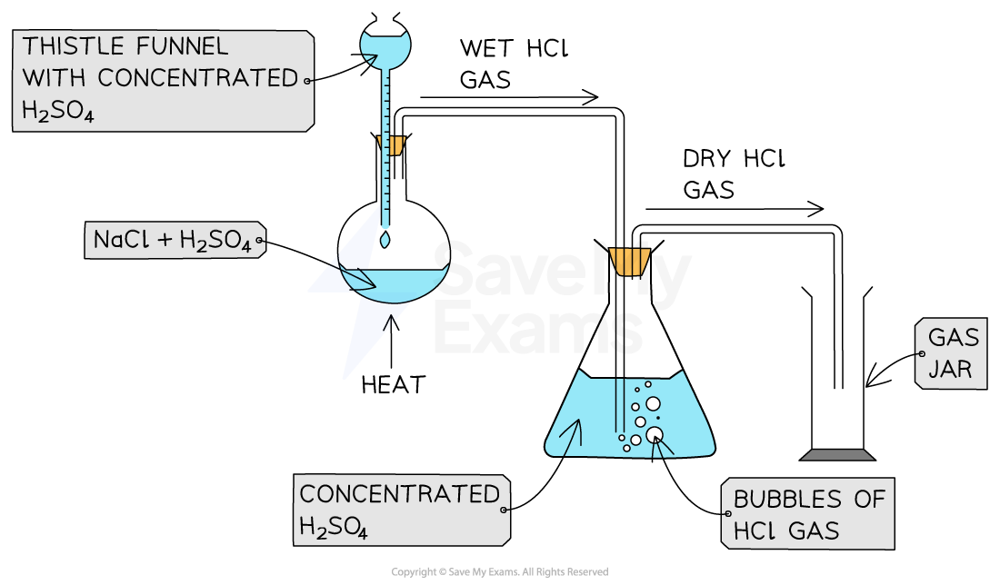
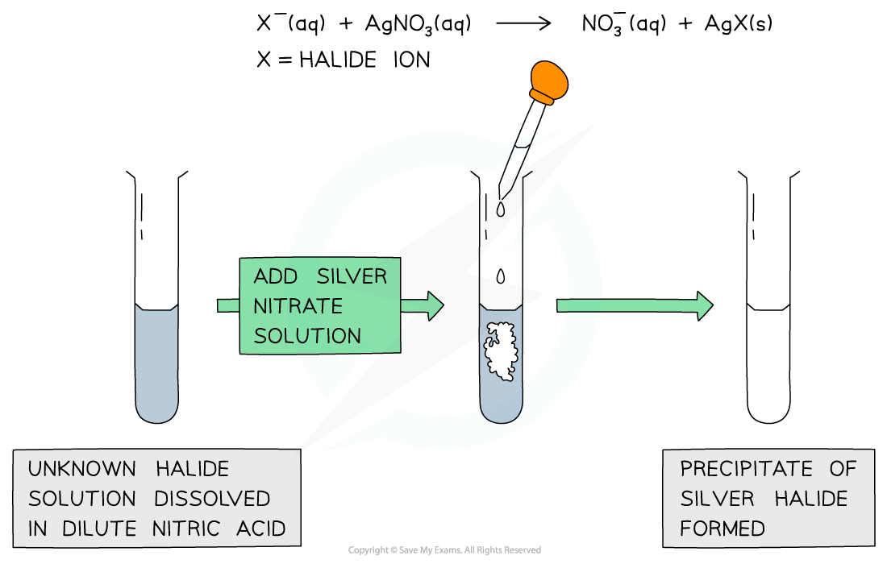
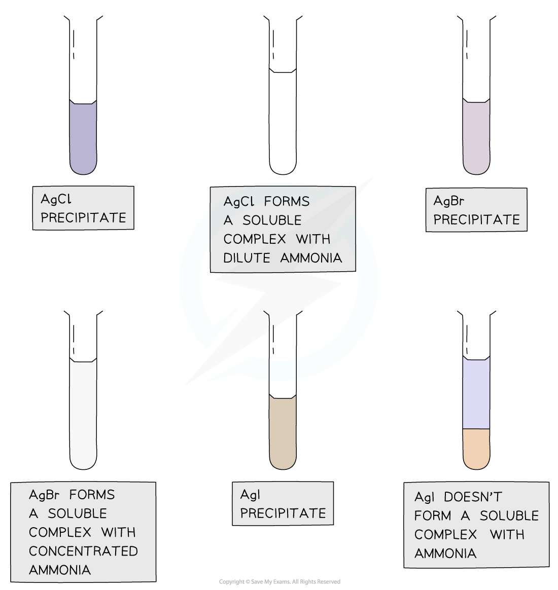

# Other Reactions of the Halogens

## Other Reactions of the Halogens

> **Spec point** — `spcpt_CwwwrCZhYGP3ftjJ`

## Other Reactions of the Halogens

#### Concentrated sulfuric acid

- Chloride, bromide and iodide ions react with concentrated sulfuric acid to produce **toxic gases**
- These reactions should therefore be carried out in a fume cupboard
- The general reaction of the halide ions with concentrated sulfuric acid is:

**H****2****SO****4****(l) + X****-****(aq) → HX(g) + HSO****4****-****(aq)**

(general equation)

Where **X****-** is the halide ion

#### Reaction of chloride ions with concentrated sulfuric acid

- Concentrated sulfuric acid is dropwise added to sodium chloride crystals to produce **hydrogen chloride gas**

***Apparatus set up for the reaction of sodium chloride with concentrated sulfuric acid***

- The reaction that takes place is:

**H****2****SO****4 ****(l) + NaCl (s) → HCl (g) + NaHSO****4 ****(s)      **

- The HCl gas produces is seen as **misty fumes **

#### Reaction of bromide ions with concentrated sulfuric acid

- The **thermal stability **of the hydrogen halides decreases down the group
- The reaction of sodium bromide and concentrated sulfuric acid is:

**H****2****SO****4 ****(l) + NaBr (s) → HBr (g) + NaHSO****4 ****(s)     **

- The concentrated sulfuric acid **oxidises **HBr which decomposes into **bromine **and **hydrogen gas **and sulfuric acid itself is **reduced **to **sulfur** **dioxide** **gas**:

**2HBr (g) + H****2****SO****4 ****(l) → Br****2 ****(g) + SO****2 ****(g) + 2H****2****O (l)**

- The bromine is seen as a **reddish-brown gas**

#### Reaction of iodide ions with concentrated sulfuric acid

- The reaction of sodium iodide and concentrated sulfuric acid is:

**H****2****SO****4 ****(l) + NaI (s) → HI (g) + NaHSO****4 ****(s)          **

- **Hydrogen iodide **decomposes the **easiest**
- Sulfuric acid oxidises the hydrogen iodide to several extents:
- The concentrated sulfuric acid **oxidises **HI and is itself **reduced **to **sulfur** **dioxide** **gas**:

**2HI (g) + H****2****SO****4 ****(l) → I****2 ****(g) + SO****2 ****(g) + 2H****2****O (l)**

- Iodine is seen as a violet/purple vapour
- The concentrated sulfuric acid **oxidises **HI and is itself **reduced **to **sulfur**:

**6HI (g) + H****2****SO****4 ****(l) → 3I****2 ****(g) + S (s) + 4H****2****O (l)**

- Sulfur is seen as a **yellow solid**
- The concentrated sulfuric acid **oxidises **HI and is itself **reduced **to **hydrogen sulfide**:

**8HI (g) + H****2****SO****4 ****(l) → 4I****2 ****(g) + H****2****S (s) + 4H****2****O (l)**

- Hydrogen sulfide has a **strong smell of bad eggs**

#### Further redox reaction involving sulfur dioxide

- HI is such a strong reducing agent that it can reduce sulfur dioxide, SO2, further to hydrogen sulfide, H2S

** SO****2**** (g) + 6HI (g) → H****2****S (g) + 3I****2**** (s) + 2H****2****O (l)**

- Sulfur is reduced from +4 in SO₂ to –2 in H2S, a gain of 6 electrons:

  - This demonstrates reduction
- The iodide ion is oxidised to iodine (I2), seen as purple vapour
- The bad egg smell of H2S confirms the presence of this gas
- This final step highlights the maximum reducing power of iodide ions, not seen with Cl⁻ or Br⁻

#### Halide ion Reactions with Concentrated Sulfuric Acid Table

| Halide ion | Reaction with conc H2SO4 | Observations |
|---|---|---|
| Cl- (aq) | H2SO4 (l) + NaCl (s) → HCl (g) + NaHSO4 (s) | Misty fumes of HCl gas |
| Br- (aq) | H2SO4 (l) + NaBr (s) → HBr (g) + NaHSO4 (s)  H2SO4 (l) + 2HBr (g) → Br2 (g) + SO2 (g) + 2H2O (l) | Misty fumes of HBr gas  Choking gas of SO2 and reddish brown gas of Br2 |
| I- (aq) | H2SO4 (l) + NaI (s) → HI (g) + NaHSO4 (s)  H2SO4 (l) + 2HI (g) → I2 (s) + SO2 (g) + 2H2O (l)  H2SO4 (l) + 6HI (g) → 3I2 (s) + S (s) + 4H2O (l)  H2SO4 (l) + 8HI (g) → 4I2 (s) + H2S (g) + 4H2O (l) | Misty fumes of HI gas  Choking gas of SO2 and purple vapour of I2  Yellow solid of S (s)  Strong, bad egg smell of H2S (g) |

#### Explaining the Trend in Reducing Ability of Halide Ions

- As you go down Group 7, the halide ions get bigger (Cl⁻ → Br⁻ → I⁻)
- So, the attraction between the outer electrons and the nucleus gets weaker
- This makes it easier for the larger halide ions to lose electrons
- When they lose electrons, they reduce other substances,
- So the reducing power increases down the group:

  - Cl⁻ < Br⁻ < I⁻

#### Silver ions & ammonia

- Halide ions can be identified in an **unknown** **solution** by dissolving the solution in **nitric acid **and then adding a **silver nitrate solution **followed by **ammonia **solution
- The halide ions will react with the silver nitrate solution as follows:

**AgNO****3 ****(aq) + X****- ****(aq) → AgX (s) + NO****3****- ****(aq)**

**Ag****+ ****(aq) + X****- ****(aq) → AgX (s)**

- **X****-** is the halide ion in both equations
- If the unknown solution contains halide ions, then a **precipitate** of the **silver halide** will be formed (AgX)

***A silver halide precipitate is formed upon addition of silver nitrate solution to halide ion solution***

- **Dilute **followed by **concentrated ammonia** is added to the silver halide solution to identify the halide ion
- If the precipitate dissolves in **dilute **ammonia the unknown halide is **chloride**
- If the precipitate does not dissolve in dilute but in **concentrated **ammonia the unknown halide is **bromide**
- If the precipitate does not dissolve in **dilute **nor **concentrated **ammonia the unknown halide is iodide

***Silver chloride and silver bromide precipitates dissolve on addition of ammonia solution whereas silver iodide doesn’t***

#### Reaction of Halide Ions with Silver Nitrate & Ammonia Solutions Table

| Halide ion | Colour of Silver Halide Solution | Effect of adding dil. NH3 | Effect of adding conc. NH3 |
|---|---|---|---|
| Cl- (aq) | White | Dissolves | Dissolves |
| Br- (aq) | Cream | Insoluble | Dissolves |
| I- (aq) | Pale yellow | Insoluble | Insoluble |

#### Reactions with hydrogen halides

- When a halogen reacts with hydrogen a hydrogen halide is produced, for example:

  - **Cl****2**** (g) + H****2**** (g) → 2HCl (g) **
- These hydrogen halides react with ammonia gas to form **ammonium halides**

  - **NH****3**** (g) + HCl (g) → NH****4****Cl (s) **
- Hydrogen halides will also react with water
- For example, hydrogen chloride also dissolves in water to form **hydrochloric acid**

  - **HCl (g) → H****+ ****(aq) + Cl****-**** (aq) **

## Fluorine & Astatine

> **Spec point** — `spcpt_T89ngqPrMg7VGPPR`

## Fluorine & Astatine

**Fluorides and Astatides **

- If you are asked to predict reactions of fluorides and astatides that you are not familiar with you can use the information about Group 7 to help

- There are, however, exceptions to some of the reactions

  - For example, silver fluoride is soluble, so we can not used acidified silver nitrate to test for the presence of fluoride ions
  
    - Ag+ (aq) + F- (aq) → AgF (aq)

> **Worked Example**
> Write an equation to show the formation of an acid when hydrogen astatide is added to water.
> 
> **Answer:**
> 
> - Based on the reaction of hydrogen iodide with water:
> 
>   - HI (g) + H2O (g) → H3O+ (aq) + I– (aq)
> 
>   - So, hydrogen astatide must be:
>   
>     - **HAt (g) + H****2****O (g) → H****3****O****+**** (aq) + At****–**** (aq) **
