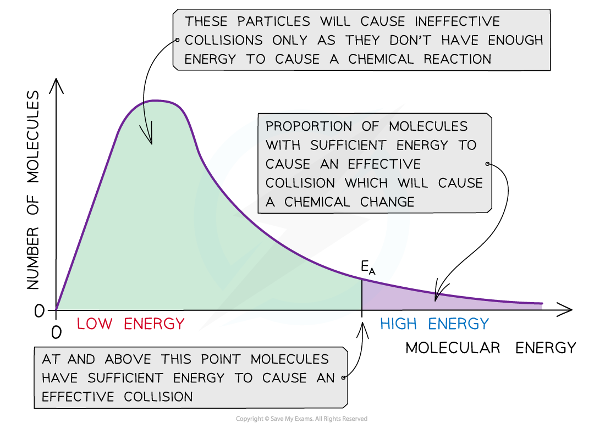
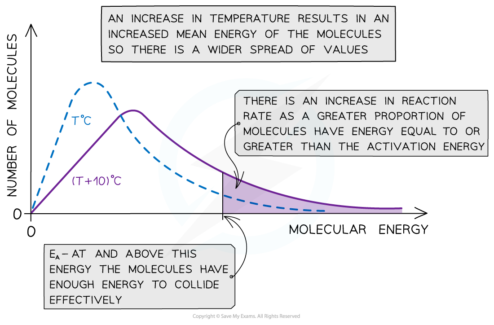

# Maxwell-Boltzmann Distributions

## Maxwell-Boltzmann & Temperature

> **Spec point** — `spcpt_Kb4HBx3RvBjpkVVP`

## Maxwell-Boltzmann & Temperature

#### Maxwell-Boltzmann distribution curve

- A** Maxwell-Boltzmann distribution curve** is a graph that shows the distribution of **energies** at a certain **temperature**
- In a sample of a gas, a few particles will have very low energy, a few particles will have very high energy, but most particles will have energy in between

***The Maxwell-Boltzmann distribution curve shows the distribution of the energies and the activation energy***

- The graph shows that only a small proportion of molecules in the sample have enough energy for an **effective collision **and for a **chemical reaction **to take place

#### Changes in temperature

- When the temperature of a reaction mixture is increased, the particles gain more kinetic energy
- This causes the particles to move around faster resulting in more **frequent collisions**
- Furthermore, the proportion of **successful collisions **increases, meaning a higher **proportion **of the particles possess the minimum amount of energy (activation energy) to cause a chemical reaction
- With higher temperatures, the Boltzmann distribution curve **flattens **and the peak **shifts **to the right

***The Maxwell-Boltzmann distribution curve at T ******o******C and when the temperature is increased by 10 ******o******C***

- Therefore, an increase in temperature causes an increased rate of reaction due to:

  - There being **more effective collisions** as the particles have **more kinetic energy**, making them move around faster
  - A **greater proportion** of the molecules having **kinetic energy** greater than the **activation energy**
