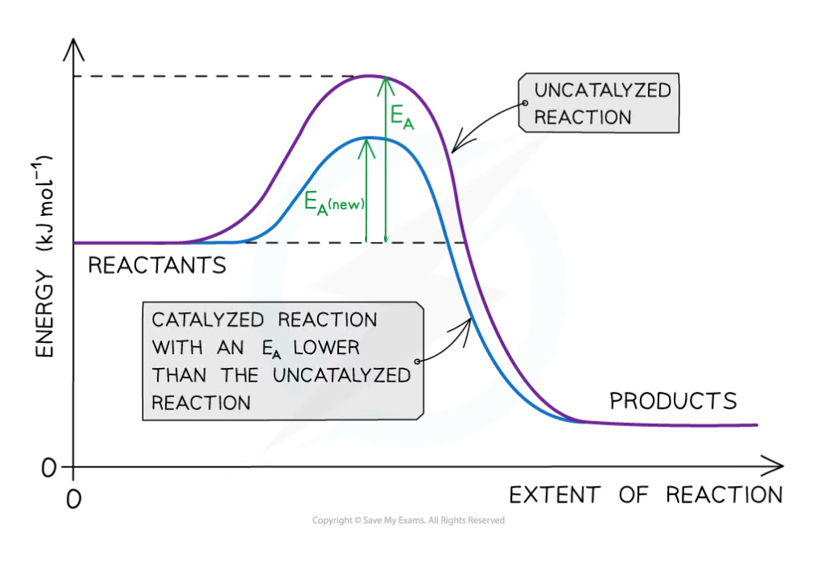
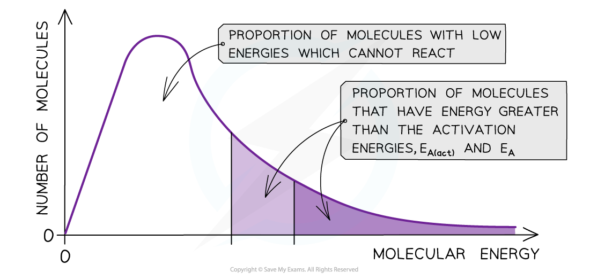

# Catalysts & Energy

## Reaction Profiles & Maxwell-Boltzmann

> **Spec point** — `spcpt_j35wCSyZVtmP6t9M`

## Reaction Profiles & Maxwell-Boltzmann

- **Catalysis** is the process in which the rate of a chemical reaction is increased, by adding a **catalyst**
- A catalyst increases the rate of a reaction by providing the reactants with an **alternative reaction pathway** which is **lower in activation energy** than the uncatalysed reaction
- There are three main advantages to using catalysts in chemical reactions:

  1. They increase the rate of reaction which means that more product is potentially made in a given amount of time
  2. They reduce energy costs as the reaction can happen at lower temperatures and pressures
  3. They can increase atom economy as the alternative reaction pathway that they provide can reduce the unwanted reactions and, in some cases, even reduce the amount of other products, e.g. the use of zeolites in the synthesis of phenol
- Catalysts can be divided into two types:

  - Homogeneous catalysts
  - Heterogeneous catalysts
- **Homogeneous** means that the catalyst is in the **same phase** as the reactants

  - For example, the reactants and the catalysts are all in solution
- **Heterogeneous** means that the catalyst is in a **different phase** to the reactants

  - For example, the reactants are gases but the catalyst used is a solid
  - This type of catalyst is the most common in industry

***The diagram shows that the catalyst allows the reaction to take place through a different mechanism, which has a lower activation energy than the original reaction***

#### Maxwell-Boltzmann distribution curve

- **Catalysts** provide the reactants another pathway which has a lower activation energy
- On the graph below, the original number of successfully reacting particles is shown by the dark shaded area
- By lowering *E**a**, *a **greater proportion **of molecules in the reaction mixture have the activation energy, and therefore have sufficient energy for an **effective collision**

  - This is shown by the combined number of particles in the light and dark shaded areas
- As a result of this, the rate of the catalysed reaction is increased compared to the uncatalysed reaction

***The diagram shows that the total shaded area (both dark and light shading) under the curve shows the number of particles with energy greater than the E******a****** when a catalyst is present. This area is much larger than the dark shaded area which shows the number of particles with energy greater than the E******a****** without a catalyst***
