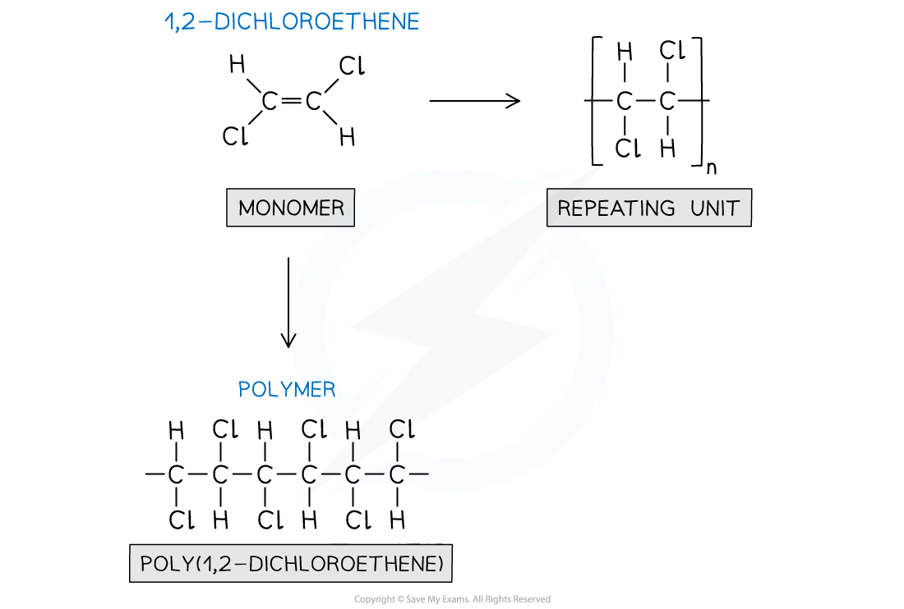

# Types of Reaction

## Types of Reaction 

> **Spec point** — `spcpt_XGKc9Z9sxvKDRKBb`

## Types of Reaction

- Reactions can be classified as:

  - Addition
  - Elimination
  - Substitution
  - Oxidation
  - Reduction
  - Hydrolysis
  - Polymerisation

#### Addition reactions

- These involve two reactants combining to form one product
- The most common example of an addition reaction involves alkenes, e.g.

C2H4 + H2 → C2H6

C2H4 + Br2 → C2H4Br2

C2H4 + H2O → C2H5OH

#### Elimination reactions

- These are usually identified by one or two reactants forming more products

  - The products often include an alkene and a smaller molecule that has been eliminated from the reactant, e.g.

CH3CH2Br + OH- $\overset{H^{+}}{\rightarrow}$C2H4 + H2O + Br–

#### Substitution reactions

- An atom or group of atoms in a compounds is replaced by another atom or group of atoms, e.g.

CH3CH2Br + OH- → C2H5OH + Br–

#### Oxidation reactions

- This can involve the loss of hydrogen or the gain of oxygen
- A reactant is oxidised by another chemical species, usually an inorganic reagent, e.g.

CH3CHO + [O] → CH3COOH

- In this example, the oxidising agent [O] could be acidified potassium dichromate(VI) solution, Fehling's solution or Tollens' reagent

#### Reduction reactions

- This can involve the gain of hydrogen or the loss of oxygen
- A reactant is reduced by another chemical species

  - This can often be completed using a catalyst and a small reactant molecule such as H2 or HCl, e.g.

CH3CHO + [H] → CH3CH2OH

- In this example, the oxidising agent [H] could be lithium aluminium hydride

#### Hydrolysis reactions

- The name can be misleading as hydrolysis suggests that water is being used to split (or lyse) a compound
- Hydrolysis reactions are a specific reaction with water, e.g.

CH3Cl + H2O → CH3OH + HCl

#### Polymerisation reactions

- At AS level, you should know about **addition polymerisation**
- This is where the carbon-carbon double bond of an alkene monomer breaks open and forms a polymer chain, e.g.

***Addition polymerisation of one alkene monomer is polymerised, a (poly)alkene is formed***
