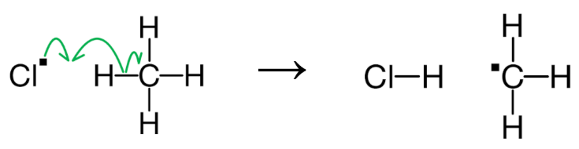
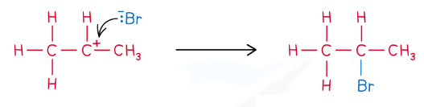

# Reaction Mechanisms: Introduction

## Reaction Mechanisms - Introduction

> **Spec point** — `spcpt_yg7yHRh9tydMT4Qf`

## Reaction Mechanisms - Introduction

- Reaction equations tell you about the amount of reactants and products, including their stoichiometry, in a reaction
- Reaction mechanisms tell you about how the reaction actually takes place

- In a reaction mechanism, curly arrows show the movement of electrons

  - Curly arrows can be single headed, sometimes called fish-hook arrows or half curly arrows, to show the movement of one electron which can occur when:
  
    - A covalent bond undergoes **homolytic fission** to form two radicals
    - Two radicals **terminate** forming a covalent bond in the process
    - A radical and a covalent compound **propagate** as part of a reaction, as shown:

***During this propagation step, the unpaired electron from chlorine and one of the electrons from the C-H bond react together to form a new covalent bond and the other electron from the C-H bond moves to form a methyl radical***

> **Exam Hint**
> The use of single headed arrows is not required knowledge Their main use is in free radical reactions which are usually represented using written equations rather than outlined mechanisms

- Curly arrows can be double headed to show the movement of a pair of electrons, which can occur when:

  - A covalent bond undergoes fission to form a positive and a negative ion
  - The positive ion is electron deficient and is an electrophile
  - The negative ion is electron rich and is a nucleophile
  - A lone pair of electrons attacks a positive or δ+ centre and forms a new covalent bond, as shown:

***During this step of an addition reaction, the lone pair from the bromide ion reacts with the positive carbocation to form a new covalent bond***

- Curly arrows are a feature of three main types of reaction:

  1. **Addition **reactions - where two reactants combine to form one product, e.g. ethene and bromine undergoing addition to form 1,2-dibromoethane
  2. **Substitution **reactions - where an atom or group of atoms in a compounds is replaced by another atom or group of atoms, e.g. bromoethane reacting with the hydroxide ion to form ethanol and the bromide ion
  3. **Elimination** reactions - where a small molecule is removed from a larger molecule, e.g. ethanol reacting with an acid catalyst to form ethene alongside a small molecule of water which is eliminated

## Bond Polarity & Mechanisms

> **Spec point** — `spcpt_dTG2JRDyyqq9WG4Y`

## Bond Polarity & Mechanisms

- Bond polarity can be used to suggest reaction mechanisms

C2H6 + Cl2 → C2H5Cl + HCl

- A hydrogen atom in ethane is **substituted **by a chlorine atom

  - All of the bonds in the reaction of ethane with chlorine are either **non-polar** or only slightly polar
  - This suggests that the type of bond breaking will be **homolytic **fission
  - The reaction is likely to involve **free radicals**
  - Therefore, the reaction mechanism is likely to be **free radical substitution**

C2H4 + HBr → C2H5Br

- The hydrogen bromide is **added** to the ethene molecule

  - The hydrogen bromide molecule contains a **polar **bond
  - This suggests that the type of bond breaking will be **heterolytic **fission
  - The reaction could involve **electrophiles **or **nucleophiles**
  - The ethene molecule contains a **carbon-carbon double bond **which will attract an electrophile
  - Therefore, the reaction mechanism is most likely to be **electrophilic addition**
