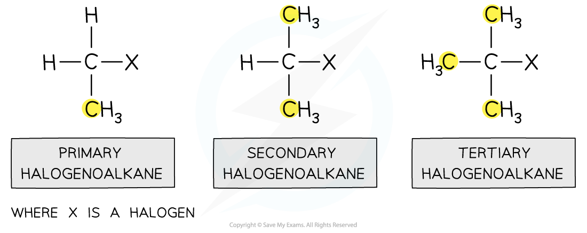

# Halogenoalkanes - Introduction

## Halogenoalkanes - Introduction

> **Spec point** — `spcpt_2PzxwKRfDZ8V3ZsD`

## Halogenoalkanes - Introduction

#### Naming halogenoalkanes

- We use the prefixes

  - **Fluoro** for fluorine
  - **Chloro** for chlroine
  - **Bromo** for bromine
  - **Iodo** for iodine
- The name of the halogenoalkane is based on the orignal alkane

  - So CH3CH2CH2Br would be 1-bromopropane
- The position of the halogen atom must be taken into account

  - So CH3CH(Br)CH3 would be 2-bromopropane
- Finally the substituents are listed alphabetically

  - So  CH3CH(Cl)CH2Br would be 1-bromo-2-chloropropane

#### Classifying halogenoalkanes

- Halogenoalkanes can be classified as **primary**, **secondary** or **tertiary** depending on the number of carbon atoms attached to the C-X functional group

  - A **primary halogenoalkane **is when a halogen is attached to a carbon that itself is attached to one other alkyl group
  - A **secondary halogenoalkane **is when a halogen is attached to a carbon that itself is attached to two other alkyl groups
  - A **tertiary halogenoalkane **is when a halogen is attached to a carbon that itself is attached to three other alkyl groups

***Primary, secondary and tertiary halogenoalkanes***

> **Exam Hint**
> You are also expected to be able to draw structural, displayed and skeletal formulae of halogenoalkanes
