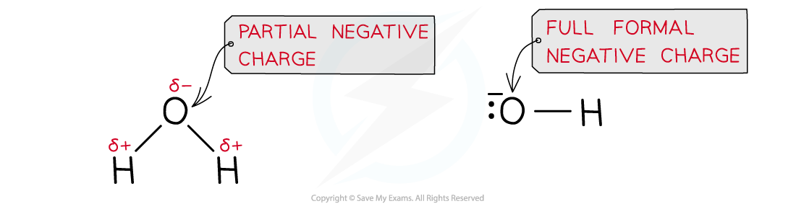
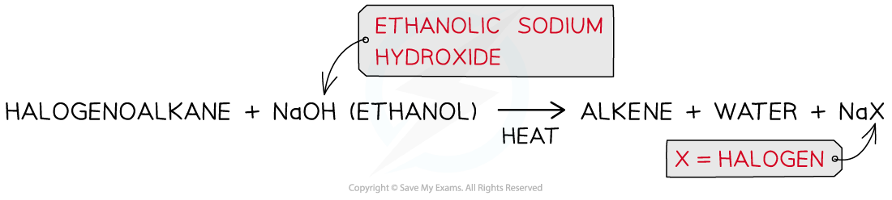
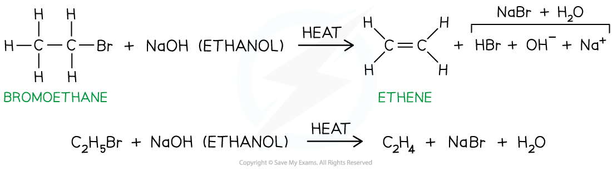

# Reactions of Halogenoalkanes

## Halogenoalkanes - Reactions 

> **Spec point** — `spcpt_cpSWwGnKYKSzXCSG`

## Halogenoalkanes - Reactions

- A **nucleophile** is an electron-rich species that can **donate** a pair of electrons

  - ‘Nucleophile’ means ‘nucleus / positive charge loving’ as nucleophiles are attracted to positively charged species
  - **Nucleophilic **refers to reactions that involve a nucleophile

#### Formation of alcohols

- The nucleophile in this reaction is the **hydroxide ion**, **OH****-**** **
- An aqueous solution of sodium hydroxide (NaOH) or potassium hydroxide (KOH) is used, with a small amount of ethanol as a co-solvent to help dissolve the halogenoalkane

  - Water must be the primary solvent,  if ethanolic conditions are  used instead, elimination will occur, forming an alkene

- This reaction is very slow at room temperature, so the reaction mixture is warmed
- This is an example of a **hydrolysis reaction** and the product is an alcohol

  - The rate of this reaction depends on the type of halogen in the halogenoalkane
  - The stronger the C-X bond, the slower the rate of the reaction
  - In terms of bond enthalpy, C-F > C-Cl > C-Br > C-I
  - Fluoroalkanes do not react at all, but iodoalkanes have a very fast rate of reaction

***The halogen is replaced by the nucleophile, OH******-****** ***

- This reaction could also be done with water as the nucleophile, but it is very slow

  - The hydroxide ion is a better nucleophile than water as it carries a full negative charge
  - In water, the oxygen atom only carries a partial charge

***A hydroxide ion is a better nucleophile as it has a full formal negative charge whereas the oxygen atom in water only carries a partial negative charge; this causes the nucleophilic substitution reaction with water to be much slower than the aqueous alkali***

**Reaction with water **

- The water molecule is a weak nucleophile, but it will eventually substitute for the halogen
- This occurs much more slowly compared to when warm aqueous sodium hydroxide is used
- An alcohol is produced

  - **RX + H****2****O → ROH + H****+**** + X****-**
  - **CH****3****CH****2****Br + H****2****O → CH****3****CH****2****OH + H****+**** + Br****-**
- If silver nitrate solution in ethanol is added to the solution, the silver ions will react with the halide ions as soon as they form, giving a silver halide precipitate

  - **Ag****+ ****(aq) + X****-**** (aq) → AgX (s) **

#### Formation of nitriles

- The nucleophile in this reaction is the **cyanide ion, CN****-**** **
- An **ethanolic solution** of **potassium** **cyanide** (KCN in ethanol) is **heated** **under** **reflux** with the halogenoalkane
- The product is a **nitrile**

  - E.g. bromoethane is heated under reflux with ethanolic potassium cyanide to form propanenitrile

***The halogen is replaced by a cyanide group, CN ******-***

- The nucleophilic substitution of halogenoalkanes with KCN adds an **extends the carbon chain** by adding an extra carbon atom
- This reaction can therefore be used by chemists to make a compound with one more carbon atom than the best available organic starting material

#### Formation of primary amines by reaction with ammonia

- The nucleophile in this reaction is the ammonia molecule, NH3
- An** ethanolic** **solution** of **excess **ammonia (NH3 in ethanol) is **heated** **under pressure **with a **primary **halogenoalkane

  - An excess of ammonia is used because the product is more reactive than ammonia so further substitution reactions could occur
- The product is a **primary amine**

  - E.g. bromoethane reacts with excess ethanolic ammonia when heated under pressure to form ethylamine

***The halogen is replaced by an amine group, NH******2***

#### Formation of alkenes

- The halogenoalkanes are **heated **with **ethanolic sodium hydroxide **causing the C-X bond to break **heterolytically, **forming an X- ion and leaving an alkene as an organic product

  - E.g. bromoethane is heated with ethanolic sodium hydroxide to form ethene

***Production of an alkene from a halogenoalkane by reacting it with ethanolic sodium hydroxide and heating it***

***Hydrogen bromide is eliminated to form ethene***
