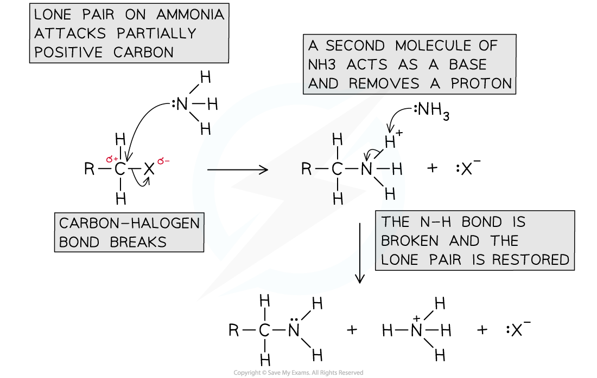

# The Nucleophilic Substitution Mechanism

## Nucleophilic Substitution - Mechanism

> **Spec point** — `spcpt_Hq2PRNpPzc5YRhpY`

## Nucleophilic Substitution - Mechanism

- A **nucleophilic substitution **reaction is one in which a **nucleophile **attacks a carbon atom which carries a **partial** **positive** **charge**
- An atom that has a **partial** **negative** **charge** is replaced by the nucleophile
- Halogenoalkanes will undergo nucleophilic substitution reactions due to the polar C-X bond (where X is a halogen)

***Due to large differences in electronegativity between the carbon and halogen atom, the C-X bond is polar***

#### Mechanism with aqueous potassium hydroxide

- In the following reaction a halogenoalkane reacts with aqueous alkali to form an alcohol

***The halogen is replaced by a nucleophile, OH******–***

- The mechanism for the reaction is as follows

***Nucleophilic substitution reaction of bromoethane and aqueous alkali (e.g. NaOH)***

#### Mechanism with ammonia

- When ammonia reacts with a haloalkane a nucleophilic substitution reaction takes place forming a primary amine

  - For example chloromethane reacts with ammonia in two steps to make methylamine and ammonium chloride

**CH****3****Cl + NH****3**** → [CH****3****NH****3****]****+****Cl****-**

**[CH****3****NH****3****]****+****Cl****-**** + NH****3**** → CH****3****NH****2**** + NH****4****+Cl****-**

- **Excess** ammonia is used to prevent further substitution and favour the formation of a primary amine

***The mechanism of nucleophilic substitution between ammonia and a halogenoalkane***
