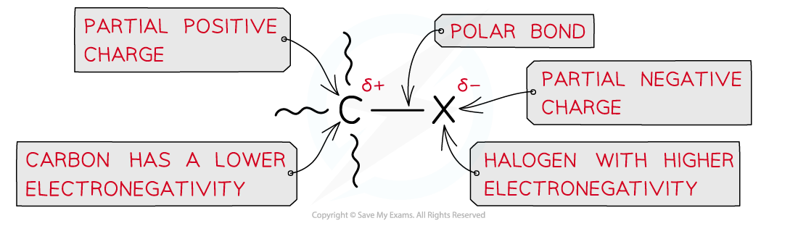
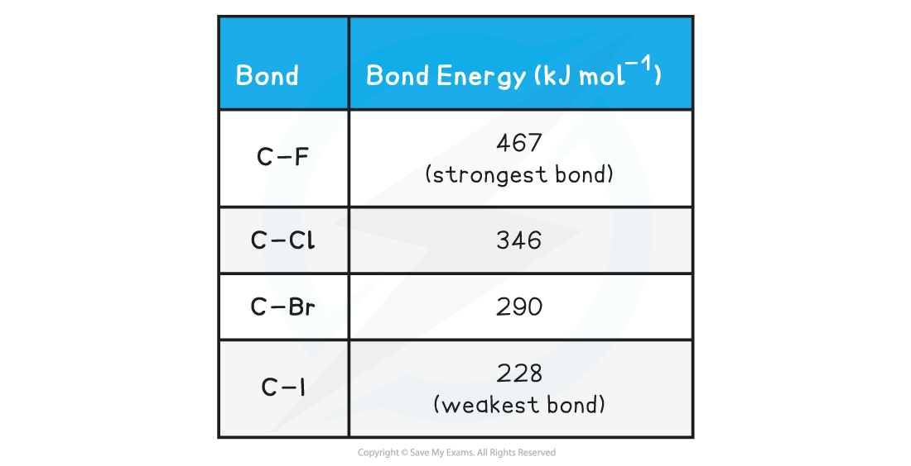

# Trends in Halogenoalkanes

## Reactivity & Bond Enthalpy

> **Spec point** — `spcpt_Dj6XtMGhMdN3GdPK`

## Reactivity & Bond Enthalpy

- Halogenoalkanes contain at least one halogen atom covalently bonded to a carbon atom within the molecules structure
- Due to the difference in electronegativity between the halogen and carbon atoms:

  - The carbon-halogen, C-X, bond is polar
  - The carbon atom has a δ+ charge
  - The halogen atom has a δ– charge

***Due to large differences in electronegativity between the carbon and halogen atom, the C-X bond is polar***

- As the electronegativity down the group decreases, so does the polarity of the bond

  - This suggests that fluoroalkanes would be the quickest to react but the strength of the bond is another important and greater factor

#### Bond Enthalpy

- The halogenoalkanes have different **rates** of **substitution** **reactions**
- Since substitution reactions involve **breaking** the **carbon-halogen** bond the **bond** **energies **can be used to explain their different reactivities

#### Halogenoalkane Bond Energy

- The table above shows that the C-I bond requires the least energy to break, and is therefore the **weakest** carbon-halogen bond
- During substitution reactions, the C-I bond of the halogenoalkane will therefore **heterolytically** break to form the alcohol

  - For example

**CH****3****CH****2****I + OH****- ****→ CH****3****CH****2****OH + I****-**

- The C-F bond, on the other hand, requires the most energy to break and is, therefore, the **strongest **carbon-halogen bond
- Fluoroalkanes will, therefore, be less likely to undergo substitution reactions
