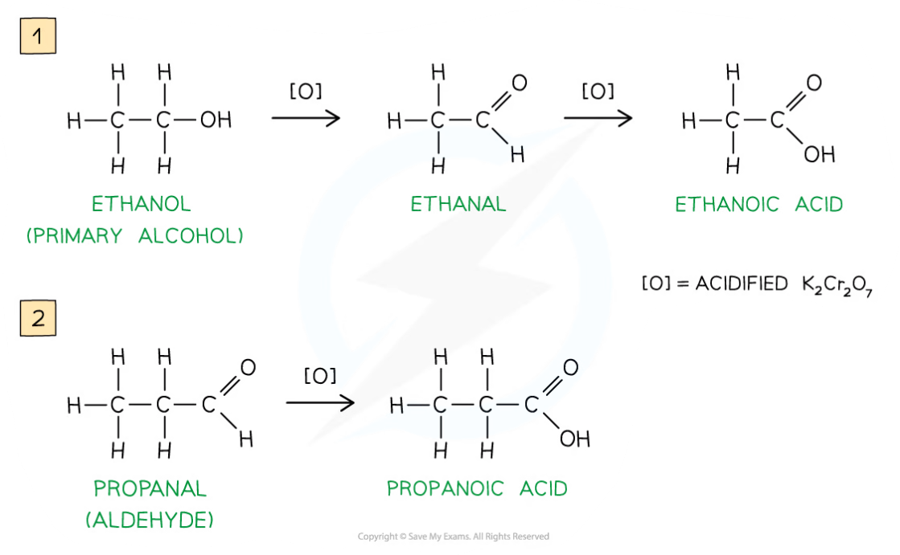
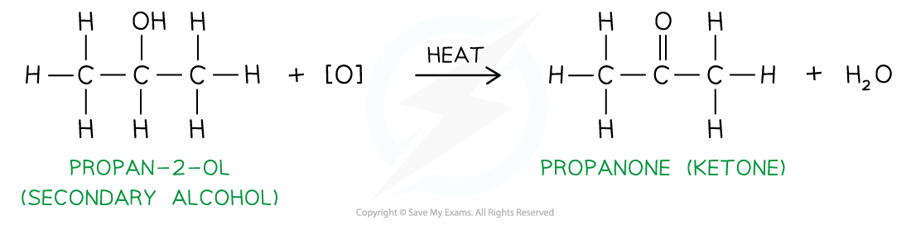
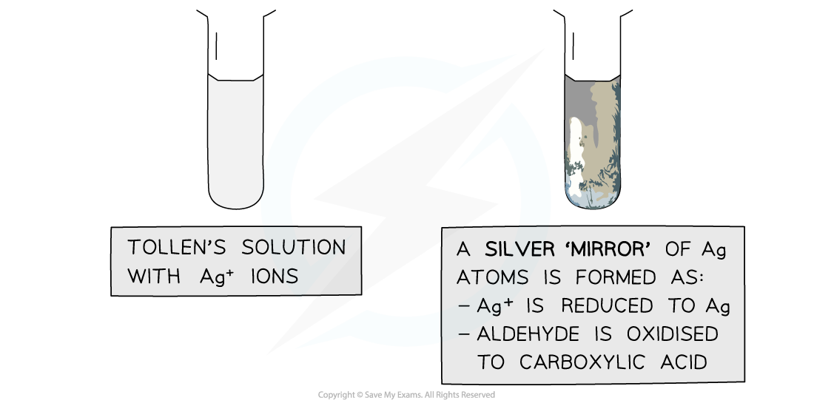
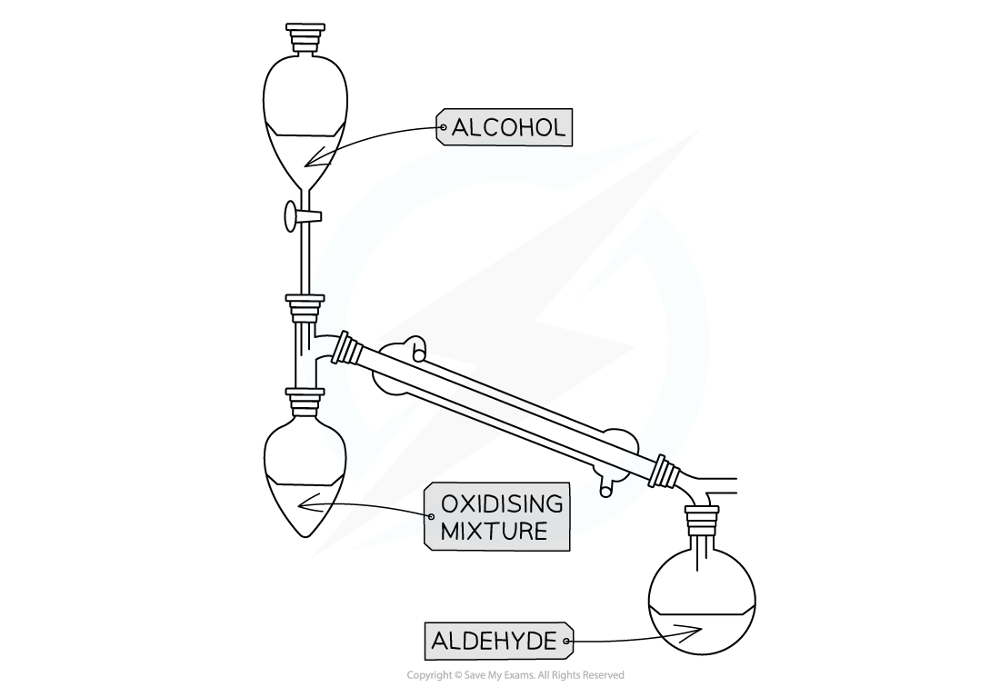

# Oxidation of Alcohols

## Alcohols - Oxidation

> **Spec point** — `spcpt_s2tbsnsfBTgQWs3B`

## Alcohols - Oxidation

#### Oxidation of alcohols

- Primary alcohols can be oxidised to form **aldehydes** which can undergo further oxidation to form **carboxylic** **acids**
- Secondary alcohols can be oxidised to form **ketones **only
- Tertiary alcohols do not undergo oxidation
- The oxidising agents of alcohols include **acidified K****2****Cr****2****O****7**
- **Acidified potassium dichromate(VI)**, K2Cr2O7, is an orange oxidising agent

  - Acidified means that that the potassium dichromate(VI) is in a solution of **dilute** **acid** (such as dilute sulfuric acid)
  - For potassium dichromate(VI) to act as an oxidising agent, it itself needs to be reduced
  - This reduction requires hydrogen (H+) ions which are provided by the acidic medium
  
    - When alcohols are **oxidised **the orange dichromate ions (Cr2O72-) are reduced to green Cr3+ ions
- The primary alcohol is added to the oxidising agent and warmed
- The aldehyde product has a lower boiling point than the alcohol reactant so it can be **distilled off **as soon as it forms
- If the aldehyde is not distilled off, further **refluxing** with excess oxidising agent will oxidise it to a carboxylic acid
- Since ketones cannot be further oxidised, the ketone product does not need to be **distilled off **straight away after it has been formed

***Oxidation Stages of Primary Alcohols***

***Oxidation of propan-2-ol by acidified K******2******Cr******2******O******7****** to form a ketone***

- The presence of an aldehyde group (-CHO) in an **unknown compound **can be determined by the **oxidising agents** Fehling’s and Tollens’ reagents

#### Fehling’s solution

- **Fehling’s solution** is an alkaline solution containing copper(II) ions which act as the oxidising agent
- When **warmed** with an aldehyde, the aldehyde is oxidised to a carboxylic acid and the Cu2+ ions are reduced to Cu+ ions

  - In the alkaline conditions, the carboxylic acid formed will be neutralised to a carboxylate ion (the -COOH will lose a proton to become -COO- )
  - The carboxylate ion (-COO-) will form a salt with a positively charged metal ion such as sodium (-COO-Na+)

- The **clear blue** solution turns **opaque **due to the formation of a **red precipitate**, **copper(I) oxide**
- **Ketones **cannot be oxidised and therefore give a **negative test** when warmed with Fehling’s solution

***The copper(II) ions in Fehling’s solution are oxidising agents, oxidising the aldehyde to a carboxylic acid and getting reduced themselves to copper(I) ions in the Cu******2******O precipitate***

#### Tollens’ reagent

- **Tollens' reagent **is an aqueous alkaline solution of silver nitrate in excess ammonia solution

  - Tollen’s reagent is also called **ammoniacal silver nitrate solution**
- When **warmed** with an aldehyde, the aldehyde is oxidised to a carboxylic acid and the Ag+ ions are reduced to Ag atoms

  - In the alkaline conditions, the carboxylic acid will become a carboxylate ion and form a salt

- The Ag atoms form a silver ‘mirror’ on the inside of the tube
- **Ketones **cannot be oxidised and therefore give a **negative test** when warmed with Tollens’ reagent

***The Ag******+ ******ions in Tollens’ reagent are oxidising agents, oxidising the aldehyde to a carboxylic acid and getting reduced themselves to silver atoms***

#### Different practical techniques

- Because of the easier oxidation of aldehydes compared to alcohols, two different techniques are used

  - Heating under reflux
  - Distillation with addition

#### Heating under reflux

- This technique is used when we want full oxidation

  - Producing a carboxylic acid for a primary alcohol
  - Producing a ketone for a secondary alcohol

***Apparatus set up for heating under reflux***

- This set up means any products of oxidation remain in the reaction mixture
- Products which boil off condense in the vertical condenser then return to the heating flask

#### Distillation with addition

- This technique is used when we do not want to complete oxidation

  - To obtain an aldehyde rather than carboxylic acid for primary alcohol

**Apparatus set up for distillation with addition**

- Only the oxidising agent is heated whilst the alcohol is slowly added
- When the aldehyde is formed it immediately distils off as it has a much lower boiling point than the alcohol used to make it
- The aldehyde is then collected in the reciever
