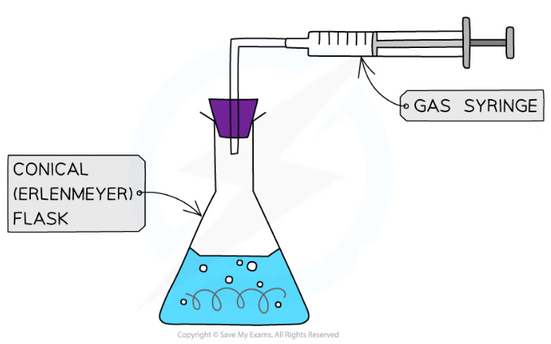
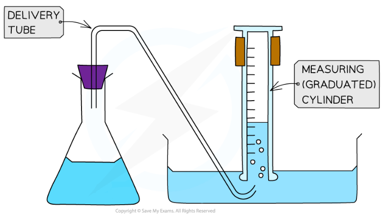
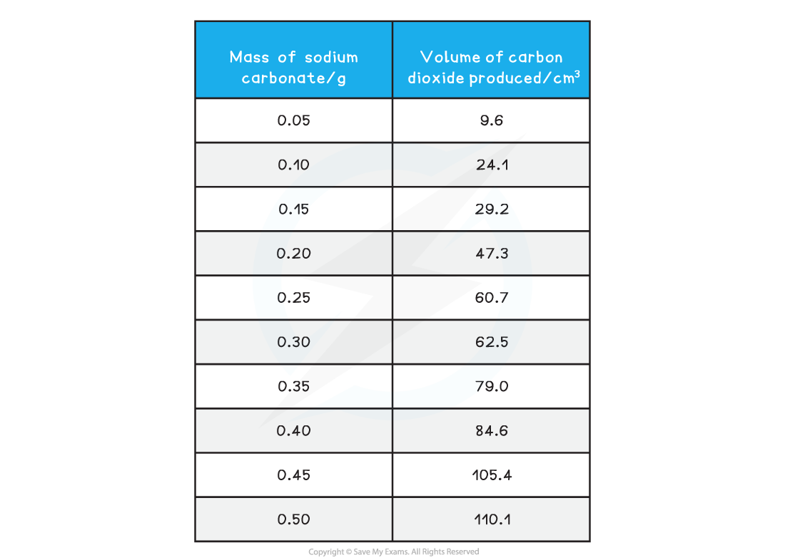
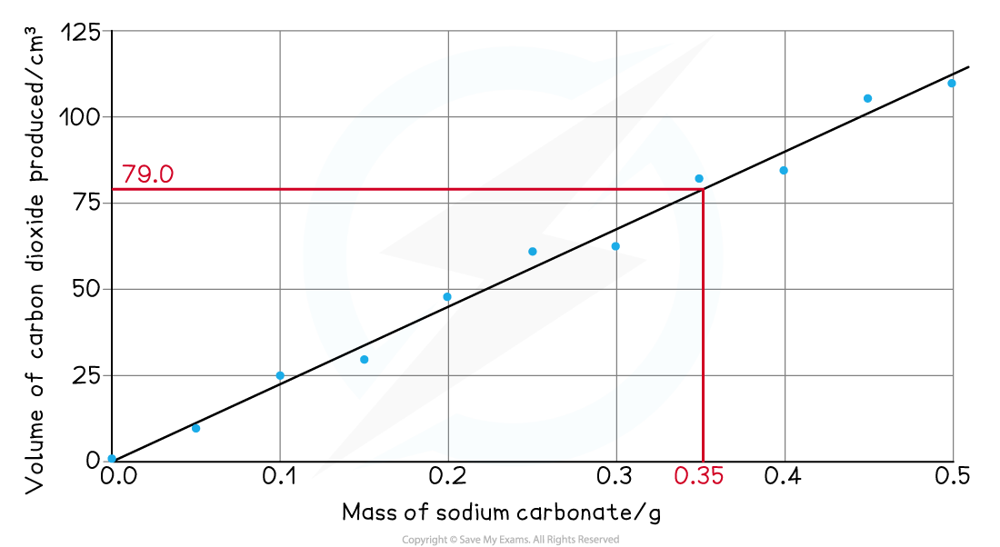
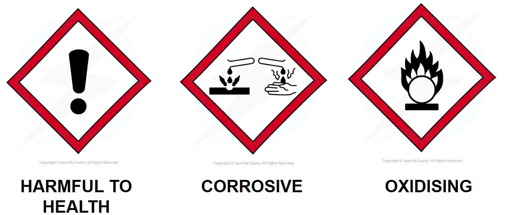

# Molar Volume of a Gas

## Core Practical 1: Measuring the Molar Volume of a Gas

> **Spec point** — `spcpt_TZwYVzXmJDJNrHXx`

## Core Practical 1: Measuring the Molar Volume of a Gas

#### Measuring gas volumes

- The volume of gas produced in a reaction can be measured by collecting the gas with a gas syringe or by the displacement of water

***Gas syringe equipment for collecting the gas produced in a reaction***

***Displacement of water equipment for collecting the gas produced in a reaction***

**Sample method**

- For the reaction of hydrochloric acid and sodium carbonate

**Na****2****CO****3**** (s) + 2HCl (aq) → 2NaCl (aq) + H****2****O (l) + CO****2**** (g)**

1. Measure out a fixed volume of hydrochloric acid, e.g. 25.0 cm3, into a conical flask
2. Add a known mass of sodium carbonate, e.g. 0.05 g, to the conical flask
3. Immediately connect the gas syringe delivery tube
4. Allow the reaction to go to completion
5. Record the volume of carbon dioxide produced
6. Repeat the experiment with different masses of sodium carbonate, e.g. 0.10 g, 0.15 g, 0.20 g, 0.25 g... 0.50 g
7. Some assumptions are made about the experiment:

  - The amount of gas lost between adding the sodium carbonate and connecting the delivery tube is negligible
  - The delivery tube set up is airtight so no gas is lost
  - The reaction does go to completion

#### Sample results

**Mass Volume Results Table**

- The results are then plotted on to a graph

  - Mass of sodium carbonate on the *x*-axis and volume or carbon dioxide produced on the *y*-axis
- Anomalous results are ignored and one straight line (or one smooth curve) of best fit is added

#### Analysis

- Read off the volume of gas produced for a sensible mass of sodium carbonate, e.g. 0.35 g produces 79.0 cm3

  - The mass of sodium carbonate may be specified in an exam question

**Na****2****CO****3**** (s) + 2HCl (aq) → 2NaCl (aq) + H****2****O (l) + CO****2**** (g)**

- From the reaction equation, one mole of sodium carbonate produces one mole of carbon dioxide
- Calculate the molar mass of sodium carbonate

  - (2 x 23.0) + 12.0 + (3 x 16.0) = 106.0
- Calculate the number of moles of sodium carbonate, using the mass from your graph reading

  - Moles $=\frac{\mathrm{mass}}{\mathrm{molar} \mathrm{mass}}=\frac{0.35}{106.0}=$0.0033 moles
- Convert the volume of carbon dioxide from your graph reading from cm3 to dm3

  - $\frac{79.0\mathrm{cm}^{3}}{1000}$= 0.079 dm3
- Calculate the molar volume of gas produced:

  - Molar gas volume $=\frac{\mathrm{volume}}{\mathrm{moles}}=\frac{0.079}{0.0033}=$23.93 dm3

#### Application

- This experiment can be used to determine the identity of an unknown metal, M, in a metal carbonate, MCO3
- This process can be applied to thermal decomposition of metal carbonates as well as their reaction with acid

> **Worked Example**
> At room temperature and pressure, 0.950 g of a Group 2 metal carbonate, MCO3, reacted with hydrochloric acid to produce 226.0 cm3 of carbon dioxide.
> 
> Deduce the identity of the metal **M**.
> 
> **Answer:**
> 
> **Step 1**: Find the number of moles of carbon dioxide released using the volume produced at room temperature and pressure:
> 
> - number of moles of CO2 = `fraction numerator volume space of space gas space open parentheses dm cubed close parentheses over denominator molar space gas space volume space open parentheses dm cubed close parentheses end fraction`
> 
>   - n(CO2) = $\frac{0.226}{24}$ = **0.009417 mol**
> 
> **Step 2**: Find the number of moles of metal carbonate, MCO3
> 
> - One mole of metal carbonate will release one mole of carbon dioxide
> 
>   - Number of moles of CO2 = number of moles of MCO3
>   - n(MCO3) = **0.009417 mol**
> 
> **Step 3**: Calculate the molar mass of MCO3
> 
> - *M**r* = $\frac{\mathrm{mass}}{\mathrm{moles}}$
> 
>   - *M**r* = $\frac{0.950}{0.009417}$  = **100.9 g mol****-1**** **
> 
> **Step 4**: Calculate the atomic mass of M in MCO3 and deduction of the Group 2 metal
> 
> - *M**r* = Σ(atomic masses)
> 
>   - 100.9 = M + 12.0 + (3 x 16.0)
>   - M = 100.9 - 60.0 = **40.9 g mol****-1**** **
>   - The closest Group 2 atomic mass is calcium at 40.1 g mol-1, therefore the metal M is calcium

> **Exam Hint**
> **Careful: **Examiners can write these questions to include the following distractions:
> 
> - The molar mass of the metal carbonate / MCO3 is close to the mass of a Group 2 metal
> 
>   - The mass of the carbonate ion needs to be subtracted from the molar mass in order to deduce the identity of the metal
> - The atomic mass of the metal is close the atomic mass of another metal, not necessarily a Group 2 metal
> 
>   - Read the question as it will provide information about the metal
> 
> The above points can be applied to any metal carbonate, not just Group 2 metal carbonates although they are the most common

#### Hazards, risks and precautions

- The hazards associated with acids depend on the type and concentration of the acid
- Most dilute acids either require no hazard symbol or they are an irritant, so require the symbol to show they are harmful to health

  - Eye protection should be worn when handling
- Moderately concentrated acids are often corrosive

  - In addition to eye protection, gloves should also be worn
- Some concentrated acids, e.g. nitric acid, are oxidising which can cause or intensify a fire in contact with combustible materials

  - Eye protection and gloves are necessary when handling concentrated acids and the use of a fume cupboard is often required
