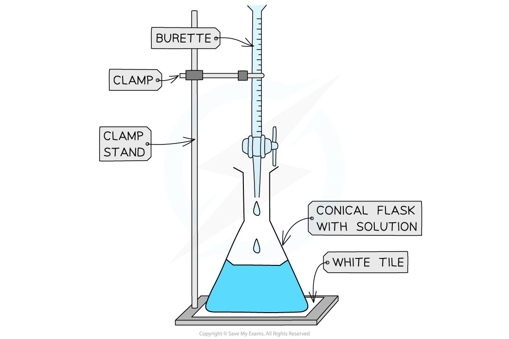
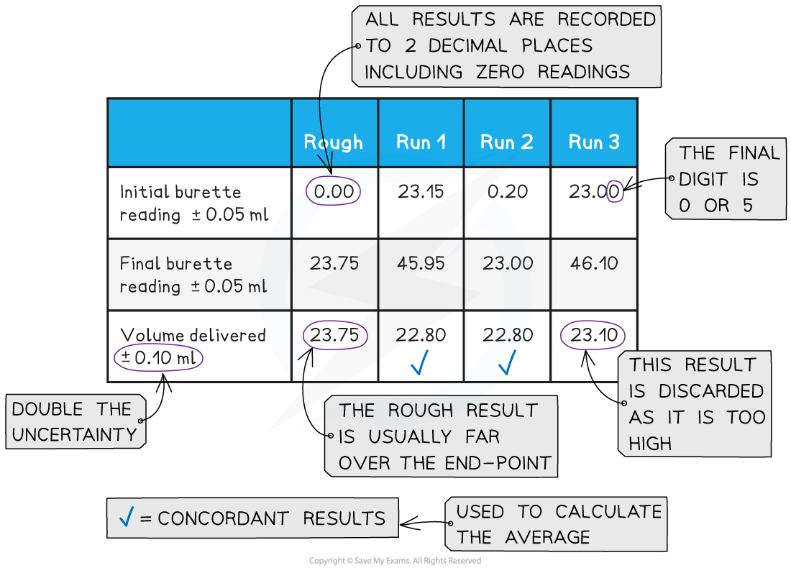

# Determining Concentrations

## Core Practical 3: Hydrochloric Acid Concentration

> **Spec point** — `spcpt_cnCQY7KM54wRjbS5`

## Core Practical 3: Hydrochloric Acid Concentration

#### Performing the Titration

- The key piece of equipment used in the titration is the burette
- **Burettes** are usually marked to a precision of 0.10 cm3

  - Since they are analogue instruments, the uncertainty is recorded to **half** the smallest marking, in other words to ±0.05 cm3
- The **end point** or **equivalence point** occurs when the two solutions have reacted completely and is shown with the use of an **indicator**

***The steps in a titration***

- A white tile is placed under the conical flask while the titration is performed, to make it easier to see the colour change

***Titrating***

- The steps in a titration are:

  - Measuring a known volume (usually 20 or 25 cm3) of one of the solutions with a** volumetric** **pipette** and placing it into a **conical flask**
  - The other solution is placed in the **burette**
  
    - To start with, the burette will usually be filled to 0.00 cm3
  - A few drops of the **indicator** are added to the solution in the conical flask
  - The tap on the **burette** is carefully opened and the solution added, portion by portion, to the **conical flask** until the **indicator** starts to change colour
  - As you start getting near to the end point, the flow of the burette should be slowed right down so that the solution is added dropwise
  
    - You should be able to close the tap on the burette after one drop has caused the colour change
  - Multiple runs are carried out until **concordant** results are obtained
  
    - Concordant results are within 0.1 cm3 of each other

#### Recording and processing titration results

- Both the initial and final **burette** readings should be recorded and shown to a **precision** of  ±0.05 cm3, the same as the **uncertainty**

***A typical layout and set of titration results***

- The volume delivered (**titre**) is calculated and recorded to an **uncertainty** of ±0.10 cm3

  - The **uncertainty** is doubled, because two **burette** readings are made to obtain the **titre** (V final – V initial), following the rules for **propagation of uncertainties**
- **Concordant **results are then averaged, and non-concordant results are discarded
- The appropriate calculations are then done

> **Worked Example**
> 25.0 cm3 of hydrochloric acid was titrated with a 0.200 mol dm-3 solution of sodium hydrogencarbonate, NaHCO3.
> 
> **NaHCO****3**** + HCl → NaCl + H****2****O + CO****2**** **
> 
> Use the following results to calculate the concentration of the acid, to 3 significant figures.
> 
> 
> 
> **Answer**
> 
> **Step 1:** Calculate the average titre
> 
> - Average titre$=\frac{22.80+22.80}{2}=$22.80 cm3
> 
> **Step 2:** Calculate the number of moles of sodium hydrogencarbonate
> 
> - Moles = $\frac{22.80}{1000}$ x 0.200 = 4.56 x 10-3 moles
> 
> **Step 3:** Calculate (or deduce) the number of moles of hydrochloric acid
> 
> - The stoichiometry of NaHCO3 : HCl is 1 : 1
> 
>   - Therefore, the number of moles of sodium hydrogencarbonate is also 4.56 x 10-3 moles
> 
> **Step 4: **Calculate the concentration of hydrochloric acid
> 
> - Concentration = $=\frac{moles}{volume}=\frac{4.56\times10^{-3}}{(25.0/1000)}=$**0.182 mol dm****-3**** **
