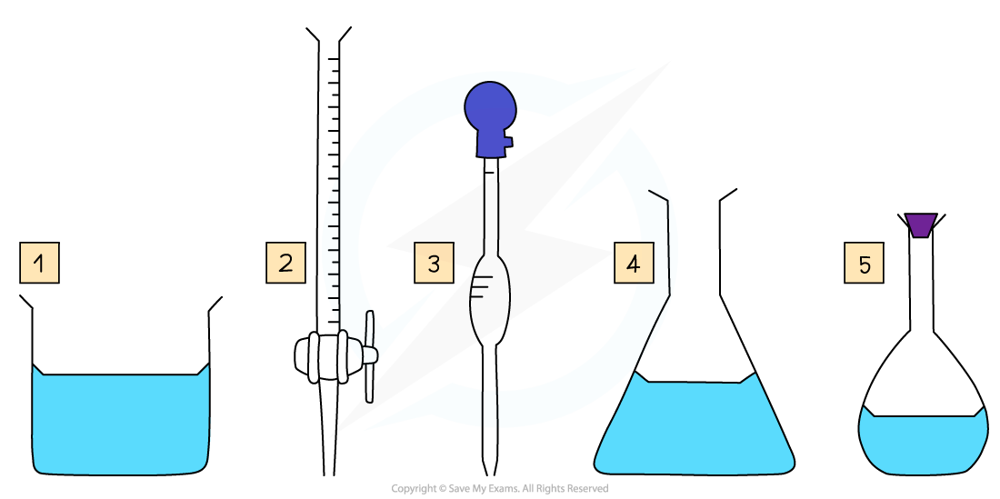
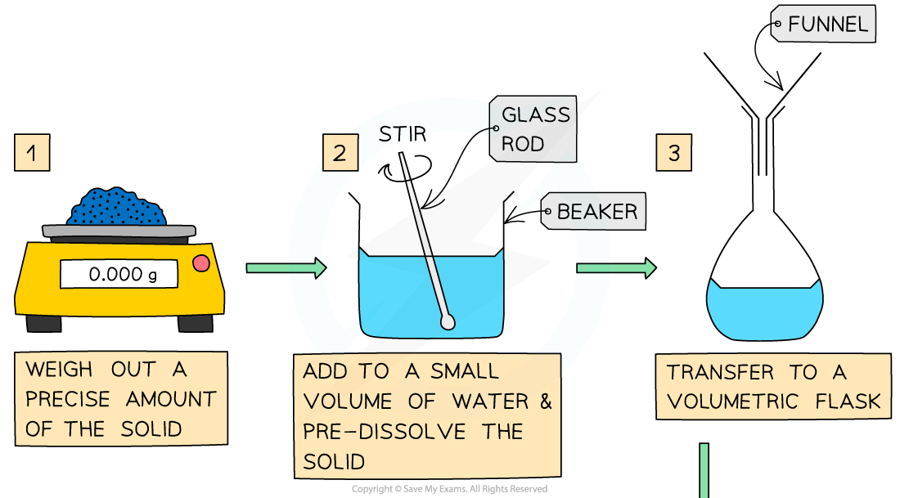
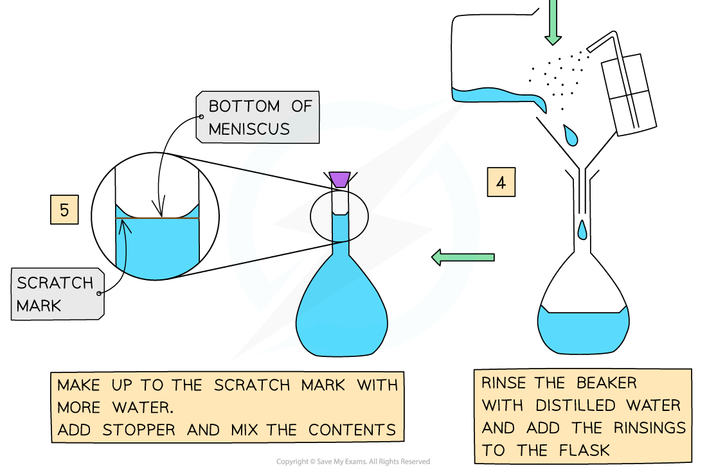

# Standard Solutions

## Core Practical 4: Preparing a Standard Solution

> **Spec point** — `spcpt_bHRTDTKwq7Fmgp4B`

## Core Practical 4: Preparing a Standard Solution

#### Volumetric Analysis

- **Volumetric analysis** is a process that uses the volume and concentration of one chemical reactant (**a volumetric solution**) to determine the concentration of another unknown solution
- The technique most commonly used is a **titration**
- The volumes are measured using two precise pieces of equipment, a **volumetric **or** graduated pipette **and a **burette**
- Before the titration can be done, the standard solution must be prepared
- Specific apparatus must be used both when preparing the standard solution and when completing the titration, to ensure that volumes are measured precisely

***Some key pieces of apparatus used to prepare a volumetric solution and perform a simple titration ***

1. Beaker
2. Burette
3. Volumetric Pipette
4. Conical Flask
5. Volumetric Flask

#### Making a Volumetric Solution

- Chemists routinely prepare solutions needed for analysis, whose concentrations are known precisely
- These solutions are termed **volumetric solutions** or **standard solutions**
- They are made as accurately and precisely as possible using three decimal place balances and volumetric flasks to reduce the impact of measurement uncertainties
- The steps are:

#### Volumes & concentrations of solutions

- The **concentration **of a solution is the amount of **solute **dissolved in a **solvent** to make 1 dm3 of  **solution**

  - The solute is the substance that dissolves in a solvent to form a solution
  - The solvent is often water
- A **concentrated **solution is a solution that has a **high **concentration of solute
- A **dilute **solution is a solution with a **low **concentration of solute
- Concentration is usually expressed in one of three ways:

  - moles per unit volume
  - mass per unit volume
  - parts per million

> **Worked Example**
> Calculate the mass of sodium hydroxide, NaOH, required to prepare 250 cm3 of a 0.200 mol dm-3 solution
> 
> **Answer:**
> 
> **Step 1**: Find the number of moles of NaOH needed from the concentration and volume:
> 
> - *number of moles  = concentration (mol dm**-3**) x volume (dm**3**)  *
> 
>   - n = 0.200 *mol dm**-3* x 0.250 *dm**3*
>   - n = **0.0500 mol**
> 
> **Step 2**: Find the molar mass of NaOH
> 
> - *M* = 22.99 + 16.00 + 1.01 = 40.00 g mol-1
> 
> **Step 3**: Calculate the mass required
> 
> - mass = moles x molar mass
> 
>   - mass =  0.0500 mol x 40.00 g mol-1   = **2.00 g**
