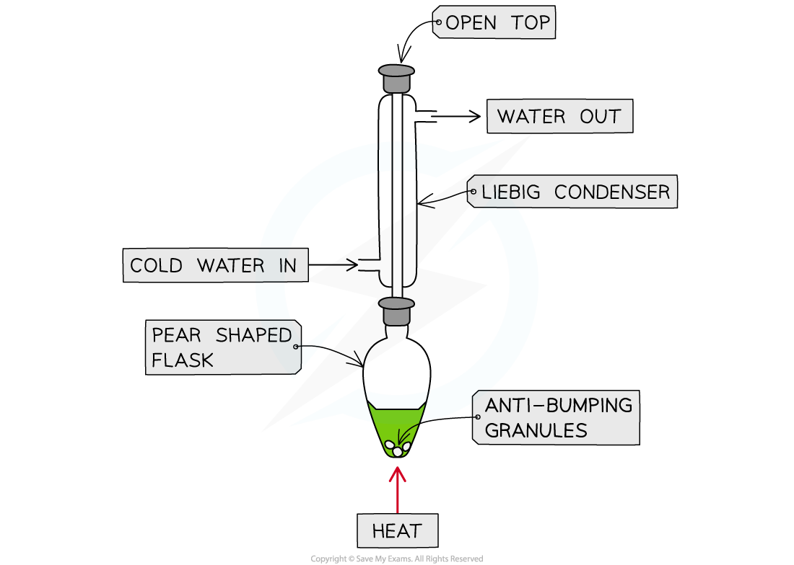
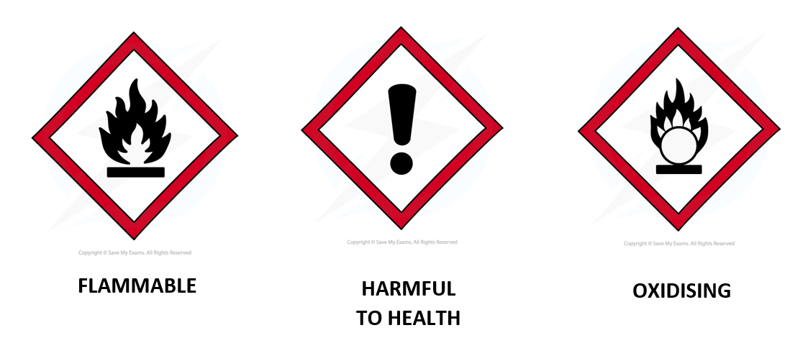

# Propan-1-ol Oxidation

## Core Practical 7: Oxidation of Propan-1-ol

> **Spec point** — `spcpt_zTYx8jKxGxBxTCtn`

## Core Practical 7: Oxidation of Propan-1-ol

#### Oxidation of propan-1-ol

- Primary alcohols can be oxidised to form **aldehydes** which can undergo further oxidation to form **carboxylic** **acids**

  - When propan-1-ol is oxidised, propanal is produced and when oxidised further propanoic acid will be formed

#### Synthesis and purification of propanal and propanoic acid

- Carefully add 20 cm3 of acidified potassium dichromate(VI) solution, K2Cr2O7 (aq), to a 50 cm3 pear-shaped flask and cool the flask in an iced water bath
- Set up the reflux apparatus keeping pear shaped flask cool
- Place **anti-bumping granules** into the pear shaped flask
- Measure out 1 cm3 of propan-1-ol
- Using a pipette, slowly add the propan-1-ol drop wise into the reflux condenser
- When the propan-1-ol has been added remove the ice bath and allow to warm up to room temperature
- Position the flask over an electric heater or in a water bath and heat for 20 minutes

  - Propan-1-ol is flammable, therefore. naked flames should not be used when heating which is why the use of an electric heater or water bath is an important safety precaution
- Purify the product using distillation apparatus

***Reflux apparatus for the oxidation of propan-1-ol to propanoic acid***

***Oxidation of propan-1-ol by acidified K******2******Cr******2******O******7****** to form propanal by distillation***

#### Hazards, risks and precautions

- The alcohols used are flammable and often harmful to health, e.g, propan‐1‐ol, butan‐1‐ol, pentan‐1‐ol
- The alcohols should be kept away from naked flames, e.g. a Bunsen burner
- Avoid contact with the skin and breathing in the vapour
- A fume cupboard can be used for harmful alcohols
- Potassium dichromate is a strong oxidising agent and should be handled with care
- Spillages should be mopped up right away with plenty of water
