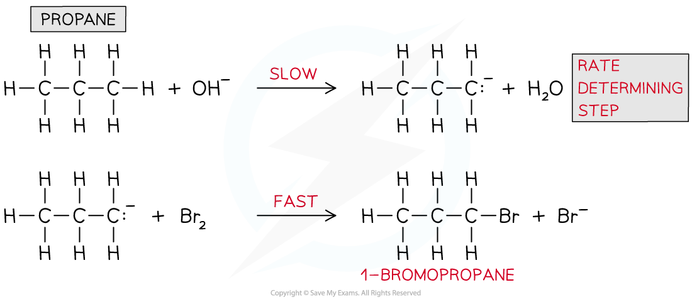

# Rate-Determining Steps from Equations

## Rate-Determining Steps from Equations

> **Spec point** — `spcpt_b4tskbKpDcYJm2kP`

## Rate-Determining Steps from Equations

#### Rate-determining step & intermediates

- A chemical reaction can only go as fast as the slowest part of the reaction

  - So, the **rate-determining step **is the slowest step in the reaction
- If a reactant appears in the **rate-determining step**, then the concentration of that reactant will also appear in the **rate equation**
- For example, the rate equation for the reaction below is rate = *k *[CH3Br] [OH-]

**CH****3****Br + OH****-**** → CH****3****OH + Br****-**

- This suggests that **both **CH3Br and OH- take part in the **slow rate-determining step**

#### Predicting the reaction mechanism

- The **overall reaction equation** and **rate equation** can be used to predict a possible reaction mechanism of a reaction

  - This shows the individual reaction steps which are taking place
- For example, nitrogen dioxide (NO2) and carbon monoxide (CO) react to form nitrogen monoxide (NO) and carbon dioxide (CO2)

  - The overall reaction equation is:

**NO****2**** (g) + CO (g) → NO (g) + CO****2**** (g)**

- The rate equation is:

**Rate = *****k***** [NO****2****]****2**

- From the rate equation it can be concluded that the reaction is **zero order** with respect to CO (g) and **second order** with respect to NO2 (g)
- This means that there are **two molecules** of NO2 (g) involved in the **rate-determining step** and **zero molecules** of CO (g)
- A possible reaction mechanism could therefore be:

**Step 1:**

**   2NO****2**** (g) → NO (g) + NO****3**** (g)**                   **slow **(rate-determining step)

**Step 2:**

**   NO****3**** (g) + CO (g) → NO****2**** (g) + CO****2**** (g)**     **fast**

**Overall:**

** 2****NO****2**** (g) + ****NO****3**** (g)**** + CO (g) → NO (g) + ****NO****3**** (g)**** + ****NO****2**** (g) ****+ CO****2**** (g)**

**   =     NO****2**** (g) + CO (g) → NO (g) + CO****2**** (g)**

#### Identifying the rate-determining step

- The rate-determining step can be identified from a rate equation given that the reaction mechanism is known
- For example, propane (CH3CH2CH3) undergoes bromination under alkaline solutions
- The overall reaction is:

**CH****3****CH****2****CH****3**** + Br****2**** + OH****-**** → CH****3****CH****2****CH****2****Br + H****2****O + Br****-**

- The reaction mechanism is:

***Reaction mechanism for the bromination of propane under alkaline conditions***

- The rate equation is:

**Rate = *****k***** [CH****3****CH****2****CH****3****] [OH****-****]**

- From the rate equation, it can be deduced that only CH3CH2CH3 and OH- are involved in the **rate-determining step** and not bromine (Br2)
- CH3CH2CH3 and OH- are only involved in the first step of the reaction mechanism, therefore the **rate-determining step **is:

  - CH3CH2CH3 + OH- **→** CH3CH2CH2- + H2O
