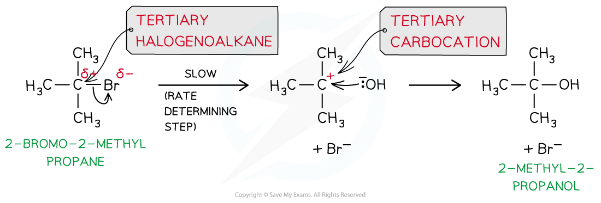
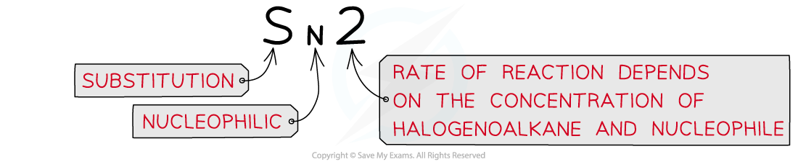
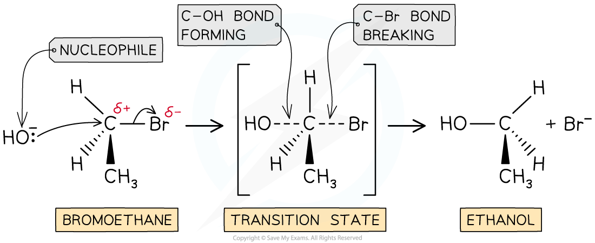

# Reaction Mechanisms

## Reaction Mechanisms - Deduction

> **Spec point** — `spcpt_zhwnKTP9WVCJTy4d`

## Reaction Mechanisms - Deduction

- Chemical kinetics can only **suggest** a reaction mechanism, they cannot prove it

  - However, they can be used to disprove a proposed mechanism
- Elementary steps are the steps involved in a reaction mechanism

  - For example, in the following general reaction:

**A + B → C + D**

- The elementary steps could involve the formation of an intermediate:

**Elementary step 1: A → R + D**

**Elementary step 2: R + B → C**

- It is important that the elementary steps for a proposed mechanism agree with the overall stoichiometric equation

  - For example, combining the 2 elementary steps above gives the overall stoichiometric equation

**A + R + B → R + C + D**

**A + B → C + D**

> **Worked Example**
> Sulfur dioxide reacts with oxygen to form sulfur trioxide
> 
> 1. Propose a one step mechanism for the above reaction
> 2. The above reaction is catalysed by the formation of nitrogen dioxide from nitrogen monoxide. Propose a two step mechanism for this reaction.
> 
> **Answers**
> 
> **Answer 1:**
> 
> - A one step reaction mechanism is simply the overall stoichiometric equation
> 
>   - Therefore, the correct answer is 2SO2 + O2 → 2SO3
> 
> **Answer 2:**
> 
> - One of the two elementary steps for this two step mechanism can be taken from the question:
> 
> Elementary step 1: 2NO + O2 → 2NO2
> 
> - The second elementary step must involve the reaction of the nitrogen dioxide formed with sulfur dioxide:
> 
> Elementary step 2: NO2 + SO2 → NO + SO3 (or 2NO2 + 2SO2 → 2NO + 2SO3)

> **Exam Hint**
> It is important that you check that the equations you are proposing for a reaction mechanism.They **must** add up to the overall stoichiometric equation, otherwise the proposed mechanism is wrong.

#### Predicting the reaction order & deducing the rate equation

- The **order** of a reactant and thus the rate equation can be deduced from a reaction mechanism if the rate-determining step is known
- For example, the reaction of nitrogen oxide (NO) with hydrogen (H2) to form nitrogen (N2) and water

**2NO (g) + 2H****2**** (g) → N****2**** (g) + 2H****2****O (l)**

- The reaction mechanism for this reaction is:

**Step 1:**

**   NO (g) + NO (g) → N****2****O****2 ****(g)**                      **fast**

**Step 2:**

**   N****2****O****2**** (g) + H****2**** (g) → H****2****O (l) + N****2****O (g) **    **slow **(rate-determining step)

**Step 3:**

**   N****2****O (g) + H****2**** (g) → N****2**** (g) + H****2****O (l)           fast**

- The second step in this reaction mechanism is the **rate-determining step**
- The rate-determining step consists of:

  - N2O2 which is formed from the reaction of **two NO molecules**
  - **One H****2**** molecule**
- The reaction is, therefore, **second order **with respect to NO and **first order **with respect to H2
- So, the **rate** **equation** becomes:

**Rate = *****k***** [NO]****2**** [H****2****]**

- The reaction is, therefore, **third order overall**

> **Exam Hint**
> Intermediates in the mechanism **cannot** appear as substances in the rate equationThis is why you substitute the N2O2 in the above example. Step 1 shows that 2NO molecules are required to form the necessary N2O2

## Reaction Mechanisms - SN1 & SN2

> **Spec point** — `spcpt_nk9r2dJg9vY2nHFp`

## Reaction Mechanisms - SN1 & SN2

- Nucleophilic substitution reactions can occur in two different ways (known as **S****N****2** and **S****N****1 **reactions) depending on the structure of the halogenoalkane involved

#### SN1 reactions

- In** tertiary **halogenoalkanes, the carbon that is attached to the halogen is also bonded to three alkyl groups
- These halogenoalkanes undergo nucleophilic substitution by an **S****N****1** mechanism

  - ‘S’ stands for ‘substitution’
  - ‘N’ stands for ‘nucleophilic’
  - ‘1’ means that the rate of the reaction (which is determined by the slowest step of the reaction) depends on the concentration of only one reagent, the halogenoalkane

- The SN1 mechanism is a **two-step** reaction
- In the first step, the C-X bond breaks heterolytically and the halogen leaves the halogenoalkane as an X- ion (this is the **slow** and **rate-determining step**)

  - As the rate-determining step only depends on the concentration of the halogenoalkane, the rate equation for an SN1 reaction is **rate = *****k*****[halogenoalkane]**
  - An SN1 reaction is described as unimolecular because there is only molecule involved in the rate-determining step

  - This forms a tertiary carbocation **(which is a tertiary carbon atom with a positive charge)**
  - In the second step, the tertiary carbocation is attacked by the nucleophile

- For example, the nucleophilic substitution of 2-bromo-2-methylpropane by hydroxide ions to form 2-methyl-2-propanol

***The mechanism of nucleophilic substitution in 2-bromo-2-methylpropane which is a tertiary halogenoalkane***

#### SN2 reactions

- In** primary **halogenoalkanes**, **the carbon that is attached to the halogen is bonded to one alkyl group
- These halogenoalkanes undergo nucleophilic substitution by an **S****N****2** mechanism

  - ‘S’ stands for ‘substitution’
  - ‘N’ stands for ‘nucleophilic’
  - ‘2’ means that the rate of the reaction (which is determined by the slowest step of the reaction) depends on the concentration of both the halogenoalkane and the nucleophile ions

- The SN2 mechanism is a **one-step** reaction

  - The nucleophile donates a pair of electrons to the δ+ carbon atom of the halogenoalkane to form a new bond
  
    - As this is a one-step reaction, the rate-determining step depends on the concentrations of the halogenoalkane and nucleophile, the rate equation for an SN2 reaction is **rate = *****k*****[halogenoalkane][nucleophile]**
    - An SN2 reaction is bimolecular as there are two molecules involved in the rate-determining step
  - At the same time, the C-X bond is breaking and the halogen (X) takes both electrons in the bond
  - The halogen leaves the halogenoalkane as an X- ion
- For example, the nucleophilic substitution of bromoethane by hydroxide ions to form ethanol

***The *****S****N****2 *****mechanism of bromoethane with hydroxide causing an inversion of configuration***

> **Exam Hint**
> Primary halogenoalkanes only react via with SN2 mechanism
> 
> Secondary halogenoalkanes react via both the SN1 and SN2 mechanisms
> 
> Tertiary halogenoalkanes only react via with SN1 mechanism
