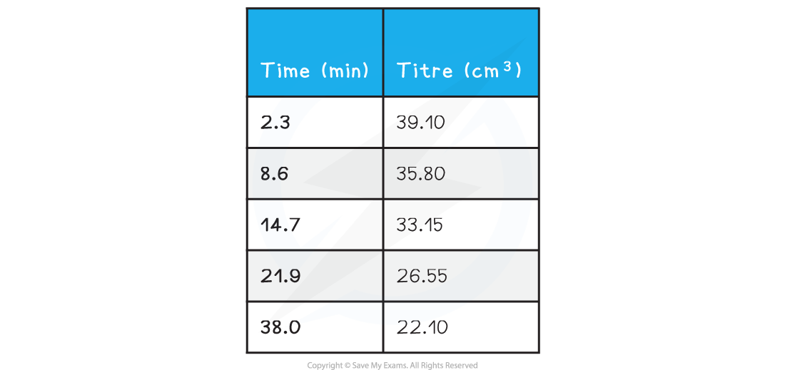
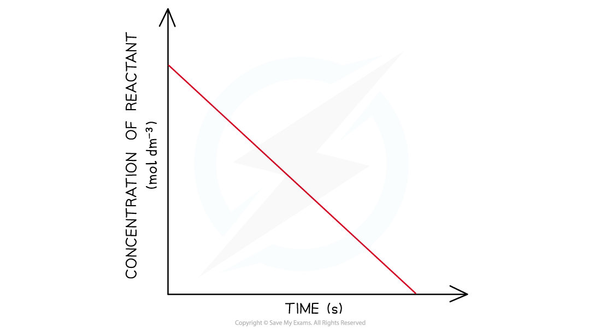

# Acid-Catalysed Iodination of Propanone

## Acid-Catalysed Iodination of Propanone

> **Spec point** — `spcpt_XBXRYVBBFrTDT52m`

## Acid-Catalysed Iodination of Propanone

- The iodination of propanone is carried out using a catalyst of dilute sulfuric acid
- The reaction between iodine in an acidic solution and propanone is

**CH****3****COCH****3 ****(aq) + I****2**** (aq) → CH****3****COCH****2****I (aq) + H****+**** (aq) + I****- ****(aq) **

- We can follow the rate of this reaction by using a continuous monitoring method and therefore we will be able to deduce the order of reaction with respect to a substance using a concentration time graph
- We can calculate the order of reaction with respect to iodine as the propanone and acid are in a large excess so their concentration do not change during the reaction
- Once a portion of the reaction mixture has been removed, we stop the reaction by adding sodium hydrogencarbonate
- Performing a titration again sodium thiosulfate(VI) solution and using starch as an indicator is used to determine the concentration of iodine

**2S****2****O****3****2-**** (aq) + I****2**** (aq) → 2I****-**** (aq) + S****4****O****6****2- ****(aq) **

#### Results

#### Sample Data from the Reaction

- This graph is a straight line graph

  - As the gradient is constant, the rate of reaction is constant, and therefore independent of the concentration of the iodine solution
  - This means **the reaction is zero order with respect to the iodine**
  - The rate equation for the reaction is
  
    - **Rate = k[CH****3****COCH****3 ****(aq)] [H****+ ****(aq)]**

***Concentration-time graphs of a zero-order reaction***
