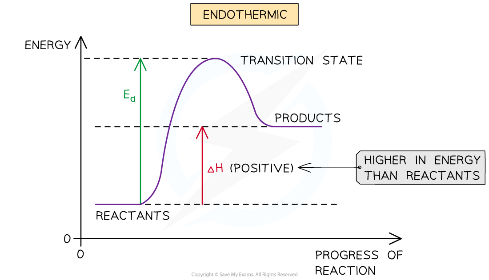
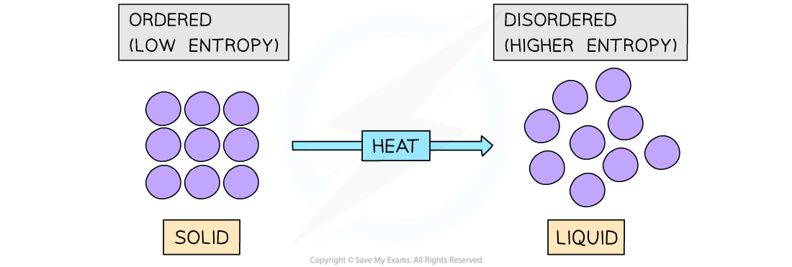
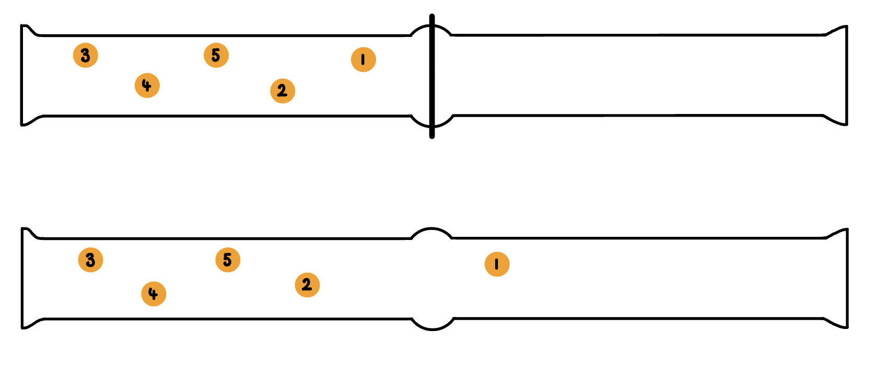
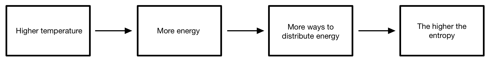

# Entropy - Introduction

## Entropy - Introduction

> **Spec point** — `spcpt_FDpPVrPxC5phDs2F`

## Entropy - Introduction

- You may have wondered why it is that **endothermic** reactions occur at all, after all, what can be the driving force behind endothermic reactions if the products end up in a less stable, higher energy state?
- Although the majority of chemical reactions we experience everyday are** exothermic**,  Δ*H*ꝋ alone is not enough to explain why endothermic reactions occur

***The driving force behind chemical reactions cannot be explained by enthalpy changes alone as it makes not sense for chemical to end up in a less stable higher energy state in endothermic reactions***

- The answer is **entropy**

#### Chaos in the universe

- The **entropy (*****S*****) **of a given system is the number of possible arrangements of the particles and their energy in a given system

  - In other words, it is a measure of how **disordered** or** chaotic** a system is
- When a system becomes **more disordered**, its entropy will **increase**
- An increase in entropy means that the system becomes **energetically more stable**

- An example of a system that becomes more disordered is when a solid is **melted**
- For example, melting ice to form liquid water:

**H****2****O (s) → H****2****O (l)**

- The water molecules in ice are in fixed positions and can only vibrate about those positions
- In the liquid state, the particles are still quite close together but are arranged more randomly, in that they can move around each other
- Water molecules in the liquid state are therefore more **disordered**
- Thus, for a given substance, the **entropy** **increases** when its solid form melts into a liquid
- In both examples, the system with the **higher** **entropy** will be **energetically favourable **(as the energy of the system is more spread out when it is in a disordered state)

***Melting a solid will cause the particles to become more disordered resulting in a higher entropy state***

#### Distribution of Molecules

- Consider two gas jars, separated by a cover slip and one of the gas jars containing five molecules of orange bromine gas
- When the cover slip between two gas jars is removed, molecules of gas will spread out evenly throughout both of the gas jars

***The first two gas jars are separated by a glass cover slip, the second two gas jars are not separated allowing molecules to spread evenly between the two ***

- Each molecule can either be in the left or the right hand gas jar, so therefore has two possible arrangements
- So the number of possible arrangements is 2
- If there are 5 molecules in one jar to begin with, the total number of ways, *W*, the five molecules can be arranged is

  - *W* = *W*1 x *W*2 x *W*3 x *W*4 x* W*5
  - *W* = 2 x 2 x 2 x 2 x 2
  - *W* = 25
  - *W* = 32
- If we increased the number of molecules to 100, W becomes 2100

- Therefore as the number of particles increases the number of possible arrangements increases rapidly
- Entropy (S) is linked to *W* by the equation

***S***** = *****k *****In*****W***

- *k *= Boltzmann distribution constant 1.38 x 10-23 J K-1 mol-1

  - The units for entropy (*S*) are J K-1 mol-1

#### Distribution of energy

- The spreading out of molecules in diffusion is an increase in entropy as the molecules are becoming more randomly dispersed
- Spreading out heat energy also represents an increase in entropy
- Energy exists in ‘packets’ called **quanta**

  - Only whole numbers of quanta are possible
- The more quanta, the more ways of arrange the particles
- The more particles the more ways of sharing quanta

***Flow chart to show the effect of increasing temperature on entropy ***
