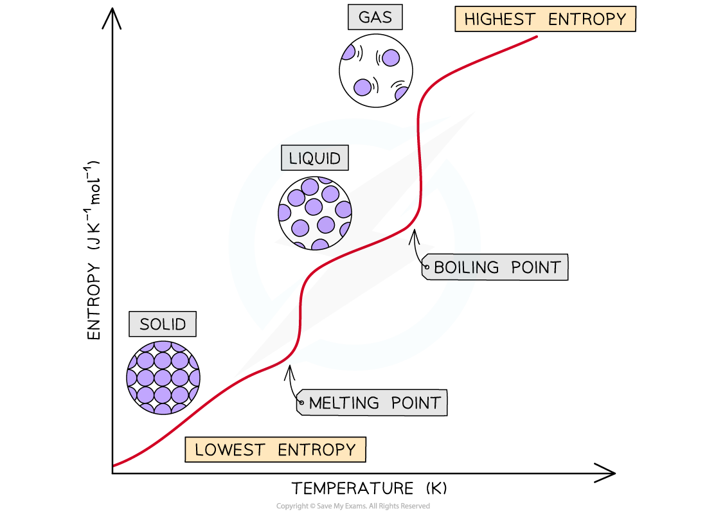

# Entropy Changes

## Entropy - Changes

> **Spec point** — `spcpt_Hxw7q6S23qkpyyWY`

## Entropy - Changes

#### Changes of State

- The entropy of a substance changes during a **change** **in** **state**
- The entropy **increases** when a substance melts (change from **solid** to **liquid**)

  - Increasing the temperature of a solid causes the particles to vibrate more
  - The **regularly** arranged lattice of particles changes into an **irregular** arrangement of particles
  - These particles are still close to each other but can now **rotate** and **slide** over each other in the liquid
  - As a result, there is an **increase in disorder**
- The entropy **increases** when a substance boils (change from **liquid **to **gas**)

  - The particles in a gas can now freely move around and are far apart from each other
  - The entropy increases **significantly** as the particles become very disordered
- Similarly, the entropy **decreases** when a substance **condenses** (change from **gas **to **liquid**) or freezes (change from **liquid **to **solid**)

  - The particles are brought together and get arranged in a more regular arrangement
  - The ability of the particles to move decreases as the particles become more ordered
  - There are fewer ways of arranging the energy so the entropy decreases

***The entropy of a substance increases when the temperature is raised as particles become more disordered***

#### Production of a gas

- During the thermal decomposition of calcium carbonate (CaCO3) the entropy of the system increases:

**CaCO****3 ****(s) → CaO (s) + CO****2 ****(g)**

- In this decomposition reaction, a gas molecule (CO2) is formed
- The CO2 gas molecule is more disordered than the solid reactant (CaCO3), as it is constantly moving around
- As a result, the system has become more **disordered** and there is an **increase **in **entropy**

- Another example is the reaction of **ethanoic acid** with **ammonium carbonate**

**(NH****4****)****2****CO****3**** (s) + 2CH****3****COOH (aq) → 2CH****3****COO****-**** (aq) + 2NH****4****+ ****(aq) + CO****2**** (g) + H****2****O (l) **

- There is a slight fall in temperature during the reaction indicating the process is endothermic

  - Energy is taken in from the surroundings
- The particles are well-ordered in the solid, and the disorder increases because a solution and, especially, a gas is formed so entropy increases during the reaction

#### Dissolving a solid

- When ammonium nitrate is dissolved in water, the temperature of the solution decreases, therefore the process is endothermic

  - Energy is taken in from the surroundings

**NH****4****NO****3**** (s) + aq → NH****4****+ ****(aq) + NO****3****- ****(aq)    ΔH = 25.7 kJ mol****-1**

- The level of disorder increases as the particles are no longer in a fixed position and are now free to move

- However, it is not always this simple!
- When an **ionic **solid dissolves

  - Bonds between the particles are broken increasing the disorder and taking in energy
  - Bonds between the solvent and particles are made reducing the disorder and releasing energy
- Therefore it is difficult to predict whether the process will be endothermic or exothermic

#### Endothermic reactions between two solids

- When barium hydroxide and ammonium chloride are mixed, they form a paste and the temperature drops significantly
- Therefore this is an endothermic process

  - Energy is taken in from the surroundings

**2NH****4****Cl (s) + Ba(OH)****2****.8H****2****O (s)  → BaCl****2****.2H****2****O (s) + 2NH****3**** (g) + H****2****O (l)**

- The gas produced is ammonia and this can be detected by the smell and it will turn damp red litmus paper blue
- When two solids are mixed and react together, the entropy change will depend on the physical state of the compounds made and not just on the energy changes in the reaction
- Two solids will of course have a very low entropy due to the high order
- If a liquid or gas is produced the entropy will have increased due to the increased disorder of the particles
