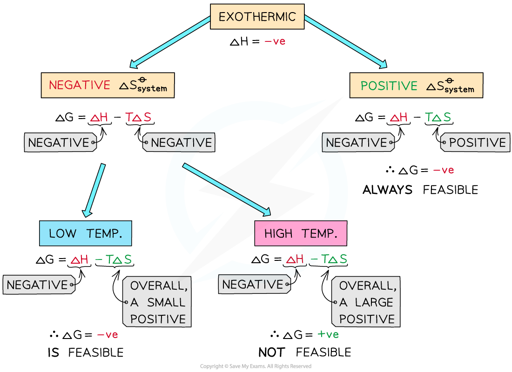
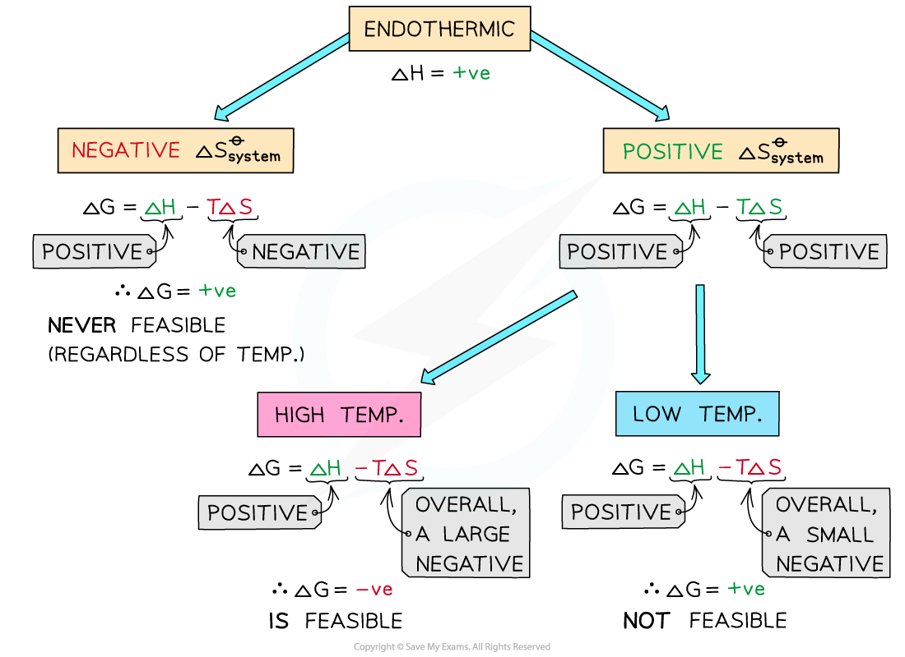
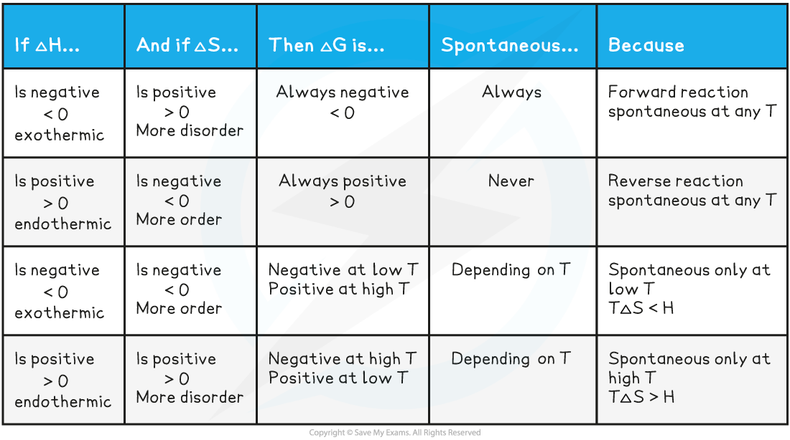

# Reaction Feasibility

## Reaction Feasibility

> **Spec point** — `spcpt_ywMxrFB6V8KHdZz4`

## Reaction Feasibility

#### Summary

- For **Δ*****S******total**** *to be positive and therefore the reaction feasible:

  - Both Δ*S**system** *and Δ*S**surroundings** *are positive
  - Δ*S**surroundings *is positive and ΔSsystem is negative, but Δ*S**surroundings *> Δ*S**system*
  - Δ*S**surroundings *is negative and ΔSsystem is positive, but Δ*S**surroundings **< *ΔSsystem

#### Feasibility

- Generally, entropy will increase in the order:
- solid < liquid < gas
- Therefore we can determine the change in entropy and the feasibility by considering the change in state of reactants to products

- Example 1: the reaction between magnesium and oxygen at 293 K is feasible

**Mg (s) + O****2**** (g) → MgO (s) **

- This reaction produces a solid from a solid and a gas. Therefore entropy of the system is negative (Δ*S**system* < Δ*S**surroundings*)
- But since the entropy of the surroundings is very large as this reaction is very exothermic
- This outweighs the entropy of the system, so the total entropy is positive therefore the reaction is spontaneous

- Example 2: the reaction between ethanoic acid and ammonium carbonate

**2CH****3****COOH (aq) + (NH****4****)****2****CO****3 ****(s) → 2CH****3****COONH****4 ****(aq) + H****2****O (l) + CO****2 ****(g) **

- This reaction is **endothermic**, therefore Δ*S**surroundings** *is negative
- However, a gas is produced from a solid and liquid, so Δ*S**system* is positive
- Δ*S**system *> Δ*S**surroundings* and the reaction is spontaneous

#### Gibbs free energy

- We can also use Gibbs free energy to work out if a reaction is feasible or not (this is not required as a part of the course)
- The feasibility of a reaction is determined by two factors

  - The **enthalpy** and **entropy change**
- The two factors come together in a fundamental thermodynamic concept called the **Gibbs free energy (*****G*****)**
- The Gibbs equation is:

**Δ*****G*****ꝋ**** = Δ*****H******reaction*****ꝋ**** – *****T*****Δ*****S******system*****ꝋ**

- The units of Δ*G*ꝋ are in kJ mol**–**1

  - The units of Δ*H**reaction*ꝋare in kJ mol**–**1
  - The units of *T* are in K
  - The units of Δ*S**system*ꝋ are in J K-1** **mol**–**1(and must therefore be converted to kJ K**–**1 mol**–**1by dividing by 1000)
- For a reaction to be feasible, Δ*G*ꝋ must be **equal or less than zero **

#### Temperature & feasibility

- We can look at the the values for Δ*H* and Δ*S *to determine whether the reaction is spontaneous / feasible at a given temperature (*T*)
- The Gibbs equation can explain what will affect the spontaneity / feasibility of a reaction for exothermic and endothermic reactions

#### Exothermic reactions

- In exothermic reactions, Δ*H**reaction*ꝋ is **negative**
- If the Δ*S**system*ꝋ is **positive:** 

  - Both the first and second term will be **negative**
  - Resulting in a **negative** Δ*G*ꝋ so the reaction is **feasible**
  - Therefore, regardless of the temperature, an exothermic reaction with a positive Δ*S**system*ꝋ will **always be feasible**
- If the Δ*S**system*ꝋ is **negative:**

  - The first term is **negative **and the second term is **positive**
  - At very high temperatures, the –*T*Δ*S**system*ꝋ will be very **large** and **positive** and will overcome Δ*H**reaction*ꝋ
  - Therefore, at high temperatures Δ*G*ꝋ is **positive** and the reaction is **not feasible**
- Since the relative size of an entropy change is much smaller than an enthalpy change, it is unlikely that TΔ*S > *Δ*H *as temperature increases
- These reactions are therefore usually spontaneous at normal conditions

***The diagram shows under which conditions exothermic reactions are feasible***

#### Endothermic reactions

- In endothermic reactions, Δ*H**reaction*ꝋ is **positive**
- If the Δ*S**system*ꝋ is **negative:**

  - Both the first and second term will be **positive**
  - Resulting in a **positive** Δ*G*ꝋ so the reaction is **not feasible**
  - Therefore, regardless of the temperature, endothermic with a negative Δ*S**system*ꝋ will **never be feasible**
- If the Δ*S**system*ꝋ is **positive:**

  - The first term is **positive **and the second term is **negative**
  - At low temperatures, the –*T*Δ*S**system*ꝋ will be **small** and **negative** and will not overcome the larger Δ*H**reaction*ꝋ
  - Therefore, at low temperatures Δ*G*ꝋ is **positive** and the reaction is not feasible
  - The reaction is **more** **feasible** at **high temperatures** as the second term will become negative enough to overcome the Δ*H**reaction*ꝋ resulting in a negative Δ*G*ꝋ
- This tells us that for certain reactions which are not feasible at room temperature, they can become feasible at higher temperatures

  - An example of this is found in metal extractions, such as the extraction if iron in the blast furnace, which will be unsuccessful at low temperatures but can occur at higher temperatures (~1500 oC in the case of iron)

***The diagram shows under which conditions endothermic reactions are feasible***

#### Summary of factors affecting Gibbs free energy

> **Worked Example**
> The reaction between aluminium oxide and carbon is not feasible at room temperature.
> 
> Al2O3 + 3C(s)  → 2Al(s) + 3CO2 (g)
> 
> Given that  Δ*H* = +1336 kJmol-1 and Δ*S*= +581 JK-1mol-1 , calculate the temperature at which the reaction becomes feasible.
> 
> **Answer**
> 
> - As both Δ*H* and Δ*S* are positive, Δ*G* will become negative if *T*Δ*S* > Δ*H*.
> - The temperature at which this reaction becomes spontaneous can be calculated. This will be when Δ*G* = 0.
> - If Δ*G* = 0, then T = Δ*H */ Δ*S**
> - T = $\frac{1336}{0.581}$
> - T = 2299 K
> 
> *Don't forget to convert this into kJ

## Thermodynamic & Kinetic Stability

> **Spec point** — `spcpt_3Hxdvb2GjtbWSfCv`

## Thermodynamic & Kinetic Stability

### Thermodynamic Stability

- Refers to whether a reaction is feasible under given conditions
- A reaction is thermodynamically feasible if the Gibbs free energy change (ΔG) is negative Δ*G *= Δ*H*−*T*Δ*S*
- This means:

  - Reactions are more likely to be feasible if **enthalpy change (Δ*****H*****)** is **negative** (exothermic)
  - Or if **entropy change (Δ*****S*****)** is **positive** (increase in disorder)
- Thermodynamic feasibility does **not** necessarily mean the reaction will happen quickly

### Kinetic Stability

- Refers to how fast a reaction occurs (i.e. the rate of reaction)
- Depends on the **activation energy (*****E*****ₐ)**:

  - Reactions with a **high *****E*****ₐ** are **kinetically stable** and may not occur at room temperature
- Even if a reaction is thermodynamically feasible, it might not happen without enough energy to overcome the activation barrier

#### Examples

- Combustion of methane, CH4

  - Thermodynamically feasible but** **kinetically stable
  - Methane (CH4) will not spontaneously form CO2 and H2O unless ignited (*E*ₐ is high)
- Decomposition of hydrogen peroxide at 298 K
- This reaction is thermodynamically feasible:

**H****2****O****2**** (l) → H****2****O (l) + ½O****2**** (g)**

- The activation energy, *E*a, is high, so a **catalyst** must be used (MnO2)
- If the reaction was left for long enough, the hydrogen peroxide would eventually decompose, however the addition of the MnO2 allows the reaction to take place via an alternative route with a lower *E*a
