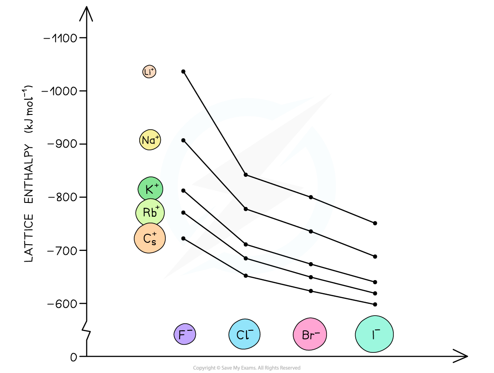

# Enthalpy of Solution - Ionic Charge & Radius

## Enthalpy of Solution - Ionic Charge & Radius

> **Spec point** — `spcpt_h854rqSQ92n2hQnH`

## Enthalpy of Solution - Ionic Charge & Radius

#### Factors affecting lattice enthalpy

- The two key factors which affect lattice energy, Δ*H**latt*ꝋ, are the **charge **and **radius **of the ions that make up the **crystalline lattice**

#### Ionic radius

- The lattice energy becomes **less exothermic** as the **ionic** **radius** of the ions **increases**
- This is because the charge on the ions is more **spread** **out** over the ion when the ions are **larger**
- The ions are also** further apart **from each other in the lattice

  - The attraction between ions is between the centres of the ions involved, so the bigger the ions the bigger the distance between the centre of the ions
- Therefore, the **electrostatic forces of** **attraction **between the oppositely charged ions in the lattice are **weaker**
- For example, the lattice energy of caesium fluoride (CsF) is **less exothermic **than the lattice energy of potassium fluoride (KF)

  - Since both compounds contain a fluoride (F-) ion, the difference in lattice energy must be due to the caesium (Cs+) ion in CsF and potassium (K+) ion in KF
  - Potassium is a Group 1 and Period 4 element
  - Caesium is a Group 1 and Period 6 element
  - This means that the Cs+ ion is **larger **than the K+ ion
  - There are **weaker **electrostatic forces of attraction between the Cs+ and F- ions compared to K+ and F- ions
  - As a result, the **lattice** **energy** of CsF is **less exothermic** than that of KF

***The lattice energies get less exothermic as the ionic radius of the ions increases***

#### Ionic charge

- The lattice energy gets **more exothermic** as the **ionic** **charge** of the ions **increases**
- The greater the ionic charge, the **higher the charge density**
- This results in **stronger electrostatic attraction **between the oppositely charged ions in the lattice
- As a result, the lattice energy is **more exothermic**
- For example, the lattice energy of calcium oxide (CaO) is **more exothermic **than the lattice energy of potassium chloride (KCl)

  - Calcium oxide is an ionic compound which consists of calcium (Ca2+) and oxide (O2-) ions
  - Potassium chloride is formed from potassium (K+) and chloride (Cl-) ions
  - The ions in calcium oxide have a **greater ionic charge** than the ions in potassium chloride
  - This means that the electrostatic forces of attraction are **stronger** between the Ca2+and O2- compared to the forces between K+ and Cl-
  - Therefore, the lattice energy of calcium oxide is **more exothermic, **as more energy is released upon its formation from its gaseous ions
  - Ca2+ and O2- are also smaller ions than K+ and Cl-, so this also adds to the value for the lattice energy being more exothermic

#### Factors affecting enthalpy of hydration

- Hydration enthalpies are exothermic as energy is given out as water molecules bond to the metal ions
- The negative ions are attracted to the **δ+ hydrogens** on the **polar water molecules** and the positive ions are attracted to the **δ- oxygen** on the polar water molecules
- The higher the charge density the greater the hydration enthalpy (e.g. smaller ions or ions with larger charges) as the ions attract the water molecules more strongly, for example:
- Fluoride ions, F-,  have more negative hydration enthalpies than chloride ions, Cl-
- Magnesium ions, Mg2+, have a more negative hydration enthalpy than barium ion, Ba2+
