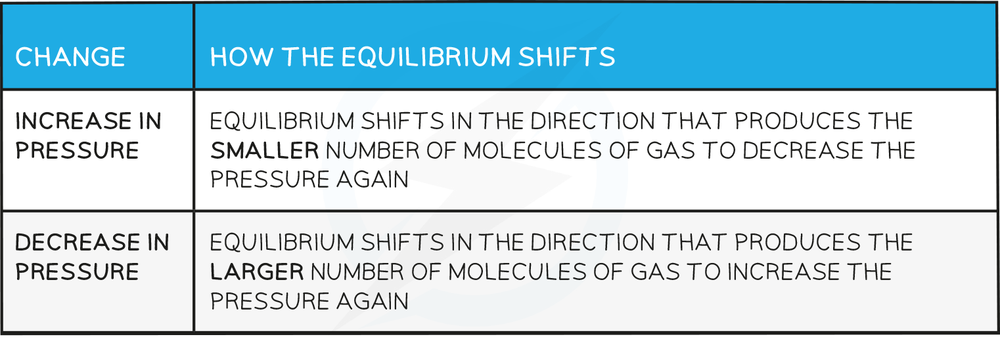

# Equilibrium Constant & Conditions

## Changing Conditions - General

> **Spec point** — `spcpt_h2qjzYPhkpVxjpjg`

## Changing Conditions - General

### Effects of temperature

- How the equilibrium shifts with temperature changes:

#### Effect on the value of Kc

- For a reaction that is exothermic in the forward direction, increasing the temperature pushes the equilibrium from right to left
- Therefore, the value of *K**c *will decrease as the ratio of [ products ] to [ reactants ] decreases
- Conversely, if the temperature is raised in an endothermic reaction, the value of *K**c *will increase

#### Effect on the value of Kp

- For a reaction that is exothermic in the forward direction, increasing the temperature pushes the equilibrium from right to left
- Therefore, the value of *K**p *will decrease as the ratio of [ products ] to [ reactants ] decreases
- Conversely, if the temperature is raised in an endothermic reaction, the value of *K**p *will increase

### Effects of pressure

- Changes in pressure only affect reactions where the reactants or products are gases
- How the equilibrium shifts with pressure changes:

#### Effect on the value of Kc

- The value of *K**c *is not affected by any changes in pressure as this does not involve gases.

#### Effect on the value of Kp

- The value of *K**p *is not affected by any changes in pressure.
- Changes in pressure cause a shift in the position of equilibrium to a new position which restores the value of *K**p *
- This is analogous to what happens to *K**c *when you change concentration in an aqueous equilibrium; a shift restores equilibrium to a new position maintaining *K**c*

### Presence of a catalyst

- If all other conditions stay the same, the equilibrium constant* K**p* is **not affected **by the presence of a catalyst
- A catalyst speeds up both the forward and reverse reactions at the same rate so the ratio of  [ products ] to [ reactants ] remains unchanged
- Catalysts only cause a reaction to reach equilibrium **faster**
- Catalysts therefore have **no effect **on the **position of the equilibrium **once this is reached

> **Worked Example**
> **Factors affecting *****K******c***
> 
> An equilibrium is established in the reaction
> 
> AB (aq) + CD (aq)  ⇌  AC (aq) + BD (aq)      ΔH = +180 kJ mol-1
> 
> Which factors would affect the value of *K**c *in this equilibrium?
> 
> **Answer**
> 
> - Only a change in temperature will affect the value of *K**c* and any other changes in conditions would result in the position of the equilibrium moving in such way to oppose this change.
> 
>   - Adding a catalyst will increase the rate of reaction meaning the state of equilibrium will be reached faster but will have no effect on the position of the equilibrium and therefore *K**c* is unchanged.
