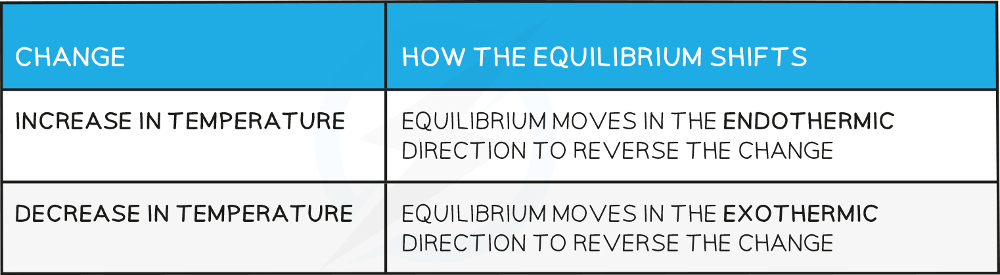

# Equilibrium Constant & Temperature

## Changing Conditions - Temperature

> **Spec point** — `spcpt_d95HsBtbSv2r5QxV`

## Changing Conditions - Temperature

- Changes in temperature **change **the equilibrium constants *K**c** *and *K**p*
- For an endothermic reaction such as:

2HI (g) ⇌ H2 (g) + I2 (g)

*K*c = `fraction numerator left square bracket straight H subscript 2 right square bracket space left square bracket straight I subscript 2 right square bracket over denominator left square bracket HI right square bracket squared end fraction`

- With an increase in temperature:

  - [H2] and [I2] **increases**
  - [HI] **decreases**
  - Because [H2] and [I2] are **increasing** and [HI] is **decreasing**, the equilibrium constant **increases**

- For an exothermic reaction such as:

2SO2 (g) + O2 (g) ⇌ 2SO3 (g)

*K*c = `fraction numerator left square bracket SO subscript 3 right square bracket squared over denominator left square bracket SO subscript 2 right square bracket squared space left square bracket straight O subscript 2 right square bracket end fraction`

- With an increase in temperature:

  - [SO3] **decreases**
  - [SO2] and [O2] **increases**
  - Because [SO3] **decreases** and [SO2] and [O2] **increases **the equilibrium constant  decreases

> **Worked Example**
> #### Increasing Kp
> 
> What will increase the value of *K*p for the following equilibrium?
> 
> 2A (g) + B (g) ⇌ 2C (g)
> 
> Δ*H* = +6.5 kJ mol-1
> 
> **  Answer**
> 
> Only temperature changes permanently affect the value of *K*p
> 
> An increase in temperature shifts the reaction in favour of the products.
> 
> The [ products ] increases and [ reactants ] decreases, therefore, the *K**p** *value increases.

#### How the equilibrium shifts with temperature changes:

**Effect on the value of the equilibrium constant**

- For a reaction that is exothermic in the forward direction, increasing the temperature pushes the equilibrium from right to left
- Therefore, the value of the equilibrium constant* *will decrease as the ratio of [ products ] to [ reactants ] decreases
- Conversely, if the temperature is raised in an endothermic reaction, the value of the equilibrium constant* *will increase
