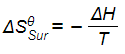
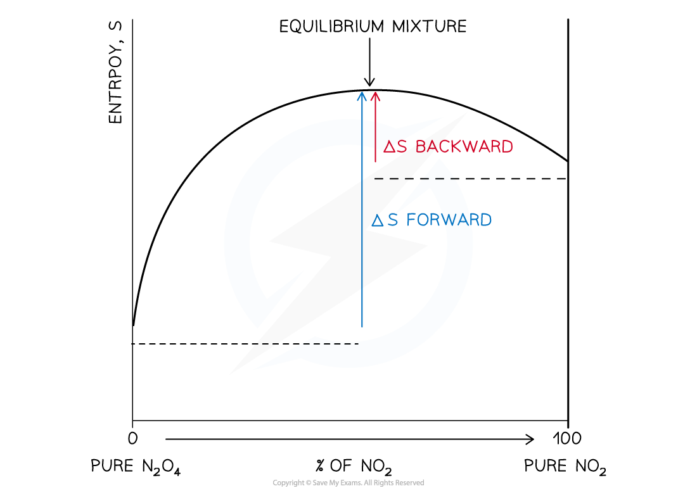

# Equilibrium Constant & Entropy

## Equilibrium Constant & Entropy

> **Spec point** — `spcpt_Gtwr2zNvcf9bZqsd`

## Equilibrium Constant & Entropy

- The equation for calculating the total entropy change is:

**Δ*****S*****ꝋ*****total****** *****=** **Δ*****S***** ****ꝋ*****sys***** + Δ*****S*****ꝋ*****surr***

(sys = system and surr = surroundings)

- Remember that **Δ*****S*****ꝋ*****total*** is positive for all spontaneous changes
- There is very little change in **Δ*****S*****ꝋ***sys*** **with a change in temperature unless there is a change in the state of one of the reactants or products
- There will be a significant change in **Δ*****S*****ꝋ*****surr***** **however
- The entropy change of the surroundings during a chemical reaction is

- Where Δ*H* is the enthalpy change and *T* is the absolute temperature (measured in kelvin)
- We can use this information to determine whether a reaction is spontaneous at a given temperature

> **Worked Example**
> Is the decomposition of calcium carbonate into calcium oxide and carbon dioxide spontaneous at the given temperatures?
> 
> CaCO3(s) → CaO(s) + CO2(g)                ΔH = +177.9 kJ mol-1        ΔS*sys* = +160.4 J K-1 mol-1
> 
> 1. 293K (20 °C)
> 2. 1173K (900 °C)
> 
> **   Answer 1: **at 293 K (20°C)
> 
> - ΔS*surroundings* = $-\frac{+177900J\mathrm{mol}^{-1}}{293K}$ = -607.2 J K-1 mol-1
> - ΔS*total*(293K) = (+160.4 - 607.2) = -446.8 J K-1 mol-1
> - The decomposition of calcium carbonate is not spontaneous at 293K
> 
> **   Answer 2: **at 1173K (900°C)
> 
> - ΔS*surroundings* = $-\frac{+177900J\mathrm{mol}^{-1}}{1173}$= -151.7 J K-1 mol-1
> - ΔS*total*(1173) = (+160.4 - 151.7) = +8.7 J K-1 mol-1
> - The decomposition of calcium carbonate is spontaneous when heated to 1173K

#### Relationship between entropy change and equilibrium constant

- For a reversible reaction that can reach equilibrium, the equilibrium position can be reached from either side of the reaction
- This means that both the forward and backward reactions are spontaneous

  - ΔS must be positive in both directions
- For example, consider the following reaction:

N2O4 (g) ⇌ 2NO2 (g)

**A graph of entropy against the percentage of NO****2**** in a mixture of N****2****O****4**** and NO****2**

- The entropy of N2O4 is less than the entropy of the equilibrium mixture
- The change in entropy from pure N2O4 to the equilibrium mixture is positive

  - The change is spontaneous
- The entropy change for NO2 to the equilibrium mixture is also positive

  - This change is also spontaneous
- The entropy change for a mixture of the gases in any proportions moving towards the equilibrium position is also positive
- Neither the forward nor backward reaction can go to completion as the entropy change from the equilibrium mixture to either the reactants or products is negative
- At equilibrium, the total entropy change is zero

Δ*S**total* [forward reaction] = Δ*S**total* [backward reaction]

- The relationship between the total entropy of the reaction and the equilibrium constant (*K*c or *K*p) is

Δ*S**total* = *R *ln*K*

**Using total entropy change to calculate an equilibrium constant**

- Rearranging the equation mentioned above we get:

ln*K* = $\frac{\DeltaS_{total}}{R}$

- Hence:

*K* = $e^{\frac{\DeltaS_{total}}{R}}$

**Relationship between equilibrium constant and equilibrium position**

- There is no hard rule for the relationship between equilibrium constant and the position of equilibrium
- As a general rule, we can say a very large value of *K* suggests the equilibrium position is pushed towards the products (right-hand side)
- Similarly, a very small value of *K* suggests the equilibrium position is pushed towards the reactants (left-hand side)
