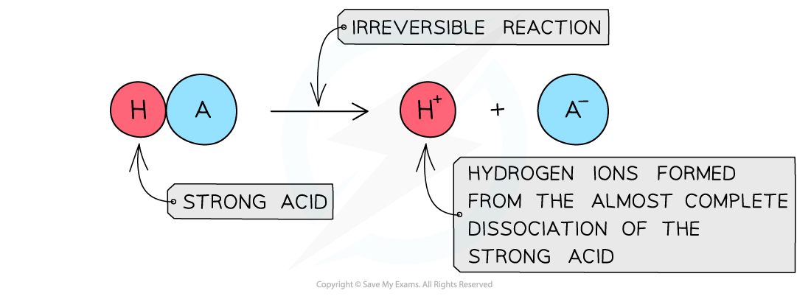
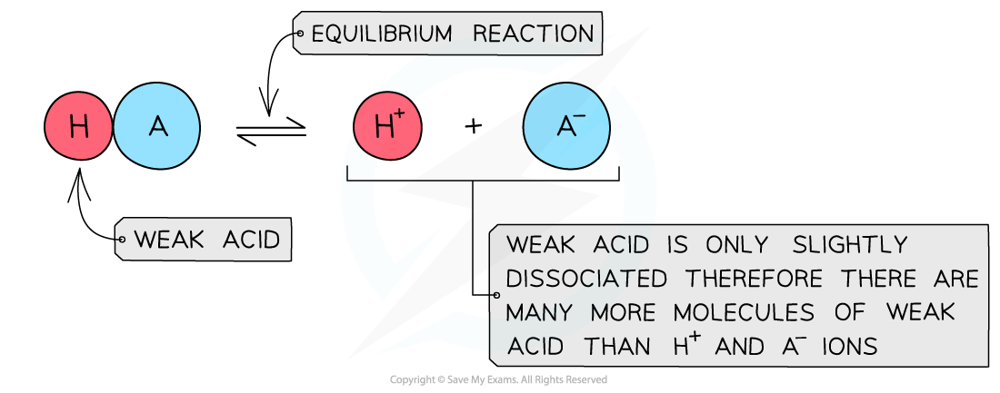
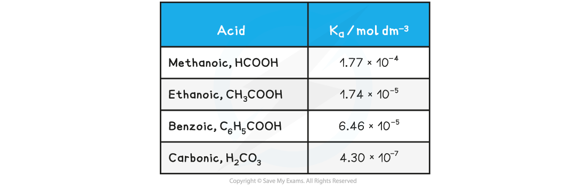
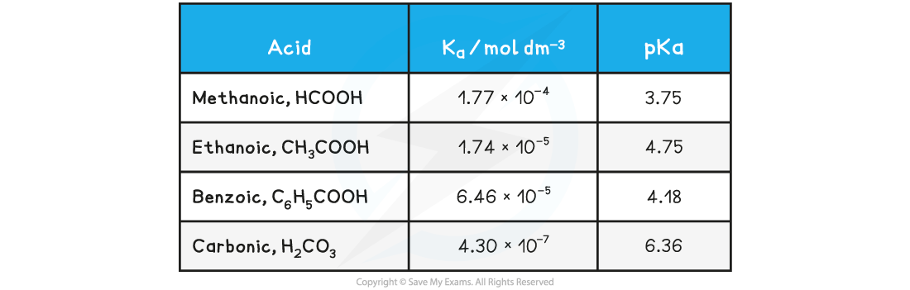

# Acid Strength

## Acids - Dissociation

> **Spec point** — `spcpt_Y2VknWpVVhxWjfRW`

## Acids - Dissociation

#### Strong acids

- A **strong acid **is an acid that **dissociates** almost **completely** in aqueous solutions

  - HCl (hydrochloric acid), HNO3 (nitric acid) and H2SO4 (sulfuric acid)
- The position of the equilibrium is so far over to the **right** that you can represent the reaction as an irreversible reaction

***The diagram shows the complete dissociation of a strong acid in aqueous solution***

#### Weak acids

- A **weak acid **is an acid that **partially** (or incompletely) **dissociates** in aqueous solutions

  - Eg. most organic acids (ethanoic acid), HCN (hydrocyanic acid), H2S (hydrogen sulfide) and H2CO3 (carbonic acid)
- The position of the equilibrium is more over to the **left** and an equilibrium is established

***The diagram shows the partial dissociation of a weak acid in aqueous solution***

## Acids - Ka Expressions

> **Spec point** — `spcpt_GWG2wSxpKwbXB73y`

## Acids - Ka Expressions

- For weak acids as there is an equilibrium we can write an equilibrium constant expression for the reaction

- This constant is called the **acid dissociation constant**, *K**a*, and has the units mol dm-3
- Values of *K**a *are very small, for example for ethanoic acid *K**a *= 1.74 x 10-5 mol dm-3 
- When writing the equilibrium expression for weak acids, the following assumptions are made:

  - The concentration of hydrogen ions due to the ionisation of water is negligible
- The value of *K**a* indicates the extent of dissociation

  - The higher the value of *K**a* the more dissociated the acid and the stronger it is
  - The lower the value of *K**a* the weaker the acid

#### pKa

- The range of values of *K**a* is very large and for weak acids, the values themselves are very small numbers

#### Table of Ka values

- For this reason it is easier to work with another term called ***pK******a***
- The ***pK******a***  is the negative log of the ***K******a*** value, so the concept is analogous to converting [H+] into pH values

***pK******a *****= -log*****K******a***

- Looking at the *pK**a *values for the same acids:

#### Table of pKa values

- The range of *pK**a *values for most weak acids lies between 3 and 7
