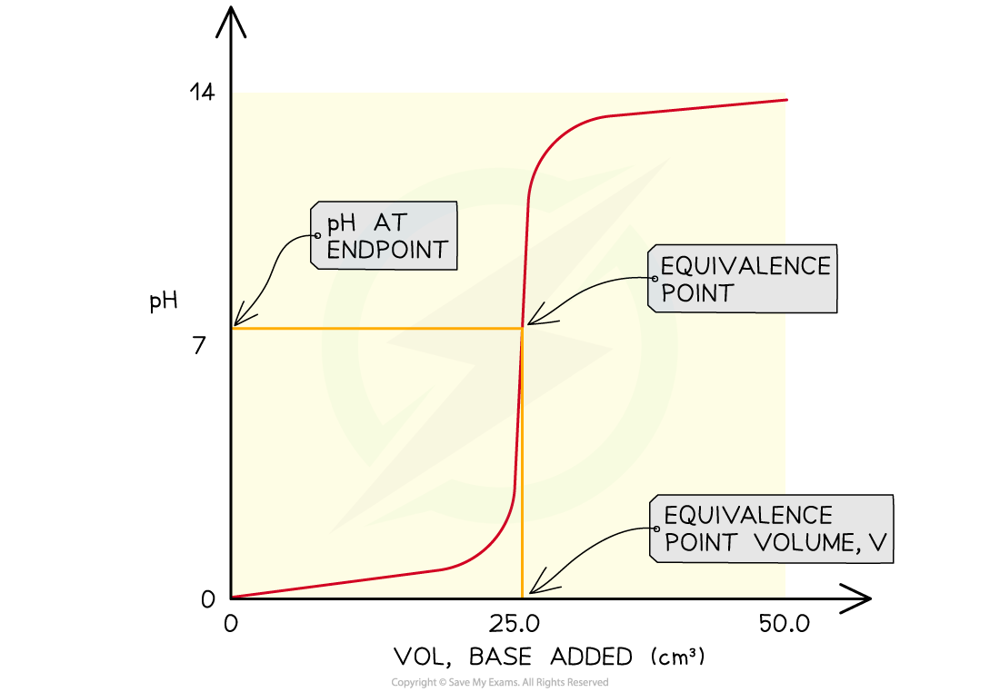
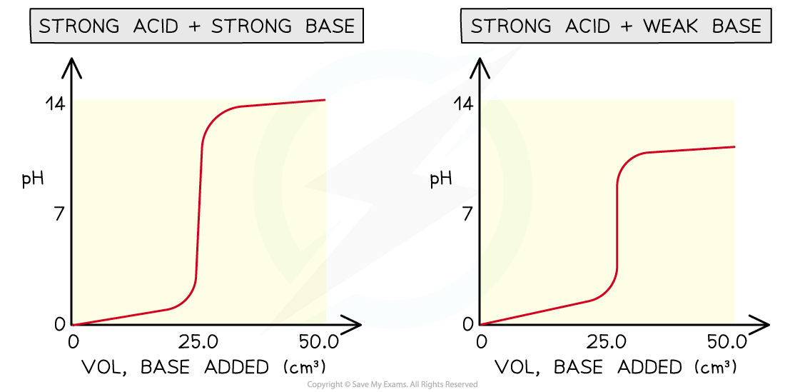
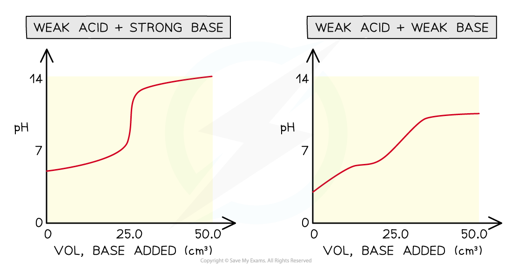
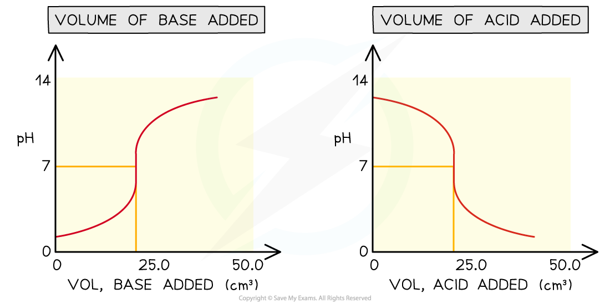
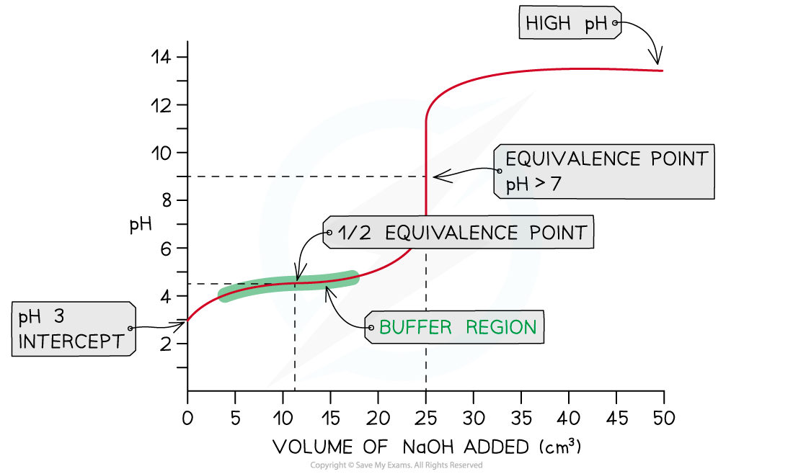

# Titration Curves

## Titration Curves - Interpretation

> **Spec point** — `spcpt_bSpd4TFrHHHk3HxW`

## Titration Curves - Interpretation

- During a titration a pH meter can be used and a pH curve plotted
- A pH curve is a graph showing how the pH of a solution changes as the acid (or base) is added
- The result is characteristically shaped graph which can yield useful information about how the particular acid and alkali react together with stoichiometric information

***The features of a pH curve***

- All pH curves show an s-shape curve and the midpoint of the inflection is called the **equivalence** or** stochiometric point**
- From the curves you can

  - Determine the pH of the acid by looking where the curve starts on the y-axis
  - Find the pH at the equivalence point
  - Find volume of base at the equivalence point
  - Obtain the range of pH at the vertical section of the curve

#### Four types of acid-base titrations

- There are four combinations of acids and alkalis that you should know about:

  - strong acid + strong base
  - weak acid + strong base
  - strong acid + weak base
  - weak acid + weak base

***pH curves for the four types of acid-base titrations***

- Without titles for the graph you can easily recognise which combination is shown by looking at the starting and ending pH and deducing whether the acid and alkali are strong or weak
- Sometimes you may see pH titration curves which show pH plotted against volume of acid added
- This produces the mirror image graph from which you can get all the same information

***Comparing different versions of pH titration curves***

#### Choosing an Indicator

- Not all indicators are suitable for every type of titration
- Indicators behave like weak acids and form an equilibrium between two coloured species:

HA(colour 1)$\rightleftharpoons$ H+ + A- (colour 2)

- The equilibrium constant,* K*a, for indicators, is known as *K*In and is normally expressed in the logarithmic form, p*K*In
- The working pH range of an indicator is a range of pH on either side of the p*K*In value
- For example, the p*K*In of methyl orange is 3.7
- Below pH 3.7 the dominant colour is colour 1 (red for methyl orange) and above it is colour 2 (yellow for methyl orange)
- The range of change for a weak acid-strong base titration is around pH 8-10
- Using methyl orange for this titration won't work because the range of change is far too high

  - You would see the indicator changing to yellow before you reach the end-point
- In this case, you need to use an indicator with a high pH range such as phenolphthalein

> **Exam Hint**
> The word base and alkali are being used interchangeably here, but you should know an alkali is a soluble base.Since we are dealing with titrations here, the bases are always in solution so they are also alkalis.

## Titration Curves - Application

> **Spec point** — `spcpt_Pj8dFrcWnYC8GdhS`

## Titration Curves - Application

- In this example, **strong **sodium hydroxide, NaOH (aq), is being added to **weak **ethanoic acid, CH3COOH (aq)

**NaOH (aq) + CH****3****COOH (aq) → CH****3****COONa (aq) + H****2****O (l)**

- The pH on the intercept on the y axis starts at roughly 3 due to the relative strength of the ethanoic acid
- The initial rise in pH is steep as the neutralisation of the weak acid by the strong base is rapid
- Ethanoate ions (conjugate base to ethanoic acid) are formed which then creates a *Buffer*

  - A buffer consists of a weak acid and its conjugate base or a weak base and its conjugate acid
- At this point, the buffer formed will resist changes in pH so the pH rises gradually as shown in the **buffer region**
- The **half equivalence point** is the stage of the titration at which exactly half the amount of weak acid has been neutralised

  - **[CH****3****COOH (aq)] = [CH****3****COO****-**** (aq)]**
  - At this point, it is important to note that the p*K*a of the acid is equal to the pH
  
    - **p*****K*****a**** = pH **at **half equivalence **
- The equivalence point in a weak acid - strong base titration is **above 7**

***Weak acid - strong base pH curve ***
