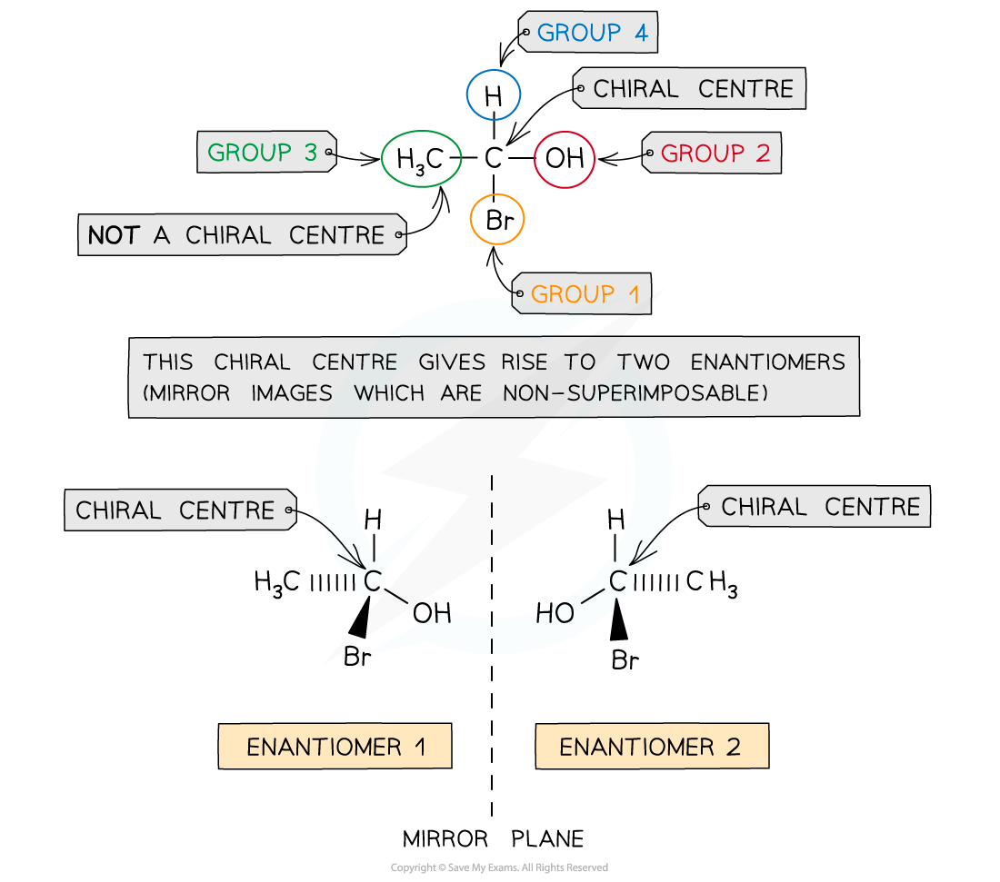

# Chirality in Optical Isomers

## Chirality in Optical Isomers

> **Spec point** — `spcpt_tsNxtB8fCWSM7m8h`

## Chirality in Optical Isomers

#### Optical isomers

- A carbon atom that has four different atoms or groups of atoms attached to it is called a **chiral carbon **or **chiral centre**

  - Chira comes from a Greek word meaning hand, so we talk about these molecules having a handedness
- The carbon atom is described as being **asymmetric**, i.e. there is no plane of symmetry in the molecule
- Compounds with one chiral centre (**chiral molecules**) exist as two optical isomers, also known as **enantiomers**
- Just like the left hand cannot be superimposed on the right hand, enantiomers are **non**-**superimposable**

  - Enantiomers are **mirror** **images** of each other

***A molecule has a chiral centre when the carbon atom is bonded to four different atoms or group of atoms; this gives rises to enantiomers***

- You always obtain two optical isomers from one chiral centre
- Where a molecule has two chiral centres, then there are two pairs of optical isomers
- The isomers will only differ in two characteristics; how they interact with plane polarised light and how they react with other chiral molecules
- If a molecule has three chiral centres there will be eight stereoisomers
- This means the relationship is:  number of isomers = 2n  where n= the number of chiral centres

> **Exam Hint**
> When drawing optical isomers, always draw mirror images including wedge and dashed bonds
> 
> 
