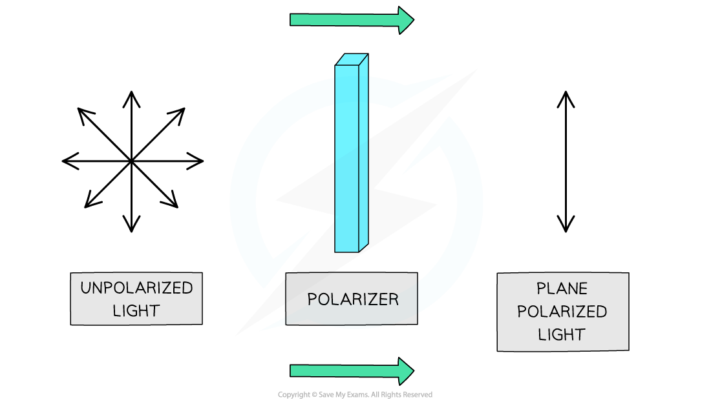
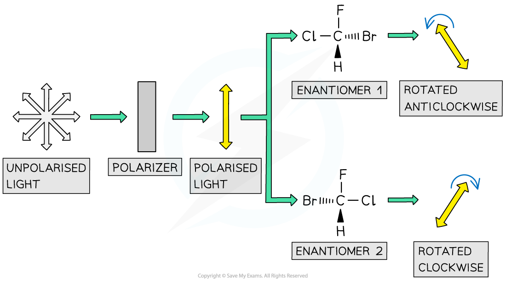

# Racemates & Optical Activity

## Racemates & Optical Activity

> **Spec point** — `spcpt_G4zbHnYzQG9Dg3jg`

## Racemates & Optical Activity

#### Properties of optical isomers

- The chemical properties of optical isomers are generally identical, with one exception

  - Optical isomers interact with biological sensors in different ways
  
    - For example, one enantiomer of carvone smells of spearmint, while the other smells of caraway 

***                         Carvone optical isomers have distinctive smells***

- Optical isomers have identical physical properties, with one exception

  - Isomers differ in their ability to rotate the plane of polarised light

***When unpolarised light is passed through a polariser, the light becomes polarised as the waves will vibrate in one plane only***

- The major difference between the two enantiomers is:

  - One enantiomer rotates plane polarised light in a **clockwise **manner and the other in an **anticlockwise **fashion
  - A common way to differentiate the isomers is to use (+) and (-), but there are other systems using d and l, D and L, or R and S
- The rotation of plane polarised light can be used to determine the identity of an optical isomer of a single substance

  - For example, pass plane polarised light through a sample containing one of the two optical isomers of a single substance
  - Depending on which isomer the sample contains, the plane of polarised light will be rotated either clockwise or anti-clockwise by a fixed number of degrees

***Each enantiomer rotates the plane of polarised light in a different direction***

- A **racemic mixture **(or **racemate**) is a mixture containing **equal amounts **of each enantiomer

  - One enantiomer rotates light clockwise, the other rotates light anticlockwise
- A racemic mixture is **optically inactive **as the enantiomers will cancel out each others effect

  - This means that the plane of polarised light will **not change** 

***           Racemic mixtures are optically inactive***

#### Racemic mixtures and drugs

- In the pharmaceutical industry, it is much easier to produce synthetic drugs that are racemic mixtures than producing one enantiomer of the drug
- Around 56% of all drugs in use are chiral and of those 88% are sold as racemic mixtures
- Separating the enantiomers gives a compound that is described as **enantiopure**, it contains only one enantiomer
- This separation process is very expensive and time consuming, so for many drugs it is not worthwhile, even though only half the of the drug is pharmacologically active
- For example, the pain reliever ibuprofen is sold as a racemic mixture

***The structure of ibuprofen showing the chiral carbon that is responsible for the racemic mixture produced in the synthesis of the drug***
