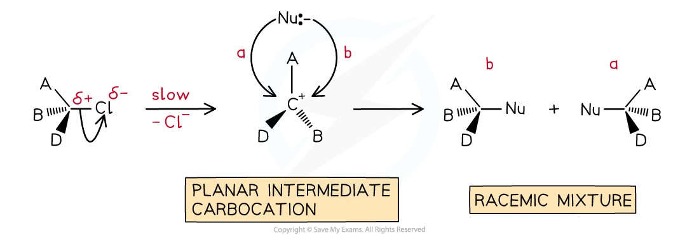

# Mechanisms & Optical Activity

## Mechanisms & Optical Activity

> **Spec point** — `spcpt_dPys4TYPtXSQcCCc`

## Mechanisms & Optical Activity

- Optical activity can be used to suggest the mechanism of a chemical reaction
- This is particularly the case for **nucleophilic substitution**

  - Nucleophilic substitution can occur via an SN1 or SN2 mechanism

#### SN1 mechanism

- The SN1 mechanism is a **two-step** reaction

  - In the first step, the C-X bond breaks heterolytically and the halogen leaves the halogenoalkane as an X- ion
  - This leaves a **trigonal planar**, tertiary carbocation
  - In the second step, the planar, tertiary carbocation is attacked by the nucleophile
  - **The nucleophile is able to attack from either side of the planar carbocation, which results in the formation of a racemic mixture**
- Therefore, a reaction with an SN1 mechanism will produce a racemic mixture** **

***S******N******1 Optical Isomers Mechanism***

#### SN2 mechanism

- The SN2 mechanism is a **one-step** reaction

  - The nucleophile donates a pair of electrons to the δ+ carbon atom of the halogenoalkane to form a new bond
  - At the same time, the C-X bond is breaking and the halogen (X) takes both electrons in the bond
  - The halogen leaves the halogenoalkane as an X- ion
- For example, the nucleophilic substitution of bromoethane by hydroxide ions to form ethanol

***The *****S****N****2 *****mechanism of bromoethane with hydroxide causing an inversion of configuration***

- The bromine atom of the bromoethane molecule causes **steric hindrance**
- This means that the hydroxide ion nucleophile can only attack from the opposite side of the C-Br bond

  - Attack from the same side as the bromine atom is sometimes called frontal attack
  - While attack from the opposite side is sometimes called backside or rear-side attack
- As the C-OH bond forms, the C-Br bond breaks causing the bromine atom to leave as a bromide ion

  - As a result of this, the molecule has undergone an inversion of configuration
  - The common comparison for this is an umbrella turning inside out in the wind

 <!-- asset download failed -->

***Inversion of configuration - umbrella analogy***

- Therefore, if a reaction with an SN2 mechanism starts with an enantiopure reactant then an enantiopure products will be formed
