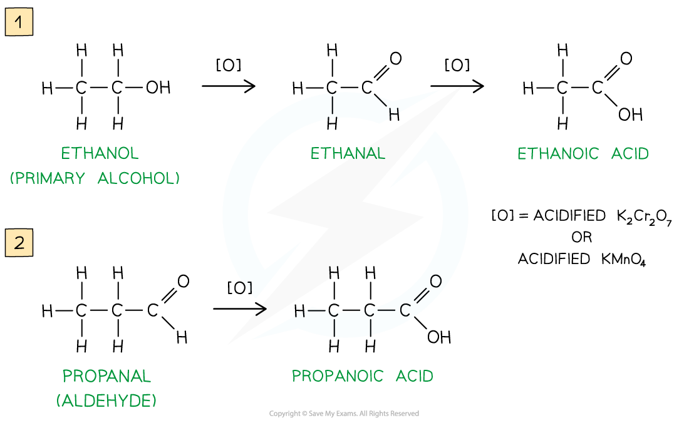
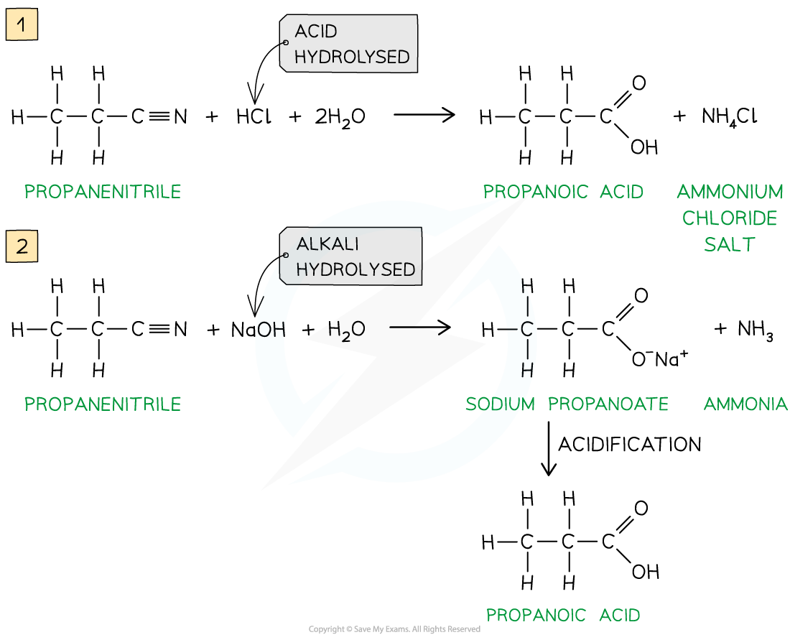

# Preparation of Carboxylic Acids

## Carboxylic Acids - Preparation 

> **Spec point** — `spcpt_hrxmYcXsFVKCqg5k`

## Carboxylic Acids - Preparation

- **Carboxylic acids **are compounds with a -COOH functional group
- They can be prepared by a series of different reactions

#### Oxidation of primary alcohols & aldehydes

- Carboxylic acids can be formed from the **oxidation** of **primary alcohols **and **aldehydes **by either **acidified K****2****Cr****2****O****7**** **or **acidified KMnO****4**** **and **reflux**
- The oxidising agents themselves get reduced causing the solutions to change colour

  - In K2Cr2O7 the orange dichromate ions (Cr2O72-) are reduced to green Cr3+ ions
  - In KMnO4**  **the purple manganate ions (MnO4-) are reduced to colourless Mn2+ ions

***Oxidation of primary alcohols (1) and aldehydes (2) gives carboxylic acids***

#### Hydrolysis of nitriles

- Carboxylic acids can also be prepared from the **hydrolysis **of **nitriles** using either **dilute acid **or **dilute alkali followed by acidification**

  - Hydrolysis by dilute acid results in the formation of a carboxylic acid and ammonium salt
  - Hydrolysis by dilute alkali results in the formation of a sodium carboxylate salt and ammonia; Acidification is required to change the carboxylate ion into a carboxylic acid
- The -CN group at the end of the hydrocarbon chain is converted to a -COOH group

***Hydrolysis of nitriles by either dilute acid (1) or dilute alkali and acidification (2) will form a carboxylic acid***
