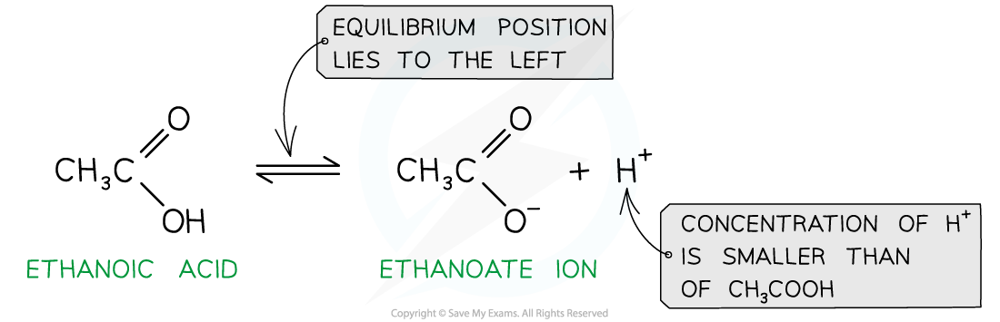
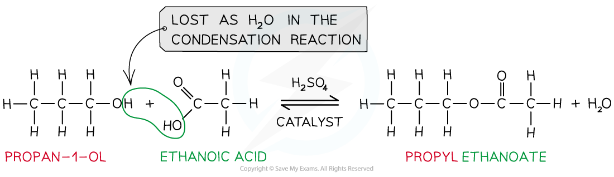

# Reactions of Carboxylic Acids

## Carboxylic Acids - Reactions 

> **Spec point** — `spcpt_75Q7mzKZnfsth682`

## Carboxylic Acids - Reactions

- In aqueous solution they are only slightly ionised, to give low concentrations of hydronium ions and alkanoate ions (often called carboxylate ions)

- This **partial ionisation** in solution means that carboxylic acids are **weak acids**
- This means that the position of the equilibrium lies to the left and that the concentration of H+ is much smaller than the concentration of the carboxylic acid
- However, the concentration of hydrogen ions is sufficient to react with an aqueous solution of sodium carbonate or sodium hydrogen carbonate to produce carbon dioxide
- These reactions are a useful test for the possible presence of a carboxylic acid:

  - Sodium carbonate: 2RCOOH + Na2CO3 → 2RCOO-Na+ + CO2 + H2O
  - Ionic equation with carbonates: 2RCOOH + CO32- → 2RCOO- + CO2 + H2O
  - Sodium hydrogen carbonate: RCOOH + NaHCO3 → RCOO-Na+ + CO2 + H2O
  - Ionic equation with hydrogen carbonates: RCOOH + HCO3- → RCOO- + CO2 + H2O

***Carboxylic acids are weak acids that do not fully dissociate in water, the position of the equilibrium lies to the left***

#### Reaction with LiAlH4

- Carboxylic acids can undergo reduction when they react with a reducing agent such as **lithium tetrahydridoaluminate, **LiAlH4, suspended in dry ether at room temperature
- A carboxylic acid will be reduced to a primary alcohol, for example

**CH****3****CH****2****COOH (l) + 4[H] → CH****3****CH****2****CH****2****OH (l) + H****2****O (l)**

- Addition of water at the end will destroy any excess lithium tetrahydridoaluminate

#### Reaction with bases

- Carboxylic acids can form salts with metals, alkalis and carbonates.
- In the reaction with **metal oxides** a metal salt and water are produced

  - For example in reaction with magnesium the salt magnesium ethanoate is formed:

**2CH****3****COOH (aq) + MgO (s) → (CH****3****COO)****2****Mg (aq) + H****2****O (l) **

- In the reaction with **alkalis** a salt and water are formed in a neutralisation reaction

  - For example in reaction with potassium hydroxide the salt potassium ethanoate is formed:

**CH****3****COOH (aq) + KOH (aq) → CH****3****COOK (aq) + H****2****O (l)**

- In the reaction with **carbonates** a metal salt, water and carbon dioxide gas are produced

  - For example in reaction with potassium carbonate the salt potassium ethanoate is formed:

**2CH****3****COOH (aq) + K****2****CO****3**** (s) → 2CH****3****COOK (aq) + H****2****O (l) + CO****2**** (g)**

#### Reaction with phosphorus(V) chloride

- Carboxylic acids react with solid phosphorus(V) chloride to form an acyl chloride
- For example, propanoic acid will react with phosphorus(V) chloride to form propanoyl chloride, phosphorus trichloride oxide and hydrogen chloride

**CH****3****CH****2****COOH (l) + PCl****5**** (s) → CH****3****CH****2****COCl (l) + POCl****3**** (l) + HCl (g)**

- In this reaction, steamy fumes of HCl are produced
- The liquid products can be separated by fractional distillation

#### Reaction with alcohols

- When carboxylic acids react with alcohols an ester is formed
- **Esters **are compounds with an -COOR functional group and are characterised by their **sweet **and **fruity** smells
- They are prepared from the **condensation **reaction between a **carboxylic acid **and **alcohol **with **concentrated H****2****SO****4**** **as **catalyst**

  - This is also called **esterification**
- The first part of the ester’s name comes from the alcohol and the second part of the name comes from the carboxylic acid

  - E.g. Propanol and ethanoic acid will give the ester propyl ethanoate

***Esters are formed from the condensation reaction between carboxylic acids and alcohols***
