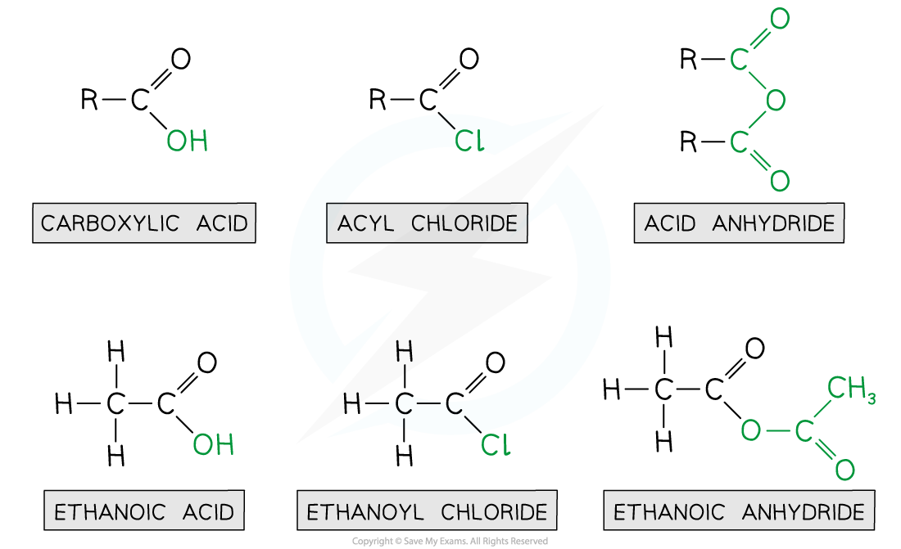
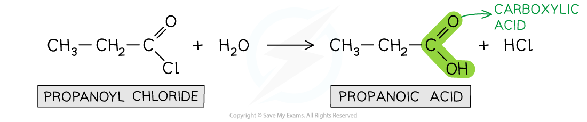
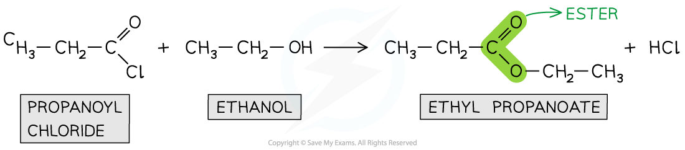

# Acyl Chlorides & Esters

## Acyl Chlorides & Esters

> **Spec point** — `spcpt_QmTqsjhZ4F58crbN`

## Acyl Chlorides & Esters

Acyl groups can be built into many molecules using acyl chlorides or acid anhydrides (known as acylating agents). Acyl chlorides are **derivatives of carboxylic acids** by substitution of the -OH group by a chlorine atom. They are named by identifying the parent hydrocarbon chain and adding the suffix -*oyl chloride.* They can also be named by removing the -oic acid from the carboxylic acid and adding -*oyl chloride*

- Acid anhydrides are also **derivatives of carboxylic acids** formed by substitution of the -OH group by an alkanoate

  - Acid anhydrides are named by identifying the parent hydrocarbon chain and adding the suffix -*oic anhydride*
  - They can also be named by removing the -oic acid from the carboxylic acid and adding -*oic anyhydride*

***Ethanoic acid derivatives***

> **Worked Example**
> Draw the displayed formula for the following:
> 
> A. Butanoyl chloride
> 
> B. Butanoic anhydride
> 
> **Answer:**
> 
> 

- **Acyl chlorides **are **reactive **organic compounds that undergo many reactions such as **nucleophilic addition-elimination **reactions
- In nucleophilic addition-elimination reactions, the **nucleophilic addition** of a small molecule across the C=O bond takes place followed by **elimination** of a small molecule
- Examples of these nucleophilic addition-elimination reactions include:

  - **Hydrolysis**
  - Reaction with alcohols to form **esters**
  - Reaction with ammonia and primary amines to form **amides**

#### Hydrolysis

- The **hydrolysis **of acyl chlorides results in the formation of a **carboxylic acid **and **HCl***** ***molecule
- This is a **nucleophilic addition-elimination **reaction

  - A **water molecule **adds across the C=O bond
  - A hydrochloric acid (HCl) molecule is **eliminated**
- An example is the hydrolysis of propanoyl chloride to form propanoic acid and HCl

***Acyl chlorides are hydrolysed to carboxylic acids***

#### Formation of esters

- Acyl chlorides can react with **alcohols **to form esters
- The esterification of acyl chlorides is also a **nucleophilic addition-elimination **reaction

  - The alcohol adds across the C=O bond
  - A HCl molecule is eliminated

***Acyl chlorides undergo esterification with alcohols to form esters***

#### Formation of amides

- Acyl chlorides react with **ammonia** or **primary amines** to form **amides** in a **condensation reaction**.
- A **lone pair** on the nitrogen atom attacks the **carbonyl carbon** in the acyl chloride.
- The reaction proceeds via a nucleophilic **addition–elimination mechanism**:

  - The nucleophile adds to the C=O bond
  - A chloride ion (Cl⁻) is eliminated
  - **Hydrogen chloride (HCl)** is formed

#### What happens to the HCl?

- The **HCl formed** does not remain unreacted.
- It is **immediately neutralised** by a **second molecule** of ammonia or amine present in excess.
- This forms an **ammonium salt** (e.g. NH₄Cl, CH₃NH₃Cl).

#### Why 2 molecules are needed

- The **1st molecule** of ammonia/amine forms the **amide**
- The **2nd molecule** of ammonia/amine neutralises the **HCl** and forms **ammonium salt**

#### Examples

- **Reaction with ammonia**
- **Product:** Primary amide (propanamide) and ammonium chloride

CH3CH2COCl + 2NH3 → CH3CH2CONH2 + NH4Cl

- **Reaction with methylamine**
- **Product:** Secondary (substituted) amide and methylammonium chloride

CH3COCl + 2CH3NH2 → CH3CONHCH3 + CH3NH3Cl

- **Reaction with ethylamine**
- **Product:** Secondary (substituted) amide and ethylammonium chloride

CH3COCl + 2CH3CH2NH2 → CH3CONHCH2CH3 + CH3CH2NH3Cl

#### Summary for formation of amides

- All reactions form **HCl**, which is **not observed** as a separate product
- The **HCl is neutralised** by excess ammonia or amine
- The final products are an **amide** and an **ammonium salt**

> **Exam Hint**
> Acyl chlorides also react with secondary amines to form secondary amides. They do not react with tertiary amines.
> 
> - acyl chloride + primary amine → secondary amide + HCl
> - acyl chloride + secondary amine → tertiary amide + HCl
> - acyl chloride + tertiary amine → no reaction
