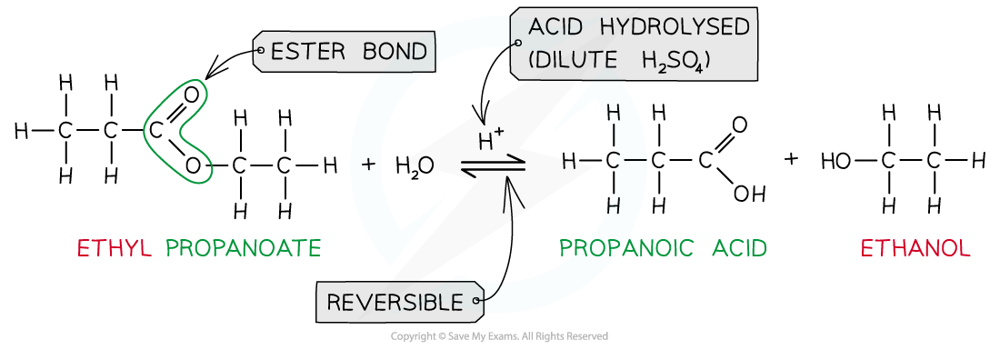
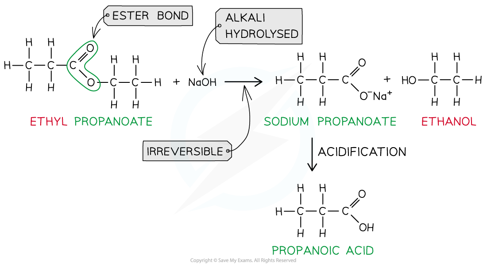
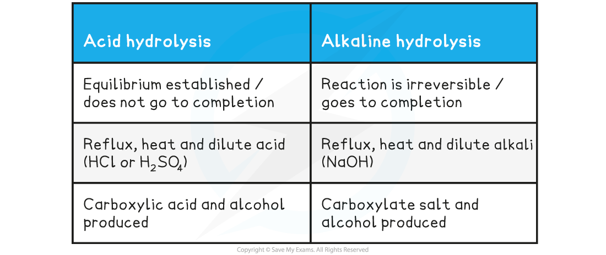

# Acid & Alkaline Hydrolysis of Esters

## Acid & Alkaline Hydrolysis of Esters

> **Spec point** — `spcpt_XN5Khv89PySX8J9b`

## Acid & Alkaline Hydrolysis of Esters

#### Hydrolysis of Esters - Acid

- The reverse of the esterification reaction is called **hydrolysis**
- Ester hydrolysis is a useful reaction for creating biodegradable plastics
- Esters can be **hydrolysed **to reform the carboxylic acid and alcohol or salts of carboxylic acids by using either **dilute acid **(e.g. sulfuric acid) or** alkali **(e.g. sodium hydroxide) and **heat**
- When an ester is **heated under reflux **with **acid **an equilibrium mixture is established, meaning that the hydrolysis reaction is not complete** **

***Ester hydrolysis by dilute acid is a reversible reaction forming carboxylic acid and alcohol***

#### Hydrolysis of Esters - Alkaline

- However, **heating **the ester **under reflux **with **dilute alkali** (e.g. sodium hydroxide) is an **irreversible **reaction as the ester is fully hydrolysed and the reaction goes to completion
- The ester directly reacts with the alkali (NaOH) to produce to form a** carboxylate salt** and **alcohol** in an irreversible step
- The **sodium** **carboxylate** salt requires further **acidification** to turn into a **carboxylic** **acid**

  - The sodium carboxylate (-COO-) ion needs to get protonated by an acid (such as HC*l*) to form the carboxylic acid (-COOH)

***Ester hydrolysis by dilute alkali is an irreversible reaction forming a sodium carboxylate salt and alcohol***

#### Table showing differences in Hydrolysis of Esters

> **Worked Example**
> Name the products and write equations for the following hydrolysis reaction:
> 
> 1. Ethyl ethanoate with hot dilute sulfuric acid solution
> 2. Methyl propanoate by hot sodium hydroxide solution
> 
> **Answer:**
> 
> **Answer 1:** Ethanoic acid and ethanol
> 
> CH3COOCH2CH3 + H2O ⇌ CH3COOH + CH3CH2OH
> 
> **Answer 2:** Sodium propanoate and methanol
> 
> CH3CH2COOCH3 + NaOH → CH3CH2COONa + CH3OH
