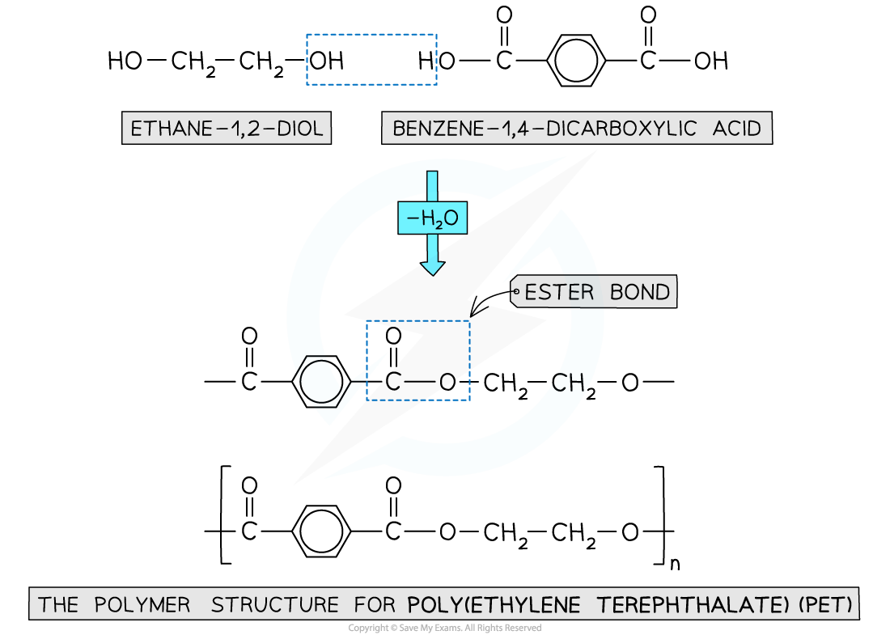

# Forming Polyesters

## Forming Polyesters

> **Spec point** — `spcpt_RP5yhgNcckZY4VgB`

## Forming Polyesters

- Addition polymerisation has been covered in reactions of alkenes

  - They are made using monomers that have C=C double bonds joined together to form polymers such as polyethene
- Condensation polymerisation is another type of reaction whereby a polymer is produced by repeated condensation reactions between monomers
- Natural condensation polymers are all formed by **elimination of water**

  - Although the process of **condensation** polymerisation involves the **elimination of a small molecule**
- **Condensation polymers** can be identified because the monomers are linked by **ester** or **amide bonds**

#### Polyester

- Is formed by the reaction between **dicarboxylic acid monomers** and **diol monomers**
- Polyester is produced by linking these monomers with **ester bonds / links**

***This polymer structure shows an ester functional group linking monomers together***

#### Formation of polyesters

- A diol and a dicarboxylic acid are required to form a polyester

  - A diol contains 2 -OH groups
  - A dicarboxylic acid contains 2 -COOH groups

***The position of the functional groups on both of these molecules allows condensation polymerisation to take place effectively***

- When the polyester is formed, the H atom on the diol and the -OH group of the -COOH are expelled as a water molecule (H2O)
- The resulting polymer is a polyester

  - In this example, the polyester is **poly(ethylene terephthalate)** or PET, which is sometimes known by its brand names of Terylene or Dacron

***Expulsion of a water molecule in this condensation polymerisation forms the polyester called (ethylene terephthalate) (PET)***

#### Formation of polyesters - hydroxycarboxylic acids

- So far the examples of making polyesters have focused on using 2 separate monomers for the polymerisation
- There is another route to making polyesters
- A single monomer containing both of the key functional groups can also be used
- These monomers are called hydroxycarboxylic acids

  - They contain an alcohol group (-OH) at one end of the molecule while the other end is capped by a carboxylic acid group (-COOH)

***Both functional groups that are needed to make the polyester come from the same monomer***
