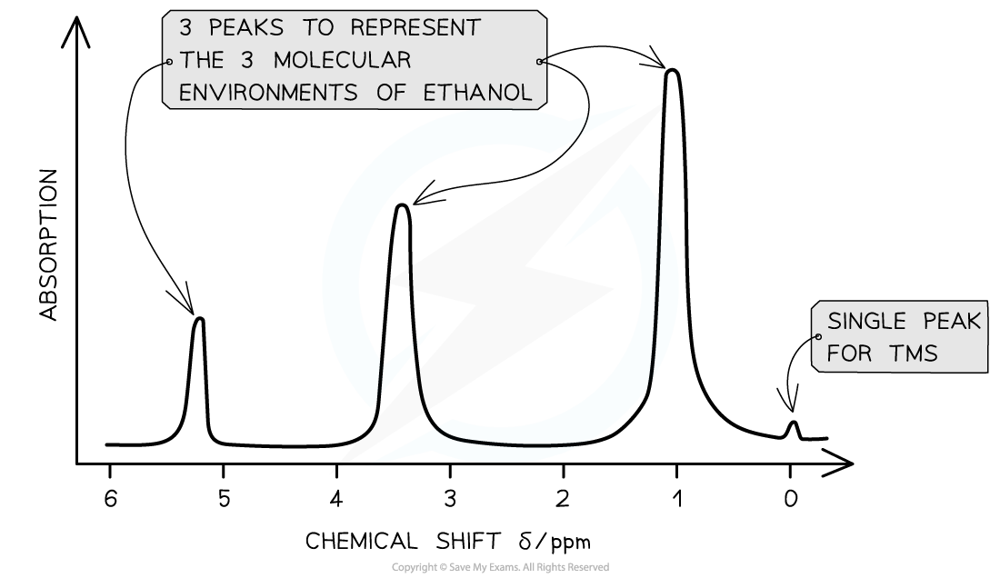
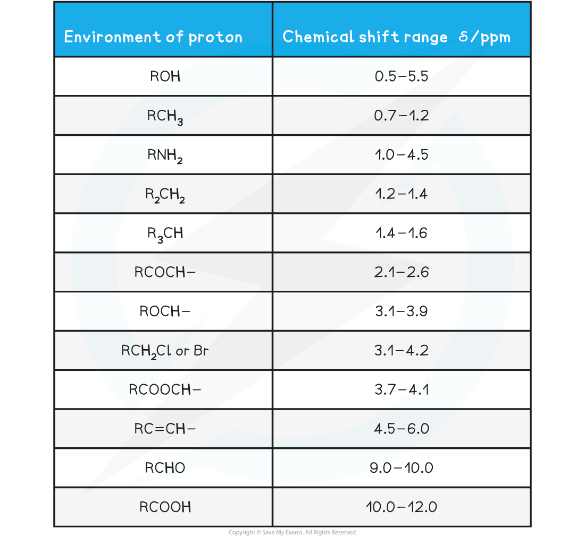
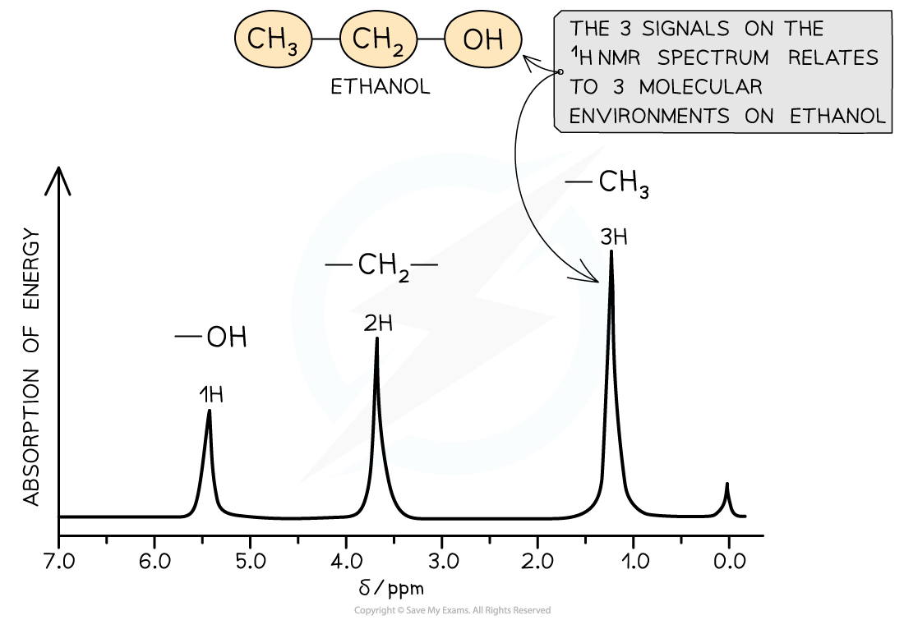

# Low Resolution Proton NMR

## Low Resolution Proton NMR

> **Spec point** — `spcpt_Grnt9JfDt86FQWrp`

## Low Resolution Proton NMR

- **Nuclear Magnetic Resonance (NMR)** spectroscopy is used for analysing organic compounds
- All samples are measured against a reference compound – **Tetramethylsilane (TMS)**

***Tetramethylsilane is the common reference compound for NMR spectroscopy***

- TMS shows a single sharp peak on NMR spectra, at a value of zero
- TMS is also used because it is:

  - Non toxic.
  - Does not react with the sample.
  - Easily separated from the sample molecule due to its low boiling point.
  - Produces one strong, sharp absorption peak on the spectrum.
- Sample peaks are then plotted as a ‘shift’ away from this reference peak
- This gives rise to ‘chemical shift’ values for protons on the sample compound
- Chemical shifts are measured in parts per million (ppm)

#### Features of a 1H NMR spectrum

- NMR spectra shows the intensity of each peak against their chemical shift
- The area under each peak gives information about the number of protons in a particular environment
- The height of each peak shows the intensity / absorption from protons
- A single sharp peak is seen to the far right of the spectrum

  - This is the reference peak from TMS
  - Usually at chemical shift 0 ppm

***A low resolution ******1******H NMR for ethanol showing the key features of a spectrum***

#### Molecular environments

- 1H nuclei that have different neighboring atoms (said to have different **chemical environments**) absorb at slightly different field strengths
- The difference environments are said to cause a **chemical shift** of the absorption

  - Ethanol has the structural formula CH3CH2OH
  - There are 3 chemical environments: -CH3, -CH2 and -OH
- The hydrogen atoms in these environments will appear at 3 different chemical shifts
- Different types of protons are given their own range of chemical shifts

> **Worked Example**
> How many different 1H chemical environments occur in 2-methylpropane?
> 
> **Answer:**
> 
> Two different 1H chemical environments occur in 2-methylpropane
> 
> - The three methyl groups are in the same 1H environment
> 
>   - The lone hydrogen is in its own 1H environment
> 
> 

#### Chemical Shift Values for 1H Molecular Environments Table

- Protons in the same chemical environment are chemically equivalent

  - 1,2-dichloroethane, Cl-CH2-CH2-Cl has one chemical environment as these four hydrogens are all exactly equivalent
- Each individual peak on a 1H NMR spectrum relates to protons in the same environment

  - Therefore, 1,2-dichloroethane would produce one single peak on the NMR spectrum as the protons are in the same environment

#### Low resolution 1H NMR

- Peaks on a low resolution NMR spectrum refers to molecular environments of an organic compound

  - Ethanol has the molecular formula CH3CH2OH
  - This molecule as 3 separate environments: -CH3, -CH2, -OH
  - So 3 peaks would be seen on its spectrum at 1.2 ppm (-CH3), 3.7 ppm (-CH2) and 5.4 ppm (-OH)
  - The strengths of the absorptions are proportional to the number of equivalent 1H atoms causing the absorption and are measured by the area underneath each absorption peak
  - Hence, the areas of absorptions of -CH3, -CH2, -OH are in the ratio of 3:2:1 respectively

***A low resolution NMR spectrum of ethanol showing 3 peaks for the 3 molecular environments***
