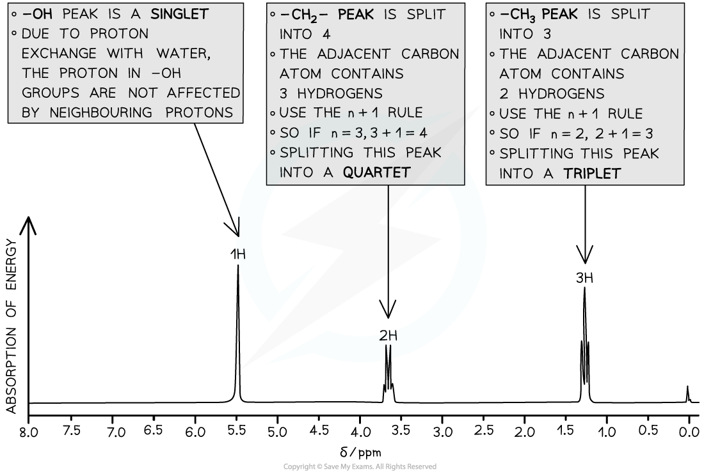
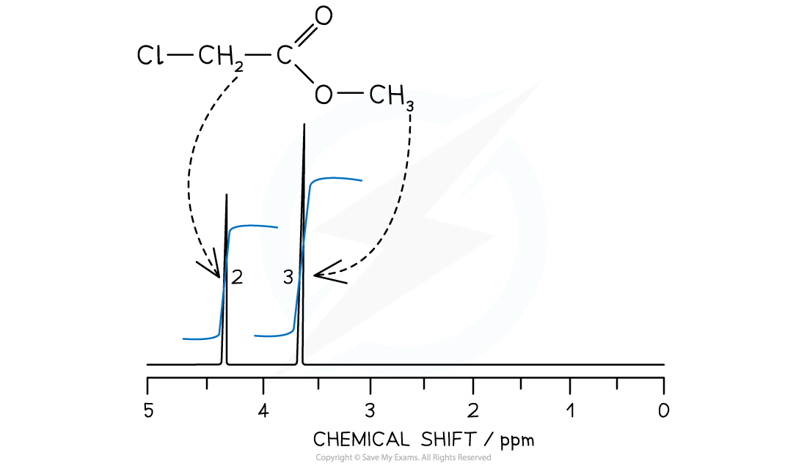
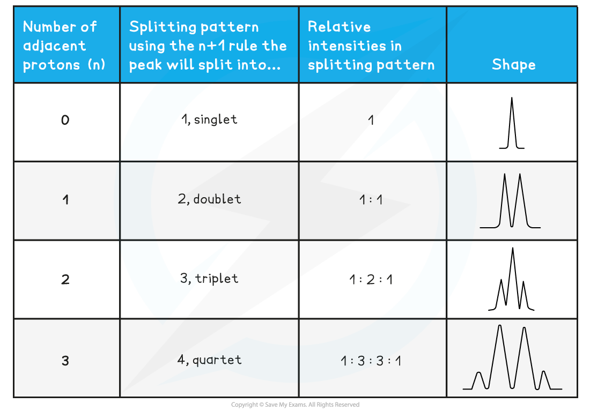
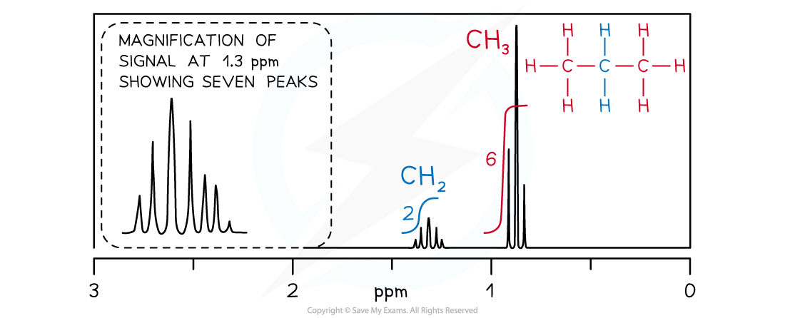

# High Resolution Proton NMR

## High Resolution Proton NMR

> **Spec point** — `spcpt_zt5vS5NJHKJv74xr`

## High Resolution Proton NMR

- More structural details can be deduced using high resolution NMR
- The peaks observed on a high resolution NMR may sometimes have smaller peaks clustered together
- The splitting pattern of each peak is determined by the number of protons on neighbouring environments

**The number of peaks a signal splits into = n + 1**

(Where n = the number of protons on the adjacent carbon atom)

***High resolution ******1******H NMR spectrum of ethanol showing the splitting patterns of each of the 3 peaks. Using the n+1, it is possible to interpret the splitting pattern***

- Each splitting pattern also gives information on relative intensities

  - A doublet has an intensity ratio of 1:1 – each peak is the same intensity as the other
  - In a triplet, the intensity ratio is 1:2:1 – the middle of the peak is twice the intensity of the 2 on either side
  - In a quartet, the intensity ratio is 1:3:3:1 – the middle peaks are three times the intensity of the 2 outer peaks

#### Integrated spectra

- In 1H NMR, the relative areas under each peak give the ratio of the number of protons responsible for each peak
- The NMR spectrometer measures the area under each peak, as an integration spectra

  - This provides invaluable information for identifying an unknown compound
- The 1H NMR of methyl chloroethanoate, C*l*CH2COOCH3, will show an integration spectra in the peak area ratio of 2:3

  - 2 for the protons in the CH2
  - 3 for the protons in CH3

#### Spin-Spin Splitting

- A 1H NMR peak can show you the structure of the molecule but also the peaks can be split into sub-peaks or splitting patterns
- These are caused by a proton's spin interacting with the spin states of nearby protons that are in different environments

  - This can provide information about the number of protons bonded to adjacent carbon atoms
  - The splitting of a main peak into sub-peaks is called spin-spin splitting

#### The n+1 rule

- The number of sub-peaks is one greater than the number of adjacent protons causing the splitting

  - For a proton with *n *protons attached to an adjacent carbon atom, the number of sub-peaks in a splitting pattern = *n*+1
- When analysing spin-spin splitting, it shows you the number of hydrogen atoms on the immediately adjacent carbon atom
- These are the splitting patterns that you need to be able to recognise from a 1H spectra:

#### 1H NMR Peak Splitting Patterns Table

- Splitting patterns must occur in pairs, because each protons splits the signal of the other
- There are some common splitting pairs you will see in a spectrum however you don't need to learn these but can be worked out using the *n*+1 rule

  - You will quickly come to recognise the triplet / quartet combination for a CH3CH2  because it is so common

#### Common pair of splitting patterns

- A quartet and a triplet in the same spectrum usually indicate an ethyl group, CH3CH2-
- The signal from the CH3 protons is split as a triplet by having two neighbours
- The signal from the CH2 protons is split as a quartet by having three neighbours
- Here are some more common pairs of splitting patterns

***Common pairs of splitting patterns***

#### 1H NMR spectrum of propane

- The CH2 signal in propane (blue) is observed as a heptet because it has six neighbouring equivalent H atoms (*n*+1 rule), three either side in two equivalent CH3 groups
- The CH3 groups (red) produce identical triplets by coupling with the CH2 group

> **Worked Example**
> For the compound (CH3)2CHOH predict the following:
> 
> i) the number of peaks
> 
> ii) the type of proton and chemical shift (using the Data sheet)
> 
> iii) the relative peak areas
> 
> iv) the split pattern
> 
> **Answers:**
> 
> i) There are 3 different hydrogen environments - the methyl CH3 hydrogens, the CH hydrogen and the OH hydrogen. This means that there are 3 peaks
> 
> ii) By looking the 3 different environments on the data sheet, we can assign chemical shifts:
> 
> - (C**H****3**)**2**CHOH at 0.7 - 1.2 ppm
> 
>   - (CH3)2C**H**OH at 3.1 - 3.9 ppm
>   - (CH3)2CHO**H **at 0.5 - 5.5 ppm
> 
> iii) There are 6 hydrogens in the (CH3)2, 1 hydorgen in the CH and 1 hydrogen in the OH. This gives an overall ratio of 6 : 1 : 1
> 
> iv) The methyl groups in (C**H****3**)**2**CHOH have one neighbouring hydrogen in the CH, which means that its splitting pattern is a doublet (1 + 1 = 2)
> 
> The CH in (CH3)2C**H**OH has 6 neighbouring hydrogens in the 2 methyl groups, which means that it ssplitting pattern is a heptet ( 6 + 1 = 7) - this is more commonly just referred to as a multiplet
