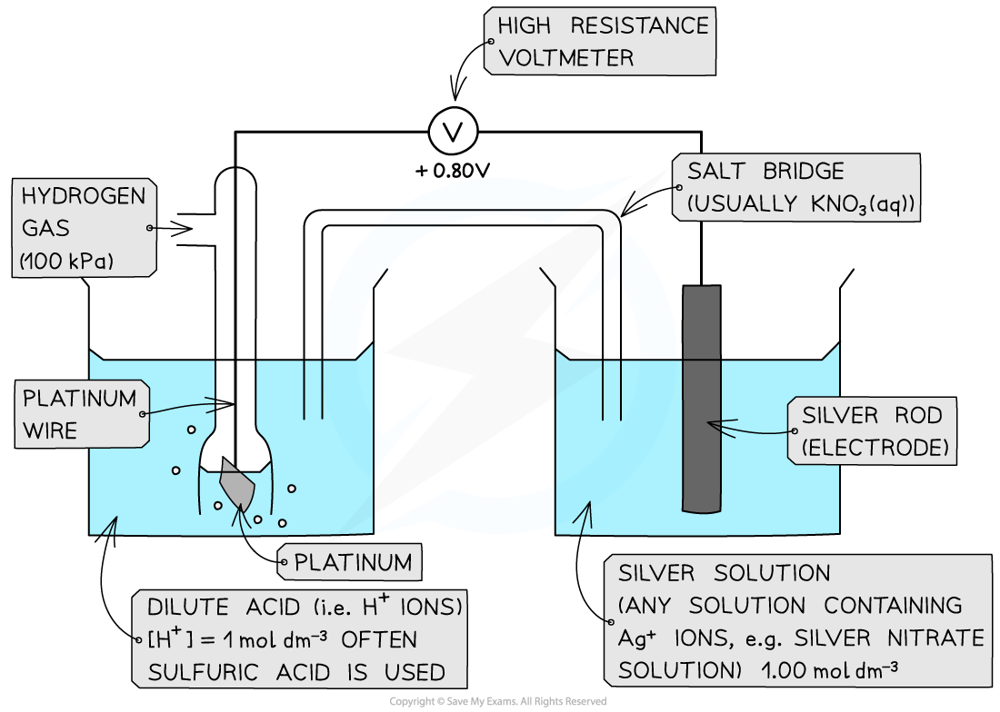
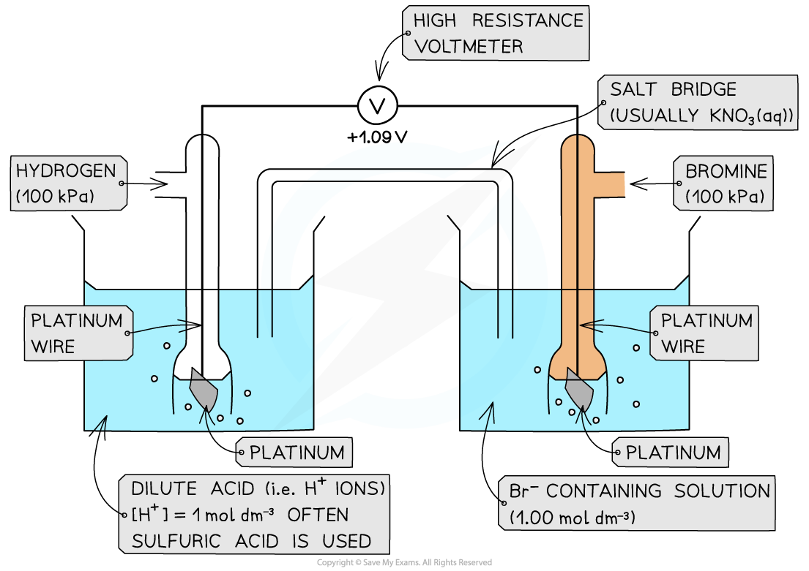
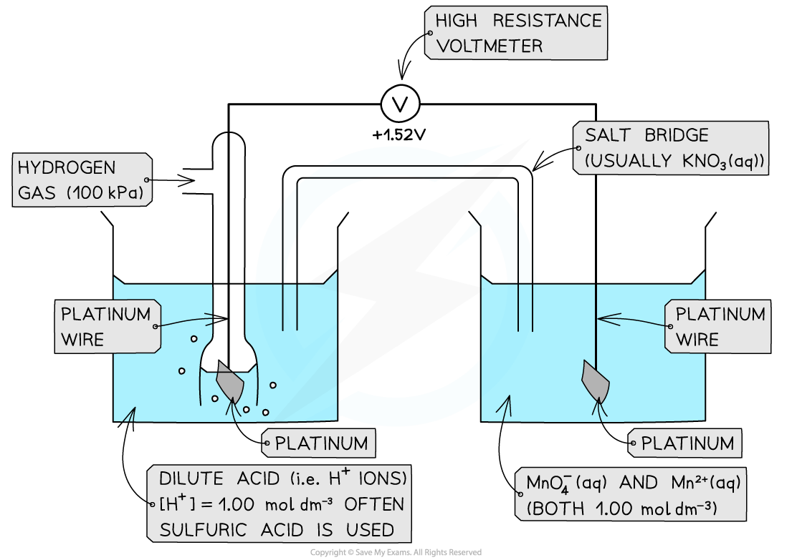

# Measuring Standard Electrode Potential

## Standard Electrode Potential

> **Spec point** — `spcpt_Xxc49MKh69PzMDmc`

## Measuring Standard Electrode Potential

- There are three different types of half-cells that can be connected to a standard hydrogen electrode to measure standard electrode potential

  - A metal / metal ion half-cell
  - A non-metal / non-metal ion half-cell
  - An ion / ion half-cell (the ions are in different oxidation states)

#### Metal / metal-ion half-cell

***Example of a metal / metal ion half-cell connected to a standard hydrogen electrode***

- An example of a metal/metal ion half-cell is the Ag+/ Ag half-cell

  - Ag is the metal
  - Ag+ is the metal ion
- This half-cell is connected to a **standard hydrogen electrode** and the two half-equations are:

**Ag****+**** (aq) + e****- ****⇌ Ag (s)        *****E*****ꝋ ****= + 0.80 V**

**2H****+**** (aq) + 2e****- ****⇌ H****2**** (g)        *****E*****ꝋ ****= 0.00 V **

- Since the Ag+/ Ag half-cell has a more positive *E*ꝋ value, this is the **positive pole **and the H+/H2 half-cell is the **negative** pole
- The **standard cell potential (***E**cell*ꝋ) is ***E******cell*****ꝋ**** = (+ 0.80) - (0.00) = + 0.80 V**
- The Ag+ ions are more likely to get **reduced **than the H+ ions as it has a greater *E*ꝋ value

  - Reduction occurs at the **positive electrode**
  - Oxidation occurs at the **negative electrode**

#### Non-metal / non-metal ion half-cell

- In a **non-metal / non-metal ion **half-cell, **platinum **wire or foil is used as an electrode to make electrical contact with the solution

  - Like graphite, platinum is inert and does not take part in the reaction
  - The redox equilibrium is established on the platinum surface
- An example of a non-metal / non-metal ion is the Br2 / Br- half-cell

  - Br2 is the non-metal
  - Br- is the non-metal ion
- The half-cell is connected to a **standard hydrogen electrode** and the two half-equations are:

**Br****2**** (aq) + 2e****- ****⇌ 2Br****-**** (aq)        *****E*****ꝋ**** = +1.09 V**

**2H****+**** (aq) + 2e****- ****⇌ H****2**** (g)        *****E*****ꝋ**** = 0.00 V   **

- The Br2 / Br- half-cell is the **positive pole** and the H+ / H2 is the **negative** pole
- The *E**cell*ꝋ is: ***E******cell*****ꝋ**** = (+ 1.09) - (0.00) = + 1.09 V**
- The Br2 molecules are more likely to get **reduced **than H+ as they have a greater *E*ꝋ value

***Example of a non-metal / non-metal ion half-cell connected to a standard hydrogen electrode***

#### Ion / Ion half-cell

- A **platinum electrode **is again used to form a half-cell of ions that are in **different oxidation states**
- An example of such a half-cell is the MnO4- / Mn2+ half-cell

  - MnO4- is an ion containing Mn with oxidation state +7
  - The Mn2+ ion contains Mn with oxidation state +2
- This half-cell is connected to a **standard hydrogen electrode** and the two half-equations are:

**MnO****4****-**** (aq) + 8H****+**** (aq) + 5e****- ****⇌ Mn****2+**** (aq) + 4H****2****O (l)       *****E*****ꝋ**** = +1.52 V**

**2H****+**** (aq) + 2e****- ****⇌ H****2**** (g)       *****E*****ꝋ ****= 0.00 V   **

- The H+ ions are also present in the half-cell as they are required to convert MnO4- into Mn2+ ions
- The MnO4- / Mn2+ half-cell is the **positive pole** and the H+ / H2 is the **negative** pole
- The *E**cell*ꝋ is ***E******cell*****ꝋ**** = (+ 1.52) - (0.00) = + 1.52 V**

***Ions in solution half cell***

#### The Salt Bridge

- The salt bridge completes the circuit in a voltaic (electrochemical) cell by allowing ions to move between the two half-cells
- It helps to **balance** the charges as electrons flow through the external wire
- A metal wire must not be used as a salt bridge

  - Metals allow electrons to flow, but a salt bridge **must carry ions**, not electrons
- **Potassium chloride** and **potassium nitrate** are commonly used to make the salt bridge because **chloride** and **nitrate** ions are:

  - Highly **soluble** in water
  - **Unreactive** with most ions in the half-cells
  - Unlikely to form **precipitates**
  - This ensures smooth ion flow and prevents disruption of the redox reactions

## Electromotive Force

> **Spec point** — `spcpt_NcRdsjDdkKSyhGQC`

## Electromotive Force

#### Standard cell potential

- Once the ***E***ꝋ of a half-cell is known, the **potential difference** or **voltage** or** emf** of an **electrochemical cell **made up of any two half-cells can be calculated

  - These could be **any** half-cells and neither have to be a standard hydrogen electrode
- The **standard cell potential (***E**cell*ꝋ) can be calculated by **subtracting **the **less** **positive** *E*ꝋ from the **more positive ***E*ꝋ value

  - The half-cell with the more positive *E*ꝋ value will be the **positive** pole
  
    - By convention this is shown on the right hand side in a conventional cell diagram, so is termed ** *****E******right*****ꝋ**
  - The half-cell with the less positive *E*ꝋ value will be the **negative **pole
  
    - By convention this is shown on the left hand side in a conventional cell diagram, so is termed ** *****E******left*****ꝋ**

***E******cell*****ꝋ**** = *****E******right*****ꝋ ****- *****E******left*****ꝋ   **

- Since oxidation is always on the left and reduction on the right, you can also use this version

***E******cell*****ꝋ**** = *****E******reduction*****ꝋ ****- *****E******oxidation***

> **Worked Example**
> **Calculating the standard cell potential**
> 
> Calculate the standard cell potential for the electrochemical cell below and explain why the Cu2+ / Cu half-cell is the positive pole. The half-equations are as follows:
> 
> Cu2+(aq) + 2e- ⇌ Cu(s)      *E*ꝋ = +0.34 V
> 
> Zn2+(aq) + 2e- ⇌ Zn(s)      *E*ꝋ = −0.76 V
> 
> 
> 
> **Answer**
> 
> **Step 1: **Calculate the standard cell potential. The copper is more positive so must be the right hand side.
> 
> *E**cell*ꝋ = *E**right*ꝋ - *E**left*ꝋ   
> 
> *E**cell*ꝋ = (+0.34) - (-0.76)
> 
> = +1.10 V
> 
> The voltmeter will therefore give a value of +1.10 V
> 
> **Step 2: **Determine the positive and negative poles
> 
> The Cu2+ / Cu  half-cell is the **positive** pole as its *E*ꝋ is more positive than the *E*ꝋ value of the Zn2+ / Zn half-cell

> **Exam Hint**
> **A helpful mnemonic for remembering redox in cells**
> 
> 
> 
> ***Lio the lion goes Roor! ***
> 
> Lio stands for 'Left Is Oxidation' and he is saying ROOR because that is the order of species in the cell:
> 
> Reduced/Oxidised (salt bridge) Oxidised/Reduced
