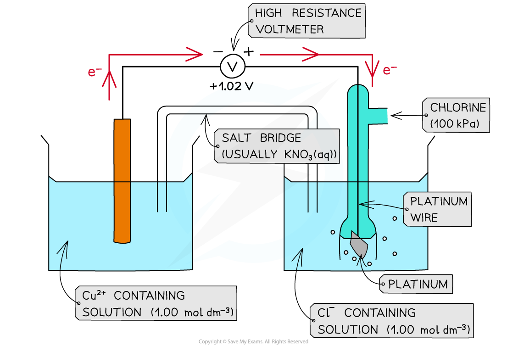
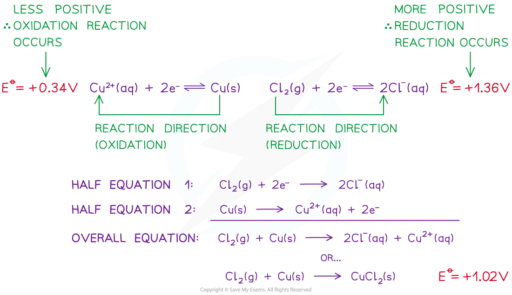

# Thermodynamics & Electrode Potential

## Thermodynamic Feasibility

> **Spec point** — `spcpt_DxbRvPTD48Z5mgBG`

## Thermodynamic Feasibility

#### Feasibility

- The *E*ꝋ values of a species indicate how **easily **they can get **oxidised **or **reduced**
- The **more **positive the value, the easier it is to reduce the species on the **left** of the half-equation

  - The reaction will tend to proceed in the **forward direction**
- The **less **positive the value, the easier it is to **oxidise** the species on the **right **of the half-equation

  - The reaction will tend to proceed in the backward direction
  - A reaction is **feasible **(likely to occur) when the *E**cell*ꝋ is **positive**
- For example, two half-cells in the following electrochemical cell are:

**Cl****2**** (g) + 2e****- ****⇌ 2Cl****-**** (aq)        *****E*****ꝋ**** = +1.36 V**

**Cu****2+**** (aq) + 2e****- ****⇌ Cu (s)        *****E*****ꝋ**** = +0.34 V**

- Cl2 molecules are **reduced **as they have a more positive *E*ꝋ value
- The chemical reaction that occurs in this half cell is:

**Cl****2**** (g) + 2e****- ****→ 2Cl****-**** (aq)          **

- Cu2+ ions are **oxidised **as they have a less positive *E*ꝋ value
- The chemical reaction that occurs in this half cell is:

**Cu (s) → Cu****2+**** (aq) + 2e****-**

- The **overall equation **of the electrochemical cell is (after cancelling out the electrons):

**Cu (s) + Cl****2**** (g) → 2Cl****- ****(aq) + Cu****2+**** (aq)**

OR

**Cu (s) + Cl****2**** (g) → CuCl****2**** (s)**

- The **forward** reaction is **feasible** (spontaneous) as it has a **positive** *E*ꝋ  value of +1.02 V ((+1.36) - (+0.34))
- The **backward **reaction is **not feasible** (not spontaneous) as it has a **negative** *E*ꝋ value of -1.02 ((+0.34) - (+1.36))

***A reaction is feasible when the standard cell potential E******ꝋ****** is positive***

> **Exam Hint**
> You may have to apply your understanding (from the above worked example) to questions with more than 2 equations
> 
> - The process is still the same in terms of identifying the most positive / least negative value as the reduction reactions
> - This reaction will also contain the oxidising agent on the left hand side

## Entropy Change & ln K

> **Spec point** — `spcpt_fT8WtY7wdkMCztXV`

## Entropy Change & ln K

- Cell potential is related to both entropy, *S*, and the equilibrium constant, *K*
- A larger cell potential means a bigger change in total entropy

  - Therefore, we can say that cell potential is directly proportional to total entropy change

*E*θ ∝ Δ*S*total

- The use of two equations for Gibbs free energy change can also show that:

*E*θ ∝ ln*K*

- Δ*G *= –*nF E**θ*cell

  - Δ*G *= –*RT *ln* K*

> **Exam Hint**
> You are expected to be aware of the two directly proportional relationships described
> 
> However, you are not expected to work with the Faraday based Gibbs free energy equation
> 
> Δ*G *= –*nF E**θ*cell
> 
> - The Faraday constant, *F*, is not given in the Data Booklet

## Limitations of Standard Electrode Potential Predictions

> **Spec point** — `spcpt_SQ9B87PZ4cMwszkM`

## Limitations of Standard Electrode Potential Predictions

- The **thermodynamic feasibility** of a reaction can be deduced from the electrode potential, however, it gives no information about the rate of reaction
- As standard electrode potentials are measured using solutions, we have to consider the le Châtelier's effect on concentration using non-standard conditions

  - For example, the redox equilibrium equation and standard electrode potential for the V3+ | V2+ system are:

V3+ (aq) + e- ⇌ V2+ (aq)       *E*θ = +0.26 V

- If the concentration of V3+ (aq) is greater than 1.0 mol dm-3, then the equilibrium will shift to the right

  - This will remove electrons from the system, therefore, making the electrode potential less negative

  - If the concentration of V2+ (aq) is greater than 1.0 mol dm-3, then the equilibrium will shift to the left
  
    - This will add electrons to the system, therefore, making the electrode potential more negative
  - Any change to the concentration will cause a change to the electrode potential and, therefore, to the overall cell potential
  
    - This is true of any change to the conditions that results in non-standard conditions
- Reaction kinetics can also affect the prediction

  1. The rate of reaction may simply be so slow that it looks like the reaction isn't happening, when it is
  2. The reaction may have a high activation energy which inhibits the reaction, for example:

Cu2+ (aq) + 2e- ⇌ Cu (s)   *E*θ = 0.34 V

2H+ (aq) + 2e- ⇌ H2 (g)   *E*θ = 0.00 V

- The reaction of Cu2+ (aq) + H2 (g) → Cu (s) + 2H+ (aq) is thermodynamically feasible with an electromotive force of +0.34 V

  - However, this reaction does not occur as the activation energy is so high which means that the reactants are **kinetically stable**
- Another, more basic limitation is the fact that many redox reactions are not aqueous
