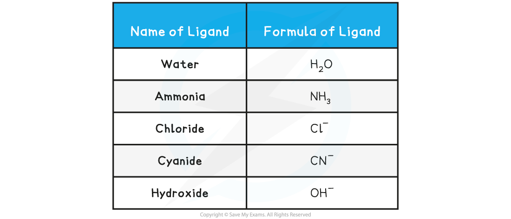

# Transition Metal Complexes

## Describing Complexes

> **Spec point** — `spcpt_dWXWgRPkqpDDCpBX`

## Describing Complexes

- Transition element ions can form complexes which consist of a **central metal ion** and **ligands**
- A ligand is a molecule or ion that forms a dative covalent / co-ordinate bond with a transition metal by donating a pair of electrons to the bond

  - This is the definition of a Lewis base - electron pair donor
- This means ligands have a negative charge or a lone pair of electrons capable of being donated

  - This definition may seem familiar: a ligand is the same as a **nucleophile**
- Different** ligands** can form different numbers of dative covalent / co-ordinate bonds to the central metal ion in a complex

  - Some ligands can form **one** dative covalent / co-ordinate bond to the central metal ion
  - Other ligands can form **two** dative covalent / co-ordinate bonds, and some can form **multiple** dative covalent / co-ordinate bonds
- **Co-ordination number** is number of dative covalent / co-ordinate  bonds to the central metal atom or ion

#### Common Ligands

- Water molecules frequently act as ligands. Each water molecule makes a single bond with the metal ion using one of the lone pairs on the oxygen atom
- The lone pair is donated to the partially filled d-subshell of the transition metal ion

#### Table Showing Examples of Common Monodentate Ligands

#### Representing complex ions

- Square brackets are used to group together the ligands and metal ion in a representation of the geometrical arrangement
- The overall charge on the complex ion is the sum of the oxidation states of all the species present
- If the ligands are neutral then the overall charge will be the same as the oxidation state of the metal ion

***Examples of complexes with monodentate ligands***

#### Naming complexes

- Complexes are named in the following way
- If the overall ion is a cation then the nomenclature is:

**Prefix for number of ligands/ligand name/element/oxidation number**

- The prefixes are the same ones used in organic chemistry: di, tetra, hexa for 2, 4 & 6 respectively (3 & 5 are rarely encountered except in mixed ligand complexes)
- If the overall ion is an anion, the name of element is modified to have the name ending 'ate' and sometimes Latin word stems are used

  - **tetrachlorcuprate(II)**
  - **hexaaquairon(II)**
  - **hexaamminecobalt(II)**
  - **tetracyanonickelate(II)**
- Using the examples in the illustration above, the names are:
- Notice in these examples that

  - cuprate( Latin - cuprum) and nickelate are used in place of copper and nickel as they are anions
  - Ammonia takes the prefix ammine as a ligand, which is spelt with a double 'm' unlike the functional group amine
