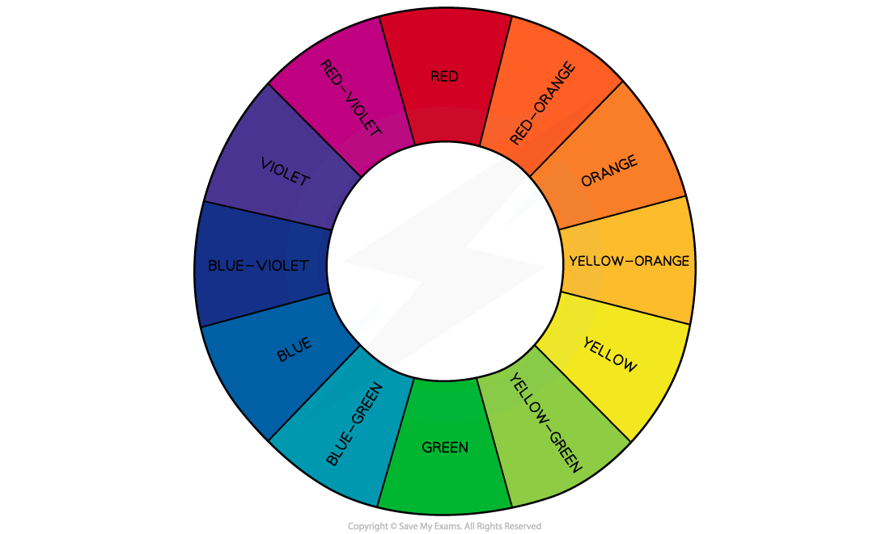
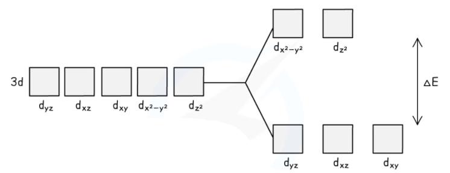
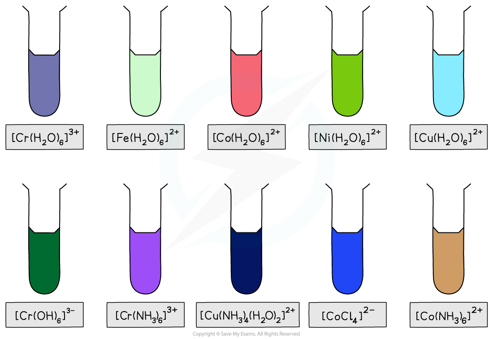
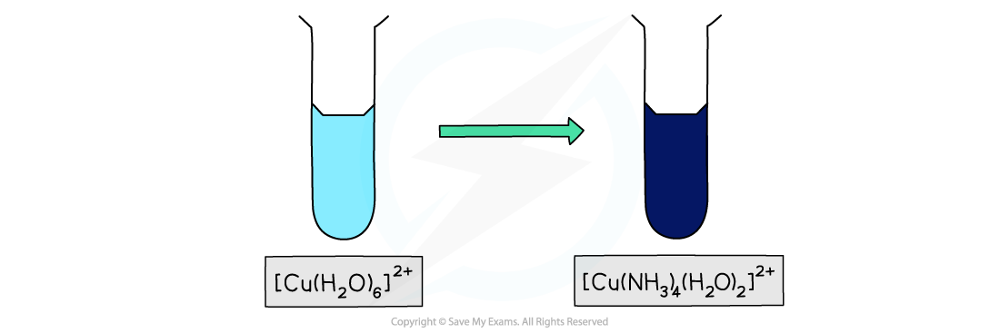
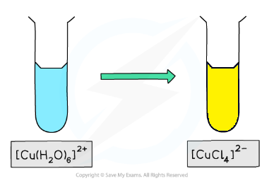

# Colour in Aqueous ions

## Colour in Aqueous ions

> **Spec point** — `spcpt_wyG2hvKD4Fft432p`

## Colour in Aqueous ions

#### Perception of colour

- Most transition metal compounds appear coloured. This is because they absorb energy corresponding to certain parts of the visible **electromagnetic spectrum**
- The colour that is seen is made up of the parts of the visible spectrum that aren’t absorbed
- For example, a green compound will absorb all frequencies of the spectrum apart from green light, which is transmitted
- The colours absorbed are **complementary** to the colour observed

***The colour wheel showing complementary colours in the visible light region of the electromagnetic spectrum***

- Complementary colours are any two colours which are directly opposite each other in the colour wheel

  - For example, the complementary colour of red is green and the complementary colours of red-violet are yellow-green

#### Splitting of 3d energy levels

- In a transition metal atom, the five orbitals that make up the d-subshell all have the same energy.
- Ions that have completely filled 3d energy levels (such as Zn2+) and ions that have no electrons in their 3d subshells (such as Sc3+) are not coloured
- Transition metals have a partially filled 3d energy level
- When ligands attach to the central metal ion the energy level splits into two levels with slightly different energies

  - If one of the electrons in the lower energy level absorbs energy from the visible spectrum it can move to the higher energy level
  - This process is known as **promotion / excitation**
- The amount of energy absorbed depends on the difference between the energy levels

  - A larger energy difference means the electron absorbs more energy
- The amount of energy gained by the electron is directly proportional to the frequency of the absorbed light and inversely proportional to the wavelength

***Upon bonding to ligands, the d orbitals of the transition element ion split into sets of orbitals with different energies***

## Colour Changes in Aqueous ions

> **Spec point** — `spcpt_ZppsqHKK6rbGr7Pp`

## Colour Changes in Aqueous ions

The size of the splitting energy Δ*E* in the d-orbitals is influenced by the following four factors:

- **The size and type of ligands**
- **The nuclear charge and identity of the metal ion**
- **The oxidation state of the metal**
- **The shape of the complex**

***The large variety of coloured compounds is a defining characteristic of transition metals***

#### Size and type of ligand

- The nature of the ligand influences the strength of the interaction between ligand and central metal ion
- Ligands vary in their charge density
- The greater the charge density; the more strongly the ligand interacts with the metal ion causing greater splitting of the d-orbitals
- The further it is then shifted towards the region of the spectrum where it absorbs higher energy
- As a result, a different colour of light is absorbed by the complex solution and a different **complementary colour** is observed
- This means that complexes with the same **transition elements** **ions,** but **different** **ligands, **can have different colours

  - For example, the [Cu(H2O)6]2+ complex has a **light blue** colour
  - Whereas the [Cu(NH3)4(H2O)2]2+ has a **dark blue** colour despite the copper(II) ion having an oxidation state of +2 in both complexes

***Ligand exchange of the water ligands by ammonia ligands causes a change in colour of the copper(II) complex solution***

#### Oxidation number

- When the same metal has a higher oxidation number that will also create a stronger interaction with the ligands
- If you compare iron(II) and iron (III):

  - [Fe(H2O)6]2+ absorbs in the red region and appears green
  - But, [Fe(H2O)6]3+ absorbs in blue region and appears orange

#### Coordination number

- The change of colour in a complex is also partly due to the change in coordination number and geometry of the complex ion
- The splitting energy, Δ*E*, of the d-orbitals is affected by the relative orientation of the ligand as well as the d-orbitals
- Changing the coordination number generally involves changing the ligand as well, so it is a combination of these factors that alters the strength of the interactions

  - For example, the [Cu(H2O)6]2+ complex has a **light blue** colour
  - Whereas the [CuCl4]2– has a **yellow** colour due to the change in the ligand and the change in the coordination number from 6 to 4
  
    - In practice, there would be a change from light blue to green (due to a mixture of both ions) to yellow
  - Since the reaction is reversible, it can also go from yellow, [CuCl4]2–,  to green to light blue, [Cu(H2O)6]2+

