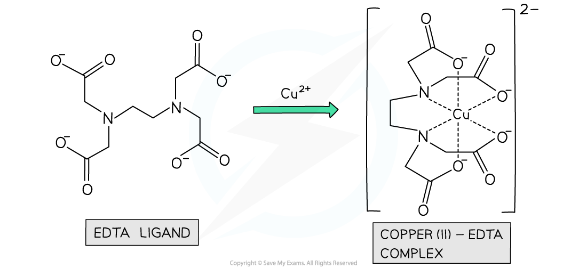

# Ligands

## Monodentate ligands

> **Spec point** — `spcpt_dmK4NP58X2GTsJQW`

## Monodentate ligands

- **Monodentate** ligands can form only **one **dative bond to the central metal ion
- This is because they have a single lone pair of electrons to form a dative bond with the metal ion
- Examples of monodentate ligands are:

  - Water (H2O) molecules
  - Ammonia (NH3) molecules
  - Chloride (Cl–) ions
  - Cyanide (CN–) ions

***Examples of complexes with monodentate ligands***

## Bidentate & Multidentate Ligands

> **Spec point** — `spcpt_MtvJ49X4zQHqqctZ`

## Bidentate & Multidentate Ligands

#### Bidentate Ligands

- **Bidentate** ligands can each form **two **dative bonds to the central metal ion
- This is because each ligand contains **two **atoms with lone pairs of electrons
- Examples of bidentate ligands are:

  - 1,2-diaminoethane (H2NCH2CH2NH2) which is also written as **‘en’**
  - Ethanedioate ion (C2O42- ) which is sometimes written as **‘ox’**

***Examples of complexes with bidentate ligands***

#### Multidentate Ligands

- Some ligands contain more than two atoms with lone pairs of electrons
- These ligands can form more than two dative bonds to the and are said to be **multidentate** ligands
- An example of a multidentate ligand is EDTA4-, which is a **hexadentate **ligand as it forms 6 dative covalent bonds to the central metal ion

***Example of a polydentate ligand complex***
