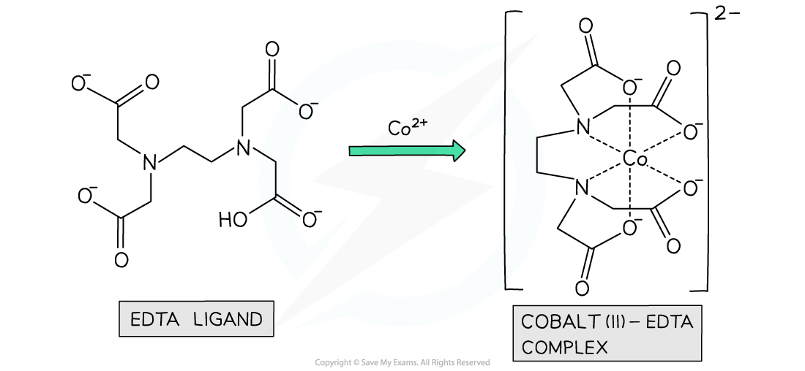

# Ligand Exchange

## Exchanging Ligands

> **Spec point** — `spcpt_km8K7kq6wZqz2jxT`

## Exchanging Ligands

- **Ligand exchange **(or **ligand** **substitution**) is when one **ligand** in a complex is replaced by another
- Ligand exchange forms a new complex that is **more stable** than the original one
- The ligands in the original complex can be **partially** or **entirely** substituted by others
- The complex ion can change its charge or remain the same depending on the ligand involved
- There are no changes in coordination number, or the geometry of the complex, if the ligands are of a** similar** **size**
- But, if the ligands are of a **different size**, for example water ligands and chloride ligands, then a change in coordination number and the geometry of the complex will occur

- Addition of a high concentration of chloride ions (from conc HCl or saturated NaCl) to an aqueous ion leads to a ligand substitution reaction.
- The Cl- ligand is **larger** than the uncharged H2O and NH3 ligands so therefore ligand exchange can involve a change of co-ordination number
- For example when concentrated hydrochloric acid is added slowly and continuously to a copper(II) sulfate solution the colour changes from blue to green then finally yellow
- The equation for this reaction is

**[Cu(H****2****O)****6****]****2+ ****(aq) + 4Cl****-**** (aq) ⇌ [CuCl****4****]****2-**** (aq) + 6H****2****O (l) **

- We can see that all six water ligands have been replaced by four chloride ions
- This reaction involves a change in coordination number from 6 to 4
- Note that despite the charge on the complex changing from +2 to -2, there has been no change in oxidation number of the copper
- We can also see that this reaction is reversible, which helps to explain the observed colour change

  - The hexaaquacopper(II) ion is blue
  - The tetrachlorocuprate(II) ion is yellow
  - The green colour is due to a mixture of the blue and yellow complex ions
- A similar reaction also takes place with cobalt resulting in a blue solution and a change in coordination number from 6 to 4

**[Co(H****2****O)****6****]****2+ ****(aq) + 4Cl****-**** (aq) ⇌ [CoCl****4****]****2-**** (aq) + 6H****2****O (l) **

> **Exam Hint**
> **Be careful**: If solid copper chloride (or any other metal) is dissolved in water it forms the aqueous [Cu(H2O)6]2+ complex and not the chloride [CuCl4 ]2- complex

## Entropy & Stability

> **Spec point** — `spcpt_fwjRXRVRP9wMnqpF`

## Entropy & Stability

- The replacement of monodentate ligands with bidentate and multidentate ligands in complex ions is called the **chelate effect**
- It is an energetically favourable reaction, meaning that **Δ*****G*****ꝋ** is negative
- The driving force behind the reaction is entropy
- The Gibbs equation reminds us of the link between enthalpy and entropy:

**Δ*****G*****ꝋ**** = Δ*****H******reaction*****ꝋ**** – TΔ*****S******system*****ꝋ**

- Reactions in solution between aqueous ions usually come with relatively small enthalpy changes
- However, the entropy changes are always positive in chelation because the reactions produce a net increase in the number of particles
- A small enthalpy change and relative large positive entropy change generally ensures that the overall free energy change is negative
- For example, when EDTA chelates with aqueous cobalt(II) two reactants becomes seven product species

**[Co(H****2****O)****6 ****]****2+**** (aq) + EDTA****4- ****(aq) → [CoEDTA]****2-**** (aq) + 6H****2****O**** ****(l) **

***The ligand EDTA readily chelates with aqueous transition metal ions in an energetically favourable reaction***
