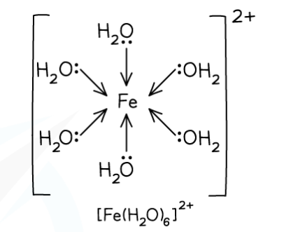

# Octahedral & Tetrahedral Complexes

## Octahedral & Tetrahedral Complexes

> **Spec point** — `spcpt_F4YbNyCtcyCNCYjg`

## Octahedral & Tetrahedral Complexes

- **Octahedral** complexes are formed when a central metal atom or ion forms **six coordinate bonds**
- This could be six coordinate bonds with **six** small, **monodentate** ligands

  - Examples of such ligands are **water **and **ammonia** molecules and **hydroxide** and **thiocyanate **ions
  - As there are six ligands, these complexes are sometimes described as having **six-fold coordination**

#### Table Showing Examples of Common Monodentate Ligands

***Example of an octahedral complex with monodentate ligands***

- It could be six-coordinate bonds with **three** **bidentate** ligands

  - Each bidentate ligand will form two coordinate bonds, meaning six-coordinate bonds in total
  - Examples of these ligands are **1,2-diaminoethane** and the** ethanedioate ion**

***Example of an octahedral complex with bidentate ligands***

- It could be six-coordinate bonds with **one multidentate **ligand

  - The multidentate ligand, for example, EDTA4-, forms all six-coordinate bonds

***Example of an octahedral complex with a polydentate ligand ***

- The bond angles in an octahedral complex are 90o
- The **coordination** **number** of a complex is the number of dative bonds formed between the central metal ion and the ligands

  - Since there are 6 dative bonds, the coordination number for the complex is 6

> **Exam Hint**
> Electron pair repulsion theory can be extended to predict and explain the shape of transition metal complexes. The only difference is you should ignore the 3d elctrons in the transition metal ion and overall charge on the complex - just count the number of electron pairs donated by the ligands.

#### Changes to the central metal ion

- The main example of the central metal ion changing oxidation state is when Fe2+ is oxidised to form Fe3+

  - Fe2+ → Fe3+ + e–
- Hexaaquairon(II) is a pale green solution, which slowly oxidises on standing in air to give a yellow solution of hexaaquairon(III) ions.

  - [Fe(H2O)6]2+ → [Fe(H2O)6]3+
- The same oxidation reaction can be achieved with different iron(II) complex ions

  - These are often performed by bubbling oxidising agents, such as chlorine gas, through a solution of the iron(II) complex ion
  - For example, bubbling chlorine gas through a yellow solution of potassium hexacyanoferrate(II), K4[Fe(CN)6], results in the formation of a red solution of potassium hexacyanoferrate(III), K3[Fe(CN)6]
  - 2K4[Fe(CN)6] + Cl2 → 2K3[Fe(CN)6] + 2K+ + 2Cl–

#### Tetrahedral complexes

- When there are **four coordinate bonds **the complexes often have a **tetrahedral **shape

  - Complexes with four **chloride** **ions** most commonly adopt this geometry
  - Chloride ligands are large, so only four will fit around the central metal ion
- The bond angles in tetrahedral complexes are 109.5o

***Example of a tetrahedral complex***

#### Isomerism in transition element complexes

- Transition element complexes can exhibit **stereoisomerism**
- Even though transition element complexes do not have a **double bond**, they can still have **geometrical** **isomers**
- **Square planar **and **octahedral **complexes with **two pairs** **of different** ligands exhibit *cis*-*trans* isomerism
- Examples of octahedral complexes that exhibit geometrical isomerism are the [Co(NH3)4(H2O)2]2+ and [Ni(H2NCH2CH2NH2)2(H2O)2]2+ complexes

  - [Ni(H2NCH2CH2NH2)2(H2O)2]2+ can also be written as [Ni(en)2(H2O)2]2+

- Like in the [square planar complexes](https://www.savemyexams.com/international-a-level/chemistry/edexcel/17/revision-notes/5-transition-metals--organic-nitrogen-chemistry/5-2-transition-metals--complexes/5-2-7-square-planar-complexes/) such as cis-platin and trans-platin, if the two ‘different’ ligands are next to each other then that is the ‘cis’ isomer, and if the two ‘different’ ligands are opposite each other then this is the ‘trans’ isomer

  - In [Co(NH3)4(H2O)2]2+, the two water ligands are next door to each other in the cis isomer and are opposite each other in the trans isomer 

***Octahedral transition metal complexes exhibiting geometrical isomerism***

#### Optical isomerism

- **Octahedral **complexes with **bidentate ligands** also have **optical isomers**
- This means that the two forms are **non-superimposable mirror images **of each other

  - They have no plane of symmetry, and one image cannot be placed directly on top of the other
- The optical isomers only differ in their ability to rotate the plane of polarised light in opposite directions
- Examples of octahedral complexes that have optical isomers are the [Ni(H2NCH2CH2NH2)3]2+and [Ni(H2NCH2CH2NH2)2(H2O)2]2+ complexes

  - The ligand H2NCH2CH2NH2 can also be written as ‘en’ instead 

***Octahedral transition metal complexes exhibiting optical isomerism***
