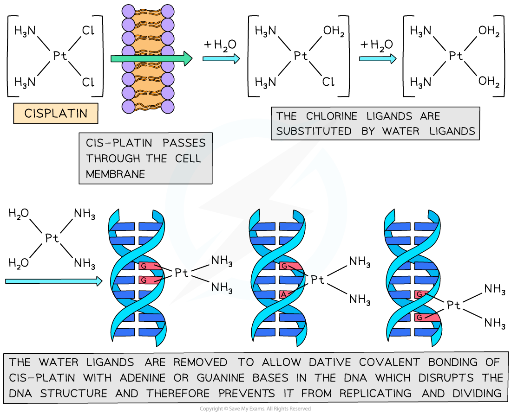

# Square Planar Complexes

## Square Planar Complexes

> **Spec point** — `spcpt_kBQDFsgCTgfbG3Zw`

## Square Planar Complexes

- Sometimes, complexes with **four coordinate bonds **may adopt a **square planar** geometry instead of a tetrahedral one

  - Cyanide ions (CN-) are the most common ligands to adopt this geometry
  - An example of a square planar complex is **cisplatin**
- The bond angles in a square planar complex are 90o

***Cisplatin is an example of a square planar complex***

- In the 1960s the drug cis-platin was discovered, which has been extremely effective in treating a number of different types cancer such as testicular, ovarian, cervical, breast, lung and brain cancer
- Cancer cells grow and replicate much faster than normal cells
- Cis-platin is a square planar molecule that has a geometric isomer with the side groups in different positions
- Cis-platin has beneficial medical effects by binding to DNA in cancer cells, *trans-*platin cannot be used in cancer treatment

***Cis-platin is an example of a square planar transition element complex that exhibits geometrical isomerism***

- The cis-platin works by binding to the nitrogen atoms on the bases in DNA
- The cis-platin passes through the cell membrane and undergoes ligand exchange where the chlorines are replaced by water molecules
- The nitrogen is a better ligand than water and forms dative covalent bonds with the cis-platin
- The cis-platin distorts the shape of the DNA and prevents the DNA from replicating

***The process by which cis-platin binds to DNA and prevents replication***

#### Adverse Effects

- Cis-platin binds to healthy cells as well as cancerous cells, but affects cancer cells more as they are replicating faster
- Unfortunately, this means that other healthy cells which replicate quickly, such as hair follicles, are also affected by cis-platin
- This is why hair loss is a side-effect of people undergoing cancer treatment
- Despite this drawback, cisplatin is a highly effective drug and society needs to find a balance between the adverse effects of drugs and their therapeutic value
- New therapeutic pathways are constantly under development that aim to deliver drugs that target cancer cells while leaving healthy cells untouched
