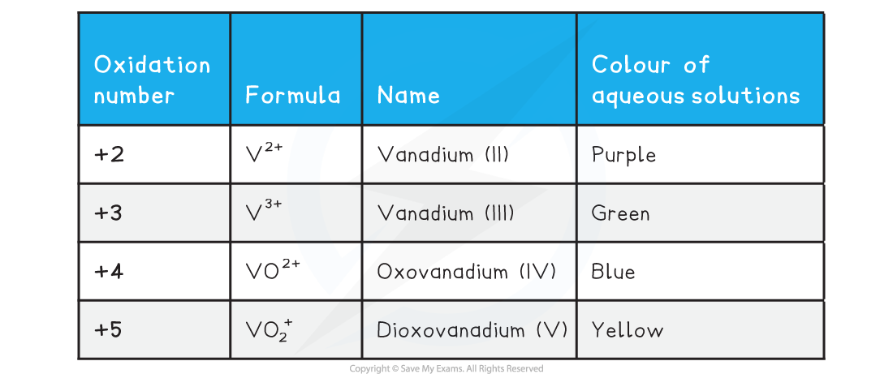
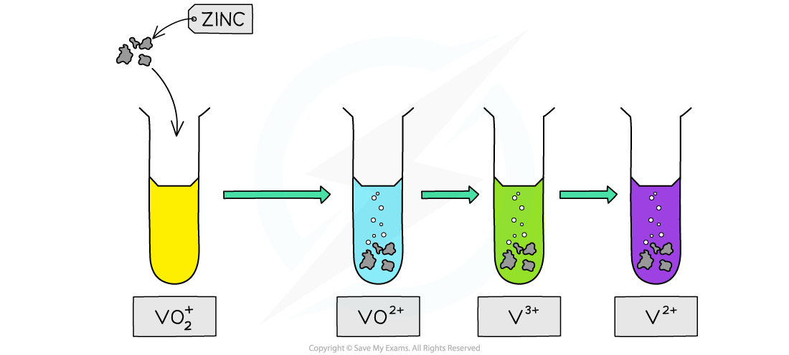
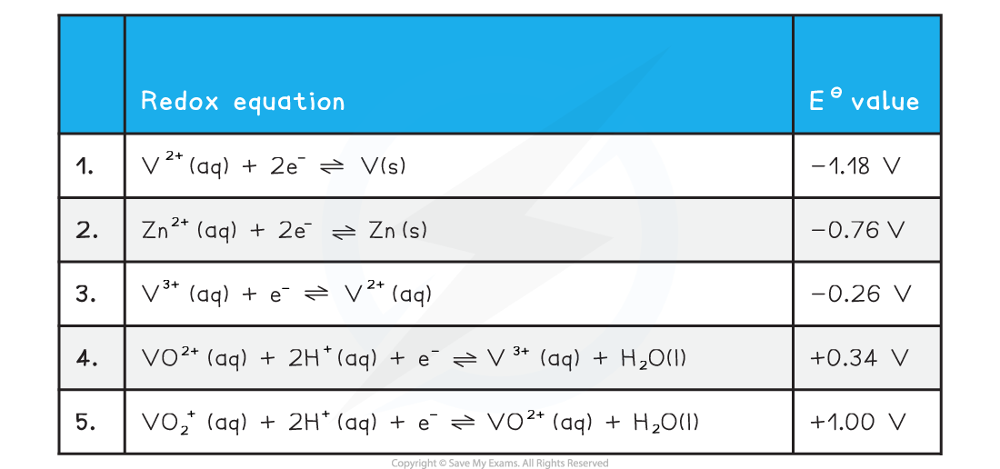

# Vanadium Chemistry

## Vanadium - Colours & Oxidation States

> **Spec point** — `spcpt_JvsbwYfCvr2yK8br`

## Vanadium - Colours & Oxidation States

- Vanadium is a transition metal which has variable oxidation states
- The table below shows the important ones you need to be aware of

- The variation in oxidation states of transition metal ions is illustrated by the reaction of zinc with ammonium vanadate(V) (also known as ammonium metavanadate) under acidic conditions
- Vanadium had four common oxidation states, from +2 to +5
- Zinc is a reducing agent that is capable to reducing vanadium(V) to vanadium(II) in a sequence of steps accompanied by vibrant colour changes

***The reduction of vanadate(V) ions by zinc in acidic conditions is one of the most colourful reactions in chemistry***

## Vanadium - Interconversions of Ions

> **Spec point** — `spcpt_3tJfhw2BRHYjmjtf`

## Vanadium - Interconversions of Ions

- For vanadium, we need to consider the following standard electrode potential values

- The half equations are arranged from the most negative *E*θ at the top to the most positive *E*θ at the bottom

  - The strongest oxidising agent is the reactant from the electrode reaction with the most positive standard electrode potential
  
    - In this case, the most positive value is + 1.00 V, which means that VO2+ is the strongest oxidising agent
  - The strongest reducing agent is the product from the electrode reaction with the most negative standard electrode potential
  
    - In this case, the most negative value is – 1.18 V, which means that V is the strongest reducing agent
- For all of the following reactions, we will use zinc as the reducing agent

#### Reduction of V from +5 to +4 by Zn

- Vanadium is being reduced from an oxidation number of +5 to +4 in half equation 5
- So, the two half equations we need to consider are:

  - 2. Zn2+ (aq) + 2e– $\rightleftharpoons$ Zn (s)     *E*θ = – 0.76 V
  - 5. VO2+ (aq) + 2H+ (aq) + e– $\rightleftharpoons$ VO2+ (aq) + H2O (l)     *E*θ = + 1.00 V
- Half equation 5 has the most positive standard electrode potential, *E*θ, value

  - Therefore, this is the reduction reaction
  - VO2+ (aq) + 2H+ (aq) + e– $\rightleftharpoons$ VO2+ (aq) + H2O (l)
- Half equation 2 has the least positive standard electrode potential, *E*θ, value

  - Therefore, this is the oxidation reaction and needs to be reversed
  - Zn (s) $\rightleftharpoons$ Zn2+ (aq) + 2e–
- We can obtain the overall equation by combining the reduction equation (half equation 5) and the oxidation equation (the reversed half equation 2)

  - **Remember: **When combining half equations, they must have the same number of electrons in both equations | **2VO****2****+**** (aq) + 4H****+**** (aq) + 2e****–**** ** | $\rightleftharpoons$** ** | **2VO****2+**** (aq) + 2H****2****O (l) ** |
  |---|---|---|
  | **Zn (s)** | $\rightleftharpoons$** ** | **Zn****2+**** (aq) + 2e****–**** ** |
  - The equal number of electrons on both sides of the equation cancel out to give the overall equation:

**2VO****2****+ ****(aq) + 4H****+ ****(aq) + Zn (s) **$\rightleftharpoons$** 2VO****2+**** (aq) + Zn****2+ ****(aq) + 2H****2****O (l)**

#### Reduction of V from +4 to +3 by Zn

- Vanadium is being reduced from an oxidation number of +4 to +3 in half equation 4
- So, the two half equations we need to consider are:

  - 2. Zn2+ (aq) + 2e– $\rightleftharpoons$ Zn (s)     *E*θ = – 0.76 V
  - 4. VO2+ (aq) + 2H+ (aq) + e– $\rightleftharpoons$ V3+ (aq) + H2O (l)     *E*θ = + 0.34 V
- Half equation 4 has the most positive standard electrode potential, *E*θ, value

  - Therefore, this is the reduction reaction
  - VO2+ (aq) + 2H+ (aq) + e– $\rightleftharpoons$ V3+ (aq) + H2O (l)
- Half equation 2 has the least positive standard electrode potential, *E*θ, value

  - Therefore, this is the oxidation reaction and needs to be reversed
  - Zn (s) $\rightleftharpoons$ Zn2+ (aq) + 2e–
- We can obtain the overall equation by combining the reduction equation (half equation 5) and the oxidation equation (the reversed half equation 2)

  - **Remember: **When combining half equations, they must have the same number of electrons in both equations | **2VO****2+**** (aq) + 4H****+**** (aq) + 2e****–****  ** | $\rightleftharpoons$** ** | **2V****3+**** (aq) + 2H****2****O (l) ** |
  |---|---|---|
  | **Zn (s)** | $\rightleftharpoons$** ** | **Zn****2+**** (aq) + 2e****–**** ** |
  - The equal number of electrons on both sides of the equation cancel out to give the overall equation:

**2VO****2+**** (aq)**** ****+ 4H****+ ****(aq) + Zn (s) **$\rightleftharpoons$** 2V****3+**** (aq) + Zn****2+ ****(aq) + 2H****2****O (l) **

#### Reduction of V from +3 to +2 by Zn

- Vanadium is being reduced from an oxidation number of +3 to +2 in half equation 3
- So, the two half equations we need to consider are:

  - 2. Zn2+ (aq) + 2e– $\rightleftharpoons$ Zn (s)     *E*θ = – 0.76 V
  - 3. V3+ (aq) + e– $\rightleftharpoons$ V2+ (aq)      *E*θ = – 0.26 V
- Half equation 3 has the most positive / least negative standard electrode potential, *E*θ, value

  - Therefore, this is the reduction reaction
  - V3+ (aq) + e– $\rightleftharpoons$ V2+ (aq)
- Half equation 2 has the least positive standard electrode potential, *E*θ, value

  - Therefore, this is the oxidation reaction and needs to be reversed
  - Zn (s) $\rightleftharpoons$ Zn2+ (aq) + 2e–
- We can obtain the overall equation by combining the reduction equation (half equation 5) and the oxidation equation (the reversed half equation 2)

  - **Remember: **When combining half equations, they must have the same number of electrons in both equations | **2V****3+**** (aq) + 2e****–**** ** | $\rightleftharpoons$** ** | **2V****2+**** (aq) ** |
  |---|---|---|
  | **Zn (s)** | $\rightleftharpoons$** ** | **Zn****2+**** (aq) + 2e****–**** ** |
  - The equal number of electrons on both sides of the equation cancel out to give the overall equation:

**2V****3+ ****(aq) + Zn (s) **$\rightleftharpoons$** 2V****2+**** (aq) + Zn****2+ ****(aq) **

#### Reduction of V from +2 to 0 by Zn

- Vanadium is being reduced from an oxidation number of +3 to +2 in half equation 1
- So, the two half equations we need to consider are:

  - 2. Zn2+ (aq) + 2e– $\rightleftharpoons$ Zn (s)     *E*θ = – 0.76 V
  - 1. V2+ (aq) + 2e– $\rightleftharpoons$ V (s)      *E*θ = – 1.18 V
- Half equation 1 has the most negative standard electrode potential, *E*θ, value

  - Therefore, this is the oxidation reaction and needs to be reversed
  - V (s) $\rightleftharpoons$ V2+ (aq) + 2e–
- Half equation 2 has the most positive / least negative standard electrode potential, *E*θ, value

  - Therefore, this is the reduction reaction
  - Zn2+ (aq) + 2e– $\rightleftharpoons$ Zn (s)
- We can obtain the overall equation by combining the reduction equation (half equation 5) and the oxidation equation (the reversed half equation 2)

  - When combining these half equations, there is no need to change them as they have the same number of electrons in both equations | **V (s) ** | $\rightleftharpoons$** ** | **V****2+**** (aq) + 2e****–**** ** |
  |---|---|---|
  | **Zn****2+**** (aq) + 2e****–****  ** | $\rightleftharpoons$** ** | **Zn (s)** |
  - The equal number of electrons on both sides of the equation cancel out to give the overall equation:

**V**** ****(s) + Zn****2+**** (aq) **$\rightleftharpoons$** V****2+**** (aq) + Zn**** ****(s) **

- Zn is not electron releasing with respect to V2+

  - This means this reaction is not thermodynamically feasible

#### Predicting oxidation reactions

- The same method can be used to predict whether a given oxidising agent will oxidise a vanadium species to one with a higher oxidation number

> **Exam Hint**
> It is important to not get confused between the two oxo ions of vanadium VO2+ and VO2+
