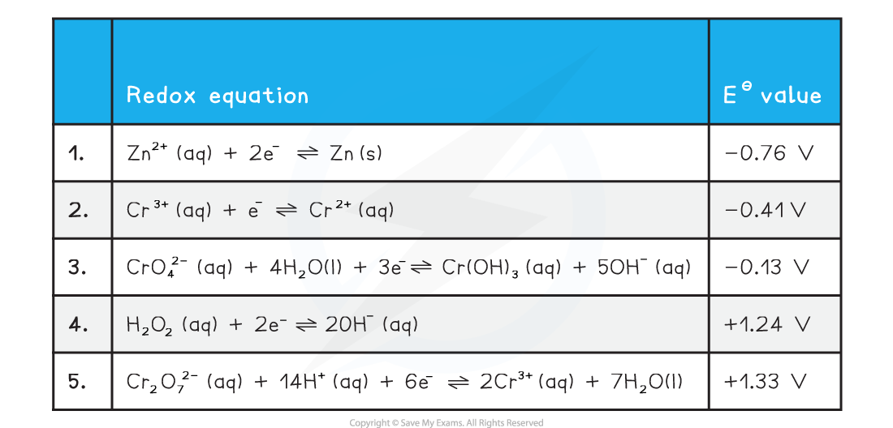
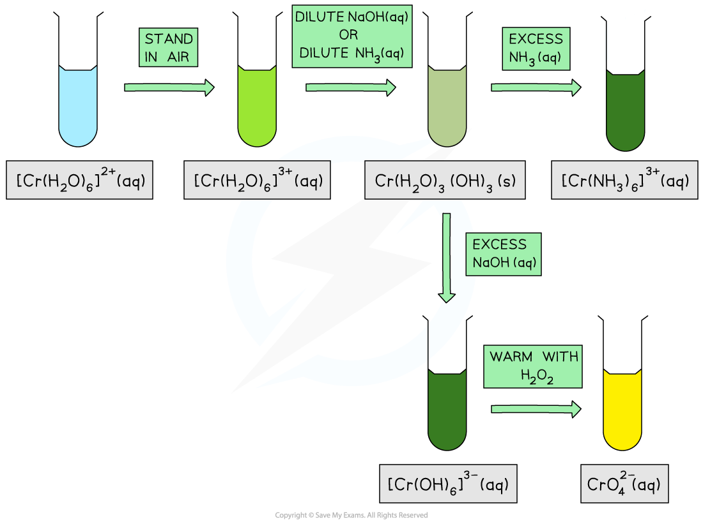

# Chromium Chemistry

## Chromium - Reduction & Oxidation

> **Spec point** — `spcpt_qYTX5wPt2XdW5mNW`

## Chromium - Reduction & Oxidation

- For chromium we need to consider the following standard electrode potential values

- The half equations are arranged from the most negative *E*θ at the top to the most positive *E*θ at the bottom

  - The strongest oxidising agent is the reactant from the electrode reaction with the most positive standard electrode potential
  
    - In this case, the most positive value is + 1.33 V, which means that Cr2O72– (aq)  is the strongest oxidising agent
  - The strongest reducing agent is the product from the electrode reaction with the most negative standard electrode potential
  
    - In this case, the most negative value is – 0.76 V, which means that Zn (s) is the strongest reducing agent

#### Oxidation of Cr from +3 to +6 by H2O2

- The two half equations we need to consider are 3 and 4
- Chromium is being oxidised from an oxidation number of +6 to +3 in half equation 3
- So, the two half equations we need to consider are:

  - 3. CrO42– (aq) + 4H2O (l) + 3e– $\rightleftharpoons$ Cr(OH)3 (aq) + 5OH– (aq)     *E*θ = – 0.13 V
  - 4. H2O2 (aq) + 2e– $\rightleftharpoons$ 2OH– (aq)     *E*θ = + 1.24 V

- Half equation 4 has the most positive standard electrode potential, *E*θ, value

  - Therefore, this is the reduction reaction
  - H2O2 (aq) + 2e– $\rightleftharpoons$ 2OH– (aq)
- Half equation 3 has the least positive standard electrode potential, *E*θ, value

  - Therefore, this is the oxidation reaction and needs to be reversed
  - Cr(OH)3 (aq) + 5OH– (aq) $\rightleftharpoons$CrO42– (aq) + 4H2O (l) + 3e
- We can obtain the overall equation by combining the reduction equation (half equation 4) and the oxidation equation (the reversed half equation 3)

  - **Remember: **When combining half equations, they must have the same number of electrons in both equations | **3H****2****O****2**** (aq) + 6e****–**** ** | $\rightleftharpoons$** ** | **6OH****–**** (aq)** |
  |---|---|---|
  | **2Cr(OH)****3**** (aq) + 10OH****–**** (aq)** | $\rightleftharpoons$ | **2CrO****4****2–**** (aq) + 8H****2****O (l) + 6e****–** |
  - The equal number of electrons on both sides of the equation cancel out and 6OH– (aq) cancel out on both sides to give the overall equation:

** 2Cr(OH)****3 ****(aq) + 4OH****-**** (aq) + H****2****O****2 ****(aq) **$\rightleftharpoons$** CrO****4****2- ****(aq) + 8H****2****O (l)**

- This reaction is carried out in alkaline conditions due to the presence of OH- ions in the equation

#### Reduction of Cr from +6 to +3 by Zn

- Chromium is being reduced from an oxidation number of +6 to +3 in half equation 5
- So, the two half equations we need to consider are:

  - 1. Zn2+ (aq) + 2e– $\rightleftharpoons$ Zn (s)     *E*θ = – 0.76 V
  - 5. Cr2O72– (aq) + 14H+ (aq) + 6e– $\rightleftharpoons$ 2Cr3+ (aq) + 7H2O (l)     *E*θ = + 1.33 V
- Half equation 5 has the most positive standard electrode potential, *E*θ, value

  - Therefore, this is the reduction reaction
  - Cr2O72– (aq) + 14H+ (aq) + 6e– $\rightleftharpoons$ 2Cr3+ (aq) + 7H2O (l)
- Half equation 1 has the least positive / most negative standard electrode potential, *E*θ, value

  - Therefore, this is the oxidation reaction and needs to be reversed
  - Zn (s) → Zn2+ (aq) + 2e–
- We can obtain the overall equation by combining the reduction equation (half equation 3) and the oxidation equation (the reversed half equation 1)

  - **Remember: **When combining half equations, they must have the same number of electrons in both equations | ** Cr****2****O****7****2–**** (aq) + 14H****+**** (aq) + 6e****–**** ** | $\rightleftharpoons$** ** | **2Cr****3+**** (aq) + 7H****2****O (l)** |
  |---|---|---|
  | **3Zn (s)** | $\rightleftharpoons$** ** | **3Zn****2+**** (aq) + 6e****–**** ** |
  - The equal number of electrons on both sides of the equation cancel out to give the overall equation:

** Cr****2****O****7****2-**** ****(aq) + 14H****+**** (aq) + 3Zn (s) **$\rightleftharpoons$** 2Cr****3+ ****(aq) + 7H****2****O (l) + 3Zn****2+**** (aq)**

- This reaction is carried out under acidic conditions due to the presence of H+ in the equation

#### Reduction of Cr from +3 to +2 by Zn

- Chromium is being reduced from an oxidation number of +3 to +2 in half equation 2
- So, the two half equations we need to consider are:

  - 1. Zn2+ (aq) + 2e– $\rightleftharpoons$ Zn (s)     *E*θ = – 0.76 V
  - 2. Cr3+ (aq) + e– $\rightleftharpoons$ Cr2+ (aq)     *E*θ = – 0.41 V
- Half equation 2 has the most positive / least negative standard electrode potential, *E*θ, value

  - Therefore, this is the reduction reaction
  - Cr3+ (aq) + e– $\rightleftharpoons$ Cr2+ (aq)
- Half equation 2 has the least positive standard electrode potential, *E*θ, value

  - Therefore, this is the oxidation reaction and needs to be reversed
  - Zn (s) $\rightleftharpoons$ Zn2+ (aq) + 2e–
- We can obtain the overall equation by combining the reduction equation (half equation 2) and the oxidation equation (the reversed half equation 1)

  - **Remember: **When combining half equations, they must have the same number of electrons in both equations | **2Cr****3+**** (aq) + 2e****–** | $\rightleftharpoons$** ** | **2Cr****2+**** (aq) ** |
  |---|---|---|
  | **Zn (s)** | $\rightleftharpoons$** ** | **Zn****2+**** (aq) + 2e****–**** ** |
  - The equal number of electrons on both sides of the equation cancel out to give the overall equation:

**2Cr****3+ ****(aq) + Zn (s) **$\rightleftharpoons$** 2Cr****2+**** (aq) + Zn****2+ ****(aq) **

- As this reaction is a further step from the previous reduction this reaction is also carried out under acidic conditions

#### Colour changes of chromium

- Another approach to transition metal chemistry is to look at the reactions of transition metal ions and complexes with various reagents
- This information is sometimes presented in the form of a reaction scheme:

***Reaction scheme outlining the colour changes associated with the reactions of different chromium species *****  **

- You would be expected to know:

  - The formula and corresponding state, (aq) or (s), of the transition metal species
  - The colour of the transition metal species
  - The reagents and conditions required to convert one transition metal species into another
  - How to write the equation for the conversion of one transition metal species into another
- For example:

  - A green solution of hexaaquachromium(III) ions, [Cr(H2O)6]3+ (aq), will react with dilute NaOH (aq) to form a grey-green precipitate of Cr(H2O)3(OH)3 (s)
  - [Cr(H2O)6]3+ (aq) + 3OH- (aq) → [Cr(H2O)3(OH)3] (s) + 3H2O (l)

## Dichromate(VI) & Chromate(VI) Equilibrium

> **Spec point** — `spcpt_xx7gYzHhFM4SwnmV`

## Dichromate(VI) & Chromate(VI) Equilibrium

- The chromate CrO42- and dichromate Cr2O72- ions can be converted from one to the other by the following equilibrium reaction

**2CrO****4****2-**** (aq) + 2H****+ ****(aq) ⇌ Cr****2****O****7****2-**** (aq) + H****2****O (l) **

- Chromate(IV) ions are stable in alkaline solution, but in acidic conditions the dichromate(VI) ion is more stable
- Addition of acid will  push the equilibrium to the dichromate

  - This results in a colour change from yellow to orange
- Addition of alkali will remove the H+ ions and push the equilibrium to the chromate
- This is not a redox reaction as both the chromate and dichromate ions have an oxidation number of +6

  - This is an acid base reaction
